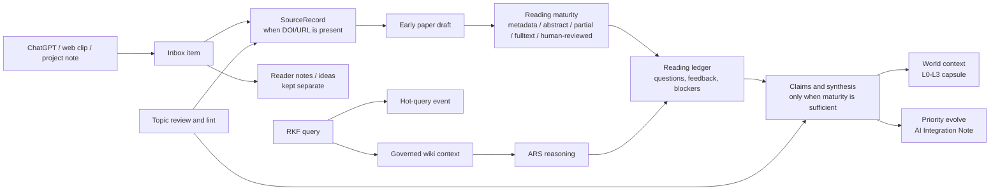

# Research Knowledge Framework

[繁體中文](README.zh-TW.md) | [Live RKF Observatory](https://chenhau-lan.github.io/ResearchWiki/) | [Beginner Setup](docs/GETTING_STARTED.md) | [Public Dashboard](docs/workflows/public-dashboard.zh-TW.md) | [Paper Discovery](docs/workflows/paper-discovery.zh-TW.md) | [Architecture](docs/ARCHITECTURE.md) | [Codex Workflows](docs/FEATURES_AND_COMMANDS.zh-TW.md)

Research Knowledge Framework, or RKF, is an LLM Wiki-based research knowledge
framework for active academic reading. It turns sources, paper drafts, reading
interactions, human feedback, questions, claims, and synthesis into governed
long-term memory.

Current stable baseline: `v1.0.0`. RKF 1.1 work on this branch is listed under
[Unreleased](CHANGELOG.md).

RKF now treats evidence as an **upgrade boundary**, not an entry gate. A paper
draft may be created early from metadata, an abstract, partial full text, or a
user-provided PDF. Stable claims, trusted synthesis, citation, and publication
still require locators, human feedback, an existing supported wiki source, or an
explicit blocker.

RKF is designed to work beside the Codex `academic-research-suite` skill:
ARS researches, reasons, writes, and reviews; RKF preserves active reading
state, human feedback, evidence boundaries, topic governance, and graph-safe
wiki memory.

```text
paper draft == active reading object
candidate != claim evidence
ARS output == proposal or reading feedback until reviewed
user feedback raises understanding maturity
stable claim -> locator, supported wiki source, human feedback, or blocker
low-risk rewrite -> AI Integration Note + maturity-aware page update
reconcile/challenge -> AI-marked blockers and counterpoints, not silent trust
emerge -> low-maturity pattern synthesis from existing RKF signals
hot.md == public-safe research demand dashboard, not evidence
inbox item == captured conversation/web/source lead, not claim evidence
```

## Five-Minute Install

RKF core needs Git, Python 3.9+, and the Codex app. It has no required Python
package install, and the static dashboard needs no Node.js.

```bash
git clone https://github.com/ChenHau-Lan/ResearchWiki.git
cd ResearchWiki
python3 tools/bootstrap_rkf.py
```

The first command is a non-mutating preview. After it reports `ready` with no
`blocker_codes`, initialize ignored local storage and optionally install the
machine-local connector plus the repository's version-matched
`rkf-auto-connect` skill used by other projects:

```bash
python3 tools/bootstrap_rkf.py --apply --install-connector
python3 tools/check_install.py --strict
```

Do not put PDFs, private Drive paths, or API keys in the repository. Windows
users may replace `python3` with `py -3`. See the
[beginner setup guide](docs/GETTING_STARTED.md) for troubleshooting and privacy
boundaries.

### Connect another research project

Preview first, then apply. This creates a v2 `.rkf-connect.toml` marker and a
small `RKF/` bridge; it does not copy the wiki or permanently activate RKF.

```bash
python3 tools/rkf_auto_connect.py connect-project "/path/to/MyResearchProject" --project-name "MyResearchProject"
python3 tools/rkf_auto_connect.py connect-project "/path/to/MyResearchProject" --project-name "MyResearchProject" --apply
```

Every new Codex task still starts with RKF OFF. Guarded query and capture
actions become available only after an explicit “Activate RKF.”

## Natural-Language Quick Start

Use RKF through natural-language research requests in the Codex app:

- "Capture this DOI and create a paper draft even if we only have metadata."
- "Save this ChatGPT/web clip to the RKF inbox; keep my idea separate from the source."
- "Show which registered papers need my PDF or human feedback."
- "I read this paper; record my feedback and raise its trust level."
- "Ask the wiki what we know, and use ARS to reason over the retrieved context."
- "Show the L0-L3 world context before this research session."
- "Use evolve to add a retrieval brief or reading-state note to this existing page."
- "Reconcile contradictions in this topic and mark anything AI-integrated."
- "Challenge this synthesis using only my existing RKF knowledge."
- "Find unnamed patterns tonight, but keep them low maturity."
- "Review this topic registry and suggest merges, splits, stale candidates, and better search strings."
- "Run maintenance checks for reading maturity, evidence boundaries, graph links, and public safety."
- "Record this paper-search question in hot.md so topic review sees repeated demand."
- "Preview Crossref and arXiv candidates from this topic's search strings; do not ingest them yet."
- "Create an aggregate-only dashboard preview; do not publish it."
- "Render this dashboard preview as a private review page; do not update the site."

## Research Dashboard And Paper Discovery

- `site/` is a dependency-free dashboard for topic-level demand, the paper
  pipeline, reading maturity, claim readiness, and machine-neutral settings. It
  excludes raw queries, paper titles, DOIs, paths, full text, and reading
  ledgers. When recent demand is empty, registered topics are shown separately
  as research areas rather than mislabeled as hotspots.
- Dashboard publication follows `preview -> private visual review -> exact
  snapshot hash -> local publish -> GitHub Pages`. The self-contained private
  review does not modify `site/`. The approved reference instance is live at
  [RKF Observatory](https://chenhau-lan.github.io/ResearchWiki/), deployed by
  `.github/workflows/pages.yml`. Every future snapshot still requires a new
  exact-hash approval before commit, push, or deployment.
- `discover.preview` can query Crossref and arXiv from a topic, `hot.md`, or an
  explicit query, with optional OpenAlex and paper-radar metadata adapters.
  Only an exact preview may be recorded, and only selected candidate IDs may be
  accepted. Acceptance defaults to no paper draft and no claim promotion.

See the [public dashboard workflow](docs/workflows/public-dashboard.zh-TW.md)
and [paper discovery workflow](docs/workflows/paper-discovery.zh-TW.md).

## Skills At A Glance

| Skill | Purpose |
|---|---|
| `rkf-evidence-vault` | Capture sources, stage discovery, track full-text availability, and update reading artifacts |
| `rkf-knowledge-synthesis` | Maintain paper drafts, questions, concepts, claims, topics, synthesis, and reading-maturity reviews |
| `rkf-wiki-core` | Retrieve LLM Wiki context, coordinate ARS reasoning, save durable memory, show Codex session context, export graph, generate handoff capsules |
| `rkf-lint` | Maintain structure, reading maturity, evidence boundaries, graph integrity, ARS handoff labels, public safety, and repair plans |
| `rkf-connect` | Experimental shared-database setup for multiple computers and Codex handoff access |

`rkf-ars-bridge` is a protocol, not an active skill. It turns ARS output into
RKF save/review/synthesis proposals or reading feedback.

## Knowledge Flow



PDFs remain important reading artifacts, but RKF does not wait for a PDF before
it can remember that a paper exists. If full text is unavailable, RKF marks the
paper `needs-user-pdf` and pushes it into the active reading queue. Temporary
PDF text, OCR output, or browser text may help reading, but durable public pages
must keep locators, review status, maturity fields, and evidence boundaries.

## Reading Maturity

Paper pages track:

- `reading_state`: metadata-only, abstract-read, partial-fulltext, fulltext-read, human-reviewed, or mixed.
- `fulltext_status`: unknown, needs-user-pdf, user-pdf-provided, publisher-html, publisher-pdf, open-access-pdf, partial-only, fulltext-read, unavailable, or blocked.
- `human_feedback_level`: none, skimmed, discussed, annotated, or trusted.
- `understanding_confidence`: low, medium, high, or mixed.
- `claim_readiness`: not-ready, locator-needed, claim-ready, or synthesis-ready.
- `reading_ledger`: a public-safe operational record under `state/reading/`.

Synthesis pages track similar maturity through `synthesis_maturity`,
`source_coverage`, `human_feedback_level`, and `claim_readiness`.

## Active Paper Push

RKF can produce an active paper queue. It surfaces registered papers that need a
paper draft, a user-provided PDF, human feedback, locators, or synthesis review.
This makes the wiki more proactive without allowing unsupported claims to become
stable knowledge.

## World Context

Ask Codex to show the RKF world context when a session starts or when another
agent needs handoff. It emits an L0-L3 context capsule: L0 identity, critical
facts, and active blockers; L1 active papers, paper queue, hot queries, and
recent reading feedback; L2 topic, synthesis, claim-readiness, and
contradiction hints; L3 graph/detail links and validation state.

`CRITICAL_FACTS.md` stores short public-safe facts with `observed_at`,
`valid_from`, `confidence`, and `source_or_blocker` so future agents can recover
the durable baseline without turning private notes or article text into wiki
state.

## Priority Evolve

Ask Codex to use `evolve` for low-risk updates to existing pages. It writes an
`AI Integration Note`, marks the page `ai_integrated: true`, and keeps maturity
conservative. High-risk stable claim promotion, source identity conflicts,
publication-ready synthesis, and delete/merge choices are written as inline
blockers or maturity downgrades instead of silent trust upgrades.

`propagate` remains available as a manual preview/audit fallback when you want
to inspect affected pages before deciding what to integrate.

## Reconcile And Challenge

Ask Codex to `reconcile` same-topic pages when you want obvious tensions,
opposing stance keywords, or explicit conflict markers surfaced. When it writes,
it uses high-priority `evolve` updates so the affected pages show an `AI
Integration Note` and a blocker instead of pretending the conflict is
human-resolved.

Ask Codex to `challenge` a target page when you want existing RKF pages to list
the strongest counterpoints, missing evidence, and maturity downgrade
suggestions. Challenge output is critique, not stable claim evidence.

Claim and synthesis pages can carry minimal bi-temporal metadata:
`observed_at`, `valid_from`, optional `valid_until`, and optional `supersedes`.
AI-integrated stable content must include an AI Integration Note plus
`observed_at` and `valid_from`.

## Emergent Pattern Synthesis

Ask Codex to `emerge` unnamed patterns from existing RKF state: paper reading
queue, hot-query demand, human-feedback gaps, and topic state. It does not
require candidate records and does not use open-web retrieval. When you approve
a write, it creates a low-maturity synthesis draft marked `synthesis_maturity:
draft`, `source_coverage: partial`, and `claim_readiness: not-ready`.

`emerge` is the single pattern-synthesis route.

Agent prompt templates live under `prompts/agents/` for morning, nightly,
weekly, and health reviews. They are repository prompts only; actual app
automations require separate user approval.

## Hot Research Questions

`hot.md` is the single retrieval file for recent research demand. RKF records
short public-safe query and discovery lines in this Markdown file, then
summarizes the last 30 days by topic, repeated question, paper/search lead, and
unknown-topic triage. This layer is operational memory only.

## RKF 1.1 Review-Gated Tools

- `paper.migration.preview` creates a local, copied-corpus report with diffs,
  routing proposals, and a manifest hash. It never changes the live wiki; a
  later live migration needs separate approval for that exact hash.
- The implemented apply/rollback path rechecks every checksum, creates a
  private backup and journal, and restores partial failures automatically. It
  is never triggered by preview or maintenance without manifest-specific approval.
- `connect.doctor` checks multi-computer safety without writing or choosing a
  sync winner. `views.preview` renders five Obsidian Bases, while
  `views.generate` is restricted to the registered maintenance writer.
- `maintenance.preview` and `cleanup.manifest.preview` are safe planning
  surfaces. They do not create automations, promote claims, delete files, or
  archive content. Each of those actions has a separate approval gate.

## Validation

Ask Codex to run the smallest relevant validation before publishing, opening a
PR, or finishing a broad RKF change. The agent should report which tests, lint
checks, and public-safety checks ran, plus any skipped checks or environment
limits.

## Experimental: Shared Database Across Computers

Use `rkf-connect` when you want one shared research database across multiple
computers or Codex handoff contexts. The current method is to use Google Drive
for desktop as the shared folder and keep real `raw/` and `wiki/` folders there.
Local RKF folders link to those shared folders per computer; machine-specific
links and private Drive paths do not become public source of truth.

Other Codex sessions or connected projects get read/proposal access by default.
Their useful outputs return as reading updates, save/review proposals, or
synthesis proposals unless the user explicitly approves a write path.

## Version Management

Current stable release: `v1.0.0`. The next compatible target is the unreleased
`v1.1.0` line.

Version rules:

- `v1.x`: compatible changes to docs, skill prompts, templates, lint checks,
  examples, reading maturity, and experimental `rkf-connect` guidance.
- `v2.0`: reserved for breaking schema changes, renamed core skills, or a new
  storage contract.
- Experimental features stay labeled experimental until they have stable tests
  and migration guidance.

See [CHANGELOG.md](CHANGELOG.md) for detailed version history.
