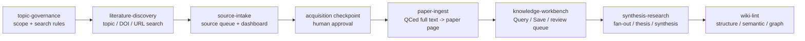

# ResearchWiki [](docs/ARCHITECTURE.md)

[繁體中文](README.zh-TW.md) | [User Guide](USER_GUIDE.md) | [Architecture](docs/ARCHITECTURE.md) | [Mode Registry](MODE_REGISTRY.md)

ResearchWiki is a GitHub-ready, skill-first LLM Wiki template for academic
research. It turns DOI/URL/PDF sources into checkable evidence, evidence into
curated wiki pages, and wiki pages into source-backed synthesis.

```text
raw/ keeps evidence
wiki/ keeps understanding
maintenance/ keeps governance
pipeline skills decide what may write where
```

> **Codex is your research database copilot, not the evidence.** Research Wiki
> lets Codex read, reflow, summarize, audit, and synthesize, but every durable
> claim must point back to files or wiki pages that can be checked later.

## Quick Start

Open Codex in this repository, or ask Codex to clone it for you, then paste:

```text
Please help me install and start Research Wiki. I do not know GitHub well.
If I do not have the repository yet, help me clone git@github.com:ChenHau-Lan/ResearchWiki.git. If I am already inside the repo, use the current folder.
Read README.md, USER_GUIDE.md, INSTALL.md, and AGENTS.md first.
Check whether Git, Python 3, ripgrep/rg, Poppler/pdftotext, and the Codex CLI are available.
If a tool is missing, explain what it is for. Ask me before using Homebrew, system installation commands, or permission-requiring steps.
After installing or confirming tools, run the repository install check for me.
When it succeeds, show me how to start with source-intake/add-source and guide me through the Skill-first illustrated quickstart.
```

The optional clickable router is:

- macOS: `ResearchWikiCodex.command`
- Windows: `ResearchWikiCodex.cmd`

You can also skip the router and talk to Codex directly by naming a skill/mode:

```text
Use source-intake/add-source for this DOI URL: https://doi.org/10.xxxx/example
```

Deterministic local commands use the CLI:

```bash
python3 tools/rw.py source add https://doi.org/10.xxxx/example
python3 tools/rw.py source search "wildfire aerosol cloud interaction" --topic-id wildfire-cloud
python3 tools/rw.py topic lint
python3 tools/rw.py wiki lint
```

## Why Research Wiki

Research material drifts easily: PDFs sit in folders, DOI lists live in chat
messages, LLM summaries remain in old sessions, and notes lose track of their
sources. Research Wiki keeps the evidence chain visible so you can later answer:

- Was this paper fully read, abstract-only, or only metadata-checked?
- Which source supports this claim?
- Is this synthesis based on peer-reviewed literature, seminar context, or a
  hypothesis?
- Can another researcher clone the repo and understand the workflow?

The goal is not full automation. The goal is **auditable human-AI research
work**: local tools handle mechanical checks, Codex handles reading-heavy work,
and the wiki preserves what was actually supported.

## Architecture & Pipeline

ResearchWiki uses seven pipeline skills. `ResearchWikiCodex.command` remains
only as a thin skill/mode router; `tools/rw.py` handles deterministic local
maintenance.



The full design lives in [Architecture](docs/ARCHITECTURE.md), and the exact
skill/mode table lives in [Mode Registry](MODE_REGISTRY.md).

## Features At A Glance

- **LLM Wiki memory**: Markdown pages compound across sessions instead of
  leaving useful discussion trapped in chat history.
- **High-automation discovery**: topic, DOI, and URL workflows can stage search
  candidates and legal-source routes.
- **Human evidence gates**: candidate PDFs stop at `pdf_checkpoint_required`
  until a human approves the route.
- **Single-paper ingest**: QCed full text becomes one concise paper page, never a
  hidden cross-paper synthesis.
- **Topic governance**: topic IDs, aliases, scope, include/exclude rules, and
  default searches keep automated discovery from drifting.
- **Question / concept / synthesis pages**: uncertainty, reusable concepts, and
  cross-source judgment are separate page types.
- **Git + Google Drive split**: Git stores public-safe wiki/code; Drive stores
  real PDFs, attachments, and large raw evidence.
- **External sandbox prompts**: generate a compact context capsule so another
  sandbox can help and propose what deserves saving back.
- **Public safety scan**: CI can catch PDFs, full text, local paths, and private
  runtime files before publishing.

## Individual Skills

### `literature-discovery`

Search from a topic, question, DOI, or URL; stage candidates; prepare legal
source routes and acquisition checkpoints. It does not write paper pages.

Common modes:

- `topic-search`
- `resolve-candidates`
- `acquire-pdf`
- `checkpoint`

### Ingest Boundary

`source-intake` and `paper-ingest` turn DOI/URL/PDF sources into checkable paper
pages. Sources enter the queue first, readable full text is QCed before it enters
`raw/full_text/`, and `paper-ingest` creates `wiki/literature/` pages.

### `source-intake`

Add DOI/URL/PDF source pointers, refresh the DOI dashboard, scan local PDFs,
detect duplicate-looking files, and create QCed full text from legal or
user-provided evidence.

Common modes:

- `add-source`
- `refresh-dashboard`
- `qced-full-text`

Example:

```text
Use source-intake/refresh-dashboard and tell me which papers already have PDF evidence, which still need legal full text, and whether duplicate-looking PDFs were found.
```

### `paper-ingest`

Turn one QCed `raw/full_text/<paper_file_key>.md` into one concise
`wiki/literature/<slug>.md` paper page. It does not acquire sources and does not
write cross-paper synthesis.

Common mode:

- `ingest-qced-full-text`

Example:

```text
Use paper-ingest/ingest-qced-full-text for raw/full_text/example_2026_journal.md. Reject the ingest if readability_status, table_quality, or equation_quality makes it unsafe.
```

### `topic-governance`

Owns `wiki/topics/topic_registry.md`, topic pages, aliases, default search
strings, and review cadence.

Common modes:

- `add-topic`
- `update-topic`
- `lint-topics`
- `topic-review`

### `knowledge-workbench`

Use the wiki without losing the read/write boundary. Query is read-only; Save is
deliberate and must choose a target layer first.

Common modes:

- `query`
- `query-to-save`
- `save`
- `review-queue`

Example:

```text
Use knowledge-workbench/query. What do we know about wildfire smoke effects on warm rain? Label evidence tier and do not write files.
```

### `synthesis-research`

Grow cross-paper understanding safely. A source that affects multiple pages
should become a fan-out candidate or review item before formal wiki updates.

Common modes:

- `fanout-review`
- `apply-approved-fanout`
- `thesis-review`
- `synthesis-page-start`
- `external-sandbox-sync`

Example:

```text
Use synthesis-research/fanout-review for wiki/literature/example_2026.md. Stage possible concept, synthesis, overview, hot-question, and supersession impacts.
```

### `wiki-lint`

Keep the LLM Wiki healthy. Use this for structure checks, semantic checks,
repair plans, and runtime graph/state exports.

Common modes:

- `structure-lint`
- `semantic-lint`
- `repair-plan`
- `state-graph`

Example:

```text
Use wiki-lint/semantic-lint to find stale claims, missing counter-evidence, and source leads.
```

## How To Use Modes

There are two equivalent ways to start a mode:

1. Ask Codex directly: `Use knowledge-workbench/query ...`
2. Open the optional router and choose a skill, then a mode.

Recommended first paper path:

```text
topic-governance/add-topic
literature-discovery/topic-search
source-intake/add-source
source-intake/refresh-dashboard
literature-discovery/checkpoint
source-intake/qced-full-text
paper-ingest/ingest-qced-full-text
knowledge-workbench/query
knowledge-workbench/query-to-save
synthesis-research/fanout-review
wiki-lint/semantic-lint
```

For illustrated step-by-step operation, use the [Skill-first illustrated quickstart](docs/manuals/research_wiki_skill_first_quickstart.en.md). For mode reference, use [USER_GUIDE.md](USER_GUIDE.md).

## Storage Model

Use Google Drive for desktop as the shared evidence root and Git as the public
wiki/code root. A typical local config is:

```bash
cp researchwiki.config.example.toml researchwiki.config.toml
```

Keep real PDFs under a Drive path such as
`Google Drive/My Drive/ResearchSync/literature/doi_pdf`. Do not use Drive's
`Computers/My Mac/My PC` backup area as the shared workspace. If old tools need
old paths, make local symlinks/junctions on each computer, but keep the real
files in Drive and keep Git free of private evidence.

## Current Release Focus

- Seven pipeline skills cover literature discovery, source intake, paper ingest,
  topic governance, knowledge workbench, synthesis research, and wiki lint.
- `knowledge-workbench` keeps read-only answers and deliberate saves separated
  by mode.
- `wiki-lint` checks structure, evidence tiers, stale claims, missing links, and
  repair leads.
- `tools/rw.py` enforces acquisition/QC gates for deterministic operations.

See [VERSION_LOG.md](VERSION_LOG.md) for the full version record.

## Outputs And Examples

- [Skill-first illustrated quickstart](docs/manuals/research_wiki_skill_first_quickstart.en.md)
- [User Guide](USER_GUIDE.md)
- [Architecture](docs/ARCHITECTURE.md)
- [LLM Wiki content brief](docs/references/llm_wiki_video_content_brief.md)

## Safety Commitments

- Do not automate unauthorized full-text acquisition.
- Do not bypass paywalls, CAPTCHA, robots, or credential barriers.
- Do not copy full articles into `wiki/`.
- Do not mark a paper `full-read` unless full text was actually read.
- Do not use recursive, wildcard, or bulk deletion commands.
- Repair plans diagnose and suggest; they do not delete files.

## More

- [User Guide](USER_GUIDE.md)
- [Skill-first illustrated quickstart](docs/manuals/research_wiki_skill_first_quickstart.en.md)
- [Pipeline Architecture](docs/guides/research_wiki_pipeline_architecture.en.md)
- [Version Log](VERSION_LOG.md)
- [Install Guide](INSTALL.md)
- [Support Guide](SUPPORT.md)
- [Agent Rules](AGENTS.md)
