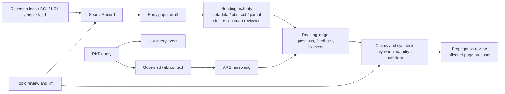

# Research Knowledge Framework

[繁體中文](README.zh-TW.md) | [Architecture](docs/ARCHITECTURE.md) | [Mode Registry](MODE_REGISTRY.md) | [Manual](docs/manuals/rkf_manual.en.md) | [Features And Commands](docs/FEATURES_AND_COMMANDS.zh-TW.md)

Research Knowledge Framework, or RKF, is an LLM Wiki-based research knowledge
framework for active academic reading. It turns sources, paper drafts, reading
interactions, human feedback, questions, claims, and synthesis into governed
long-term memory.

Current baseline: `v1.0.0`.

RKF now treats evidence as an **upgrade boundary**, not an entry gate. A paper
draft may be created early from metadata, an abstract, partial full text, or a
user-provided PDF. Stable claims, trusted synthesis, citation, and publication
still require locators, human feedback, an existing supported wiki source, or an
explicit blocker.

RKF is designed to work beside
[Academic Research Skills](https://github.com/Imbad0202/academic-research-skills):
ARS researches, reasons, writes, and reviews; RKF preserves active reading
state, human feedback, evidence boundaries, topic governance, and graph-safe
wiki memory.

```text
paper draft == active reading object
candidate != claim evidence
ARS output == proposal or reading feedback until reviewed
user feedback raises understanding maturity
stable claim -> locator, supported wiki source, human feedback, or blocker
hot.md == public-safe research demand dashboard, not evidence
```

## Quick Start

Use RKF through natural-language research requests:

- "Capture this DOI and create a paper draft even if we only have metadata."
- "Show which registered papers need my PDF or human feedback."
- "I read this paper; record my feedback and raise its trust level."
- "Ask the wiki what we know, and use ARS to reason over the retrieved context."
- "After adding this reading update, show which pages may need propagation review."
- "Review this topic registry and suggest merges, splits, stale candidates, and better search strings."
- "Run maintenance checks for reading maturity, evidence boundaries, graph links, and public safety."
- "Record this paper-search question in hot.md so topic review sees repeated demand."

## Skills At A Glance

| Skill | Purpose |
|---|---|
| `rkf-evidence-vault` | Capture sources, stage discovery, track full-text availability, and update reading artifacts |
| `rkf-knowledge-synthesis` | Maintain paper drafts, questions, concepts, claims, topics, synthesis, and reading-maturity reviews |
| `rkf-wiki-core` | Retrieve LLM Wiki context, coordinate ARS reasoning, save durable memory, show status, export graph, generate sandbox capsule |
| `rkf-lint` | Maintain structure, reading maturity, evidence boundaries, graph integrity, ARS handoff labels, public safety, and repair plans |
| `rkf-connect` | Experimental shared-database setup for multiple computers and external sandbox access |

`rkf-ars-bridge` is a protocol, not an active skill. It turns ARS output into
RKF save/review/synthesis proposals or reading feedback.

## Knowledge Flow



PDFs remain important reading artifacts, but RKF does not wait for a PDF before
it can remember that a paper exists. If full text is unavailable, RKF marks the
paper `needs-user-pdf` and pushes it into the active reading queue. Temporary
PDF text, OCR output, or browser text may help reading, but durable public pages
must keep locators, review status, maturity fields, and evidence boundaries.

## Reading Maturity

Paper pages track:

- `reading_state`: metadata-only, abstract-read, partial-fulltext, fulltext-read, human-reviewed, or mixed.
- `fulltext_status`: unknown, needs-user-pdf, user-pdf-provided, publisher-html, publisher-pdf, open-access-pdf, partial-only, fulltext-read, unavailable, or blocked.
- `human_feedback_level`: none, skimmed, discussed, annotated, or trusted.
- `understanding_confidence`: low, medium, high, or mixed.
- `claim_readiness`: not-ready, locator-needed, claim-ready, or synthesis-ready.
- `reading_ledger`: a public-safe operational record under `state/reading/`.

Synthesis pages track similar maturity through `synthesis_maturity`,
`source_coverage`, `human_feedback_level`, and `claim_readiness`.

## Active Paper Push

RKF can produce an active paper queue. It surfaces registered papers that need a
paper draft, a user-provided PDF, human feedback, locators, or synthesis review.
This makes the wiki more proactive without allowing unsupported claims to become
stable knowledge.

## Hot Research Questions

`hot.md` is the single retrieval file for recent research demand. RKF records
short public-safe query and discovery lines in this Markdown file, then
summarizes the last 30 days by topic, repeated question, paper/search lead, and
unknown-topic triage. This layer is operational memory only.

## Validation

```bash
python3 -m py_compile tools/rk.py rkf/*.py tools/public_safety_scan.py
python3 -m unittest discover -s tests
python3 tools/rk.py topic lint
python3 tools/rk.py lint
python3 tools/public_safety_scan.py
```

## Experimental: Shared Database Across Computers

Use `rkf-connect` when you want one shared research database across multiple
computers or external sandboxes. The current method is to use Google Drive for
desktop as the shared folder and keep real `raw/` and `wiki/` folders there.
Local RKF folders link to those shared folders per computer; machine-specific
links and private Drive paths do not become public source of truth.

External sandboxes get read access by default. Their useful outputs return as
reading updates, save/review proposals, or synthesis proposals unless the user
explicitly approves a write path.

## Version Management

Current release target: `v1.0.0`.

Version rules:

- `v1.x`: compatible changes to docs, skill prompts, templates, lint checks,
  examples, reading maturity, and experimental `rkf-connect` guidance.
- `v2.0`: reserved for breaking schema changes, renamed core skills, or a new
  storage contract.
- Experimental features stay labeled experimental until they have stable tests
  and migration guidance.

See [CHANGELOG.md](CHANGELOG.md) for detailed version history.
