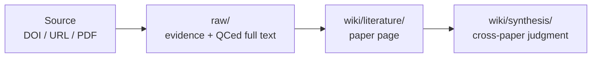

# Research Wiki

[中文快速說明](README.zh-TW.md)

Research Wiki is a GitHub-ready LLM Wiki template for academic research. It is not just a PDF folder and not just a one-off chat summary. It organizes sources, full text, paper pages, meetings, seminars, and synthesis into a version-controlled database that local tools and Codex can maintain together.

Short version:

> `raw/` keeps evidence, `wiki/` keeps understanding, commands handle mechanical work, and Codex handles reading and judgment.

## Why GitHub-Ready LLM Wiki?

Research material drifts easily: PDFs sit in folders, DOI lists live in messages, LLM summaries stay in old chats, and wiki notes often lose track of their sources. After a while, it is hard to tell whether a paper was fully read, where a claim came from, or whether another user can install and run the same workflow.

Research Wiki is designed around an evidence chain:

- Sources enter `raw/`: DOI/URL/PDF source pointers, legal PDFs, staging extraction, QCed full text, meeting transcripts, seminar slides, or other original files.
- Understanding enters `wiki/`: paper pages, synthesis pages, meeting notes, project synthesis, and seminar notes.
- GitHub manages rules and versions: README, core contracts, templates, tools, CI, and issues can all be reviewed.
- Codex is reserved for understanding-heavy work: full-text QC, reflow, paper pages, synthesis, and project discussion.

## How Research Material Enters



A paper may start from a DOI, URL, PDF URL, or local PDF. The database first turns it into a checkable evidence package in `raw/`. Only reflowed and QCed readable Markdown belongs in `raw/full_text/`, and only that full text should feed `wiki/literature/` paper pages.

PDF is an important part of the evidence package because it preserves layout, tables, equations, captions, and publisher formatting. Paper pages should not copy the whole PDF or full text; they keep reading judgment and source pointers so the evidence can be checked later.

Machine extraction may briefly live in `raw/staging/extracted_text/`; it is not official full text, is not indexed, and should not be used to create wiki pages.

## Install And Start

Required:

- Codex
- Git
- Python 3
- ripgrep (`rg`)

Recommended:

- Poppler / `pdftotext` for PDF extraction.
- Obsidian for graph browsing.
- Chrome for authenticated or authorized publisher sessions.

If you are new to GitHub, Codex can do most of the install check in one pass. Open Codex and paste:

```text
Please help me install and start Research Wiki. I do not know GitHub well.
If I do not have the repository yet, help me clone git@github.com:ChenHau-Lan/wiki_research.git. If I am already inside the repo, use the current folder.
Read README.md, USER_GUIDE.md, INSTALL.md, and AGENTS.md first.
Check whether Git, Python 3, ripgrep/rg, Poppler/pdftotext, and the Codex CLI are available.
If a tool is missing, explain what it is for. Ask me before using Homebrew, system installation commands, or permission-requiring steps.
After installing or confirming tools, run python3 tools/check_install.py --strict.
When it succeeds, tell me how to open ResearchWikiCodex.command. Do not upload private PDFs, full text, local paths, sensitive DOI lists, or Codex logs.
```

Open `ResearchWikiCodex.command` on macOS, or `ResearchWikiCodex.cmd` on Windows, when working manually. It is the canonical Codex-first launcher: local/no-token steps refresh the dashboard, scan PDFs, open source files, rebuild indexes, and prepare prompts; Codex handles source judgment, full-text QC, paper pages, synthesis, and issue discussion. See [USER_GUIDE.md](USER_GUIDE.md) for the command menu.

Use `InitializeResearchWiki.command` on macOS, or `InitializeResearchWiki.cmd` on Windows, for first-time topic setup or an explicitly confirmed local reset.

## What The Command Does

`ResearchWikiCodex.command` is the low-token / no-token entrypoint. It exists so Codex does not spend time scanning folders, renaming files, rebuilding indexes, or running diagnostics.

The command is the default interface for this data model, not the source of the database rules. It can refresh and open the dashboard, scan PDFs, hand full-text QC directly to Codex, prepare synthesis discussion pages/prompts, prepare same-computer external sandbox prompts, and prepare a Codex issue-reporting prompt. Local/no-token steps must not secretly launch Codex; Codex is for source judgment, full-text reflow/QC, paper pages, synthesis, and project discussion. Full menu details live in [USER_GUIDE.md](USER_GUIDE.md).

## Support

The easiest path is to ask Codex to prepare a redacted issue draft. Paste:

```text
Research Wiki install or execution failed. Please help me prepare a GitHub issue draft.
Read SUPPORT.md, then run python3 tools/support_report.py --issue-url.
Check maintenance/support_report.md and the generated issue URL for local paths, private PDFs, full text, sensitive DOI lists, Codex logs, and personal research state.
Do not submit the issue automatically. Give me the draft for review.
```

Manual command:

```bash
python3 tools/support_report.py --issue-url
```

It runs install, lint, and doctor checks; writes `maintenance/support_report.md`; and opens a GitHub issue draft. It redacts common private details such as local paths, DOI values, raw PDF/full-text paths, and Codex logs.

It does not submit the issue automatically. Review the draft before submitting, and make sure it does not include private PDFs, full article text, sensitive DOI lists, or personal research state.

## More

- [User Guide](USER_GUIDE.md)
- [Install Guide](INSTALL.md)
- [Support Guide](SUPPORT.md)
- [Agent Rules](AGENTS.md)
- [Current GitHub arrangement](maintenance/github_current_arrangement.md)
- [Branch strategy](maintenance/branch_strategy.md)
