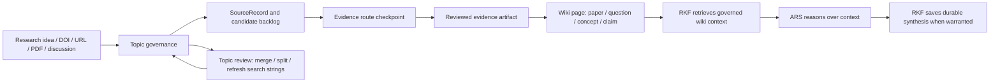

# Research Knowledge Framework

[繁體中文](README.zh-TW.md) | [Architecture](docs/ARCHITECTURE.md) | [Mode Registry](MODE_REGISTRY.md) | [Manual](docs/manuals/rkf_manual.en.md)

Research Knowledge Framework, or RKF, is an LLM Wiki-based research knowledge
framework. It turns research discussions, sources, topics, questions, claims,
and synthesis into governed long-term memory.

Current baseline: `v1.0.0`.

PDFs are important evidence carriers for paper reading, but they are not the
only source of knowledge. RKF keeps private evidence separate from public-safe
Markdown knowledge pages, and it decides what is durable enough to enter the
wiki.

RKF is designed to work beside
[Academic Research Skills](https://github.com/Imbad0202/academic-research-skills):
ARS researches, reasons, writes, and reviews; RKF preserves durable memory,
evidence boundaries, topic governance, and graph-safe wiki state.

```text
candidate != evidence
ARS output != evidence by itself
paper page -> requires reviewed source artifact, usually a QCed PDF
query answer != wiki page until saved as question, claim, or synthesis
LLM discussion -> save/review proposal
hot.md == public-safe research demand dashboard, not evidence
```

## Quick Start

Use RKF through natural-language research requests:

- "Create a topic for Taiwan atmospheric field campaigns and find related SCI papers."
- "Show which candidate papers still need a PDF or full text before ingest."
- "This PDF is legally available. Check it and turn it into a paper wiki page."
- "Ask the wiki what evidence-backed recommendations we have, and use ARS to analyze the retrieved context."
- "Save this answer as a synthesis proposal if it is reusable."
- "Show a compact RKF workspace status before we continue this research thread."
- "After adding this evidence, show which pages may need propagation review; do not rewrite them automatically."
- "Review this topic registry and suggest merges, splits, stale candidates, and better search strings."
- "Run maintenance checks for topic drift, evidence boundaries, graph links, and public safety."
- "Connect this RKF wiki to another computer or external sandbox through my shared research folder."
- "Record this paper-search question in hot.md so topic review sees what I keep asking."

## Skills At A Glance

| Skill | Purpose |
|---|---|
| `rkf-evidence-vault` | Capture sources, stage discovery, manage legal evidence routes, verify paper-reading artifacts |
| `rkf-knowledge-synthesis` | Distill reviewed evidence into paper pages and maintain questions, concepts, claims, topics, and synthesis |
| `rkf-wiki-core` | Retrieve LLM Wiki context, coordinate ARS reasoning, save durable memory, show status, export graph, generate sandbox capsule |
| `rkf-lint` | Maintain structure, evidence boundaries, graph integrity, ARS handoff labels, public safety, and repair plans |
| `rkf-connect` | Experimental shared-database setup for multiple computers and external sandbox access |

`rkf-ars-bridge` is a protocol, not an active skill. It turns ARS output into
RKF save/review/synthesis proposals.

## Worked Example

The example in
[`examples/taiwan-atmospheric-experiment`](examples/taiwan-atmospheric-experiment/)
walks through the request "I want to organize atmospheric experiments in
Taiwan": topic setup, SCI paper candidates, missing-PDF checkpoints, evidence
QC, paper wiki pages, and a synthesis answering what Taiwan should prioritize
in a future meteorological observation experiment.

## Knowledge Flow



RKF does not keep durable full article text as a public knowledge layer. Tools
may temporarily read PDF text, OCR output, or browser text to support analysis,
but saved knowledge must keep locators, review status, and evidence boundaries.

Saving is intentionally conservative. Non-paper `save` and `synthesize`
operations refuse to overwrite an existing knowledge object unless the caller
uses an explicit update path. Propagation is also proposal-first: RKF can list
affected pages and write a review gate, but it does not silently rewrite stable
knowledge pages.

## Hot Research Questions

`hot.md` is the single retrieval file for recent research demand. RKF records
short public-safe query and discovery lines in this Markdown file, then
summarizes the last 30 days by topic, repeated question, paper/search lead, and
unknown-topic triage.

This layer is operational memory only: it helps decide which topics need review,
which searches are recurring, and where new topic proposals may be needed. It
does not count as evidence and does not promote claims. External sandboxes
should return hot-query proposals or record through RKF hot-query behavior; do
not create separate hot-query files.

## Validation

```bash
python3 -m py_compile tools/rk.py rkf/*.py tools/public_safety_scan.py
python3 -m unittest discover -s tests
python3 tools/rk.py topic lint
python3 tools/rk.py lint
python3 tools/public_safety_scan.py
```

## Experimental: Shared Database Across Computers

This workflow is intentionally experimental and belongs at the edge of RKF,
not in the basic onboarding path. Use `rkf-connect` when you want one shared
research database across multiple computers or external sandboxes.

The current method is to use Google Drive for desktop as the shared folder. Put
the real shared data under one Drive location, for example:

```text
<Drive ResearchSync>/
  raw/
  wiki/
    index.md
    log.md
    hot.md
    knowledge/
    state/
    governance/
    graph/
```

Then each computer links those Drive folders into its local RKF project folder
with that operating system's local link mechanism: `ln` or symlink on macOS and
Linux, junction/symlink on Windows. The Drive folder stores the real raw and
wiki files; the local RKF folder only connects to them. Do not commit
machine-specific links or private Drive paths as the public source of truth.

When `storage.wiki_root` is configured, RKF treats that folder as the active
wiki database. Runtime paths for `knowledge`, `state`, `governance`, and
`graph` resolve under that shared folder. `index.md` is the compact LLM
retrieval entrypoint, and `log.md` is the append-only operation trail used for
cross-session continuity. `hot.md` is the rolling public-safe question dashboard
and retrieval record.

External sandbox access should be read-only by default. For read-only use, run
`python3 tools/rk.py prompt external-sandbox` to generate the local context
capsule, then paste `prompts/external_sandbox_bootstrap.en.md` or
`prompts/external_sandbox_bootstrap.zh-TW.md` into the other sandbox as its
startup instructions.

A trusted research sandbox can also receive the RKF repo as a writable workspace
and operate through the RKF CLI directly. This does not skip governance: paper
intake still follows `capture -> acquire -> verify-pdf -> distill`. Search
results are candidates, not evidence; without a legal artifact, PDF/OCR/visual
QC, and locator notes, the sandbox must not create a stable paper wiki page.

When a sandbox lacks write access, or when topic fit, PDF QC, locators, or claim
support are incomplete, it should return an RKF save/review proposal with the
evidence boundary and let RKF decide whether to save stable wiki knowledge.

## Version Management

Current release target: `v1.0.0`.

Version rules:

- `v1.x`: compatible changes to docs, skill prompts, templates, lint checks,
  examples, and experimental `rkf-connect` guidance.
- `v2.0`: reserved for breaking schema changes, renamed core skills, or a new
  storage contract.
- Experimental features stay labeled experimental until they have stable tests
  and migration guidance.

See [CHANGELOG.md](CHANGELOG.md) for detailed version history.
