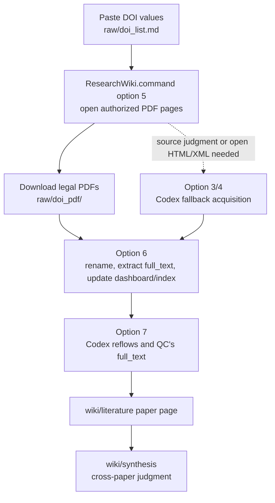
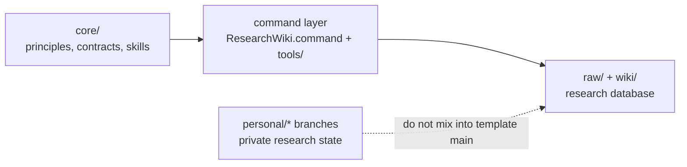

# Research Wiki

[中文快速說明](README.zh-TW.md)

Research Wiki is a GitHub-ready LLM Wiki template for academic reading. It helps you turn DOI lists, legal PDFs, extracted full text, paper notes, meetings, seminars, and synthesis pages into a maintainable research database.

Short version:

> Let local commands handle mechanical maintenance. Keep evidence in `raw/`. Use Codex only when reading, judgment, and writing are needed.

## The Main Flow



The default path is PDF-first. Do not spend a long Codex session chasing blocked downloads when a legal browser download is available. Use Codex where it pays off: full-text QC, paper-note writing, synthesis, and research discussion.

## New To GitHub?

Open Codex and paste:

```text
Please help me use this Research Wiki repository. I do not know GitHub well.
Read README.md, README.zh-TW.md, core/README.md, USER_GUIDE.md, and AGENTS.md.
Then run python3 tools/check_install.py.
Tell me what is missing and what I should do next. Do not upload private PDFs, full text, local paths, or Codex logs.
```

Then follow the answer. The usual path is:

1. Open `ResearchWiki.command`.
2. Add DOI values with option 1.
3. Open legal PDF pages with option 5.
4. Put PDFs in `raw/doi_pdf/`.
5. Run option 6 to extract and index full text.
6. Run option 7 so Codex can QC the text and write paper pages.

## Layers



- `core/` is the source of truth for rules.
- `ResearchWiki.command` and `tools/` implement those rules.
- `raw/` is the evidence layer.
- `wiki/` is the curated knowledge layer.
- `maintenance/` stores diagnostics, repair plans, release notes, and branch notes.
- `personal/*` branches are for private research state.

If command behavior and `core/` disagree, follow `core/` and open an issue.

## Support Reports

If something breaks, run:

```bash
python3 tools/support_report.py --issue-url
```

It runs install/lint/doctor checks, writes `maintenance/support_report.md`, redacts local paths, DOI values, raw PDF/full-text paths, and Codex logs, then opens a prefilled GitHub issue URL.

It does **not** submit the issue automatically. Review the draft before submitting.

## Editing AGENTS.md

`AGENTS.md` changes how future Codex sessions behave. Do not use it as a scratchpad.

- Temporary test notes belong in `maintenance/` or an issue.
- Core rule changes should start in `core/agent_contract.md` or `core/data_contract.md`, then be summarized in `AGENTS.md`.
- Command details belong in `USER_GUIDE.md` or command prompts.
- Personal preferences belong on `personal/*` branches.

Changes to `AGENTS.md` should go through a PR.

## Useful Checks

```bash
python3 tools/check_install.py
python3 tools/wiki_lint.py
python3 tools/wiki_doctor.py
python3 tools/generate_repair_plan.py
python3 tools/support_report.py --issue-url
```

Repair plans are advisory; they do not delete files.

## Test Reset

Use `InitializeResearchWiki.command` only when you intentionally want a clean local test database. It asks for `INIT TEST DATABASE`, then clears scoped test evidence and generated pages while keeping tools, templates, skills, docs, topic registry, and Obsidian settings.

## More

- [User Guide](USER_GUIDE.md)
- [Install Guide](INSTALL.md)
- [Support Guide](SUPPORT.md)
- [Agent Rules](AGENTS.md)
- [Current GitHub arrangement](maintenance/github_current_arrangement.md)
- [Branch strategy](maintenance/branch_strategy.md)
