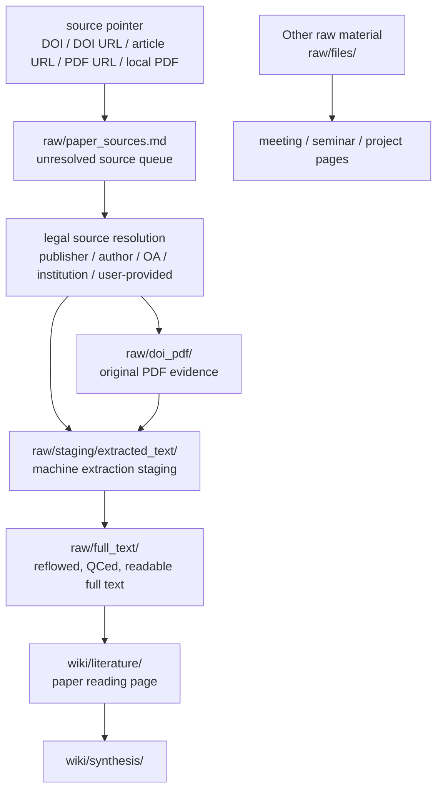
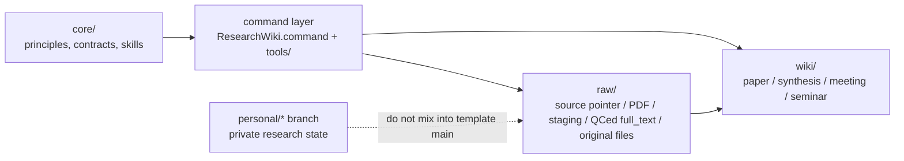

# Research Wiki

[中文快速說明](README.zh-TW.md)

Research Wiki is a GitHub-ready LLM Wiki template for academic research. It is not just a PDF folder and not just a one-off chat summary. It organizes sources, full text, paper pages, meetings, seminars, and synthesis into a version-controlled database that local tools and Codex can maintain together.

Short version:

> `raw/` keeps evidence, `wiki/` keeps understanding, commands handle mechanical work, and Codex handles reading and judgment.

## Why GitHub-Ready LLM Wiki?

Research material drifts easily: PDFs sit in folders, DOI lists live in messages, LLM summaries stay in old chats, and wiki notes often lose track of their sources. After a while, it is hard to tell whether a paper was fully read, where a claim came from, or whether another user can install and run the same workflow.

Research Wiki is designed around an evidence chain:

- Sources enter `raw/`: DOI/URL/PDF source pointers, legal PDFs, staging extraction, QCed full text, meeting transcripts, seminar slides, or other original files.
- Understanding enters `wiki/`: paper pages, synthesis pages, meeting notes, project synthesis, and seminar notes.
- GitHub manages rules and versions: README, core contracts, templates, tools, CI, and issues can all be reviewed.
- Codex is reserved for understanding-heavy work: full-text QC, reflow, paper pages, synthesis, and project discussion.

## How Research Material Enters



A paper may start from a DOI, URL, PDF URL, or local PDF. Those are source pointers first; the database resolves them into a legal evidence package, preserves the PDF or original source, and puts machine extraction into staging. Only reflowed and QCed readable Markdown belongs in `raw/full_text/`, and only that full text should feed `wiki/literature/` paper pages.

PDF is an important part of the evidence package because it preserves layout, tables, equations, captions, and publisher formatting. Paper pages should not copy the whole PDF or full text; they keep reading judgment and source pointers so the evidence can be checked later.

## Install And Start

Required:

- Codex
- Git
- Python 3
- ripgrep (`rg`)

Recommended:

- Poppler / `pdftotext` for PDF extraction.
- Obsidian for graph browsing.
- Chrome for authenticated or authorized publisher sessions.

If you are new to GitHub, open Codex and paste:

```text
Please help me use this Research Wiki repository. I do not know GitHub well.
Read README.md, README.zh-TW.md, core/README.md, USER_GUIDE.md, and AGENTS.md.
Then run python3 tools/check_install.py.
Tell me what is missing and what I should do next. Do not upload private PDFs, full text, local paths, or Codex logs.
```

Open `ResearchWiki.command` when working manually. It can help add source pointers, open legal source pages, import evidence, create QCed full text, and then turn full text into paper pages. See [USER_GUIDE.md](USER_GUIDE.md) for the command menu.

## What The Command Does

`ResearchWiki.command` is the low-token / no-token entrypoint. It exists so Codex does not spend time scanning folders, renaming files, rebuilding indexes, or running diagnostics.

The command is the default interface for this data model, not the source of the database rules. It handles source intake, legal source-page opening, PDF/evidence import, staging extraction, Codex full-text QC, wiki ingest, health checks, and support issue drafts. Full menu details live in [USER_GUIDE.md](USER_GUIDE.md).

## Data Layers



- `core/` is the source of truth for rules.
- `raw/` is the evidence layer: source pointers, PDFs, staging text, QCed full text, and original files.
- `wiki/` is the curated knowledge layer.
- `maintenance/` stores diagnostics, repair plans, release notes, and branch notes.
- `personal/*` branches are for private research state.

If command behavior and `core/` disagree, follow `core/`.

## Support

Run:

```bash
python3 tools/support_report.py --issue-url
```

It runs install, lint, and doctor checks; writes `maintenance/support_report.md`; and opens a GitHub issue draft. It redacts common private details such as local paths, DOI values, raw PDF/full-text paths, and Codex logs.

It does not submit the issue automatically. Review the draft before submitting, and make sure it does not include private PDFs, full article text, sensitive DOI lists, or personal research state.

## More

- [User Guide](USER_GUIDE.md)
- [Install Guide](INSTALL.md)
- [Support Guide](SUPPORT.md)
- [Agent Rules](AGENTS.md)
- [Current GitHub arrangement](maintenance/github_current_arrangement.md)
- [Branch strategy](maintenance/branch_strategy.md)
