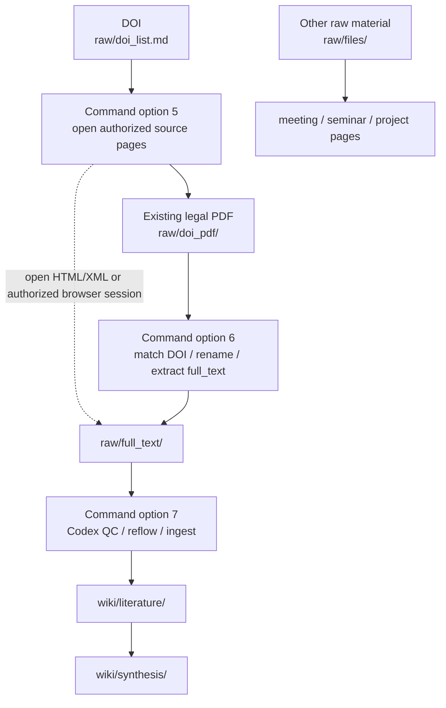
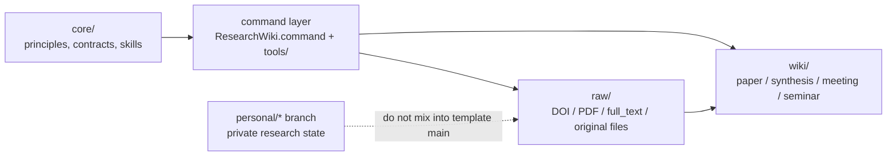

# Research Wiki

[中文快速說明](README.zh-TW.md)

Research Wiki is a GitHub-ready LLM Wiki template for academic research. It is not just a PDF folder and not just a one-off chat summary. It organizes sources, full text, paper pages, meetings, seminars, and synthesis into a version-controlled database that local tools and Codex can maintain together.

Short version:

> `raw/` keeps evidence, `wiki/` keeps understanding, commands handle mechanical work, and Codex handles reading and judgment.

## Why GitHub-Ready LLM Wiki?

Research material drifts easily: PDFs sit in folders, DOI lists live in messages, LLM summaries stay in old chats, and wiki notes often lose track of their sources. After a while, it is hard to tell whether a paper was fully read, where a claim came from, or whether another user can install and run the same workflow.

Research Wiki is designed around an evidence chain:

- Sources enter `raw/`: DOI values, legal PDFs, publisher HTML/XML text, meeting transcripts, seminar slides, or other original files.
- Understanding enters `wiki/`: paper pages, synthesis pages, meeting notes, project synthesis, and seminar notes.
- GitHub manages rules and versions: README, core contracts, templates, tools, CI, and issues can all be reviewed.
- Codex is reserved for understanding-heavy work: full-text QC, reflow, paper pages, synthesis, and project discussion.

## How Research Material Enters



A PDF is a source, and an important one. It preserves layout, tables, equations, captions, and publisher formatting. `raw/full_text/*.md` is the readable text extracted from a PDF or another legal full-text source, used for Codex QC and wiki ingest. Paper pages should not copy the whole PDF or full text; they keep source pointers so the evidence can be checked later.

## Install And Start

Required:

- Codex
- Git
- Python 3
- ripgrep (`rg`)

Recommended:

- Poppler / `pdftotext` for PDF extraction.
- Obsidian for graph browsing.
- Chrome for authenticated or authorized publisher sessions.

If you are new to GitHub, open Codex and paste:

```text
Please help me use this Research Wiki repository. I do not know GitHub well.
Read README.md, README.zh-TW.md, core/README.md, USER_GUIDE.md, and AGENTS.md.
Then run python3 tools/check_install.py.
Tell me what is missing and what I should do next. Do not upload private PDFs, full text, local paths, or Codex logs.
```

Typical manual workflow:

1. Open `ResearchWiki.command`.
2. Use option 1 to add DOI values, or put an existing legal PDF in `raw/doi_pdf/`.
3. Use option 5 to open legal source pages and download PDFs.
4. Use option 6 to import PDFs, extract full text, and update the dashboard/index.
5. Use option 7 so Codex can QC full text and create paper pages.

## What The Command Does

`ResearchWiki.command` is the low-token / no-token entrypoint. It exists so Codex does not spend time scanning folders, renaming files, rebuilding indexes, or running diagnostics.

Common items:

- Option 1: add or open the DOI list.
- Option 5: open DOI / publisher pages so you can download legal PDFs.
- Option 6: import PDFs from `raw/doi_pdf/`, rename them canonically, extract `raw/full_text/`, and update dashboard/index files.
- Option 7: hand QC, reflow, and wiki ingest to Codex.
- Options 11 / 12: run health checks and repair plans; diagnose only, no automatic deletion.
- Option 13: prepare a redacted GitHub issue draft.

## Data Layers



- `core/` is the source of truth for rules.
- `raw/` is the evidence layer: DOI values, PDFs, full text, and original files.
- `wiki/` is the curated knowledge layer.
- `maintenance/` stores diagnostics, repair plans, release notes, and branch notes.
- `personal/*` branches are for private research state.

If command behavior and `core/` disagree, follow `core/`.

## Support

Run:

```bash
python3 tools/support_report.py --issue-url
```

It runs install, lint, and doctor checks; writes `maintenance/support_report.md`; and opens a GitHub issue draft. It redacts common private details such as local paths, DOI values, raw PDF/full-text paths, and Codex logs.

It does not submit the issue automatically. Review the draft before submitting, and make sure it does not include private PDFs, full article text, sensitive DOI lists, or personal research state.

## More

- [User Guide](USER_GUIDE.md)
- [Install Guide](INSTALL.md)
- [Support Guide](SUPPORT.md)
- [Agent Rules](AGENTS.md)
- [Current GitHub arrangement](maintenance/github_current_arrangement.md)
- [Branch strategy](maintenance/branch_strategy.md)
