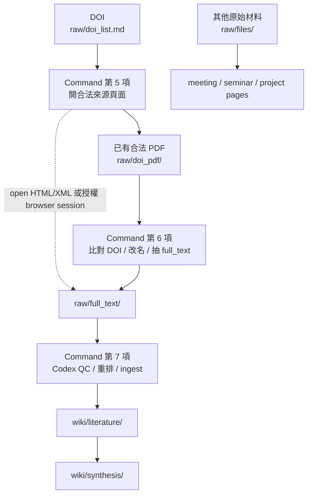
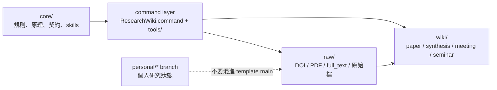

# Research Wiki：把研究材料變成可維護的 LLM Wiki

[English README](README.md)

Research Wiki 是一個 GitHub-ready LLM Wiki 研究資料庫模板。它不是單純放 PDF 的資料夾，也不是一次性的聊天摘要；它把文獻來源、全文、閱讀頁、meeting、seminar 和 synthesis 放進同一個可以版本控制、可以診斷、可以交給 Codex 協作的資料庫。

一句話版：

> `raw/` 保留證據，`wiki/` 保存理解，command 處理機械整理，Codex 處理閱讀與判斷。

## 為什麼要用 GitHub-ready LLM Wiki

研究資料很容易散掉：PDF 在資料夾、DOI 在訊息裡、LLM 摘要在另一個聊天視窗、Obsidian 筆記又不知道對應哪個來源。時間一久，很難知道「這篇到底讀完了嗎」、「這個判斷是從哪篇來的」、「這份資料能不能交給別人安裝使用」。

Research Wiki 的目標是讓研究資料有清楚的 evidence chain：

- 來源先進 `raw/`：DOI、合法 PDF、publisher HTML/XML 抽出的全文、meeting transcript、seminar slides 或其他原始檔。
- 理解再進 `wiki/`：paper page、synthesis、meeting note、project synthesis、seminar note。
- GitHub 管規則與版本：README、core contract、templates、tools、CI、issue 都可以 review。
- Codex 只做需要理解的事：全文 QC、重排、paper page、跨文獻判斷、project discussion。

## 研究材料如何進入資料庫



PDF 是來源，而且是很重要的原始 evidence。它保留版面、表格、公式、圖說與出版格式；`raw/full_text/*.md` 則是從 PDF 或合法全文來源整理出的可讀文字，給 Codex 做 QC 與 wiki ingest。Paper page 不複製整篇全文，而是保留來源指標，讓你可以回查 PDF 或 full text。

## 安裝與開始使用

需要的基本工具：

- Codex
- Git
- Python 3
- ripgrep (`rg`)

建議工具：

- Poppler / `pdftotext`：從 PDF 抽文字。
- Obsidian：看 wiki graph。
- Chrome：用已登入或已授權的 browser session 打開 publisher 頁面。

如果你不熟 GitHub，打開 Codex，把這段貼給它：

```text
請幫我使用這個 Research Wiki repository。我不熟 GitHub。
請先讀 README.zh-TW.md、core/README.md、USER_GUIDE.zh-TW.md、AGENTS.md，
然後執行 python3 tools/check_install.py。
請用中文告訴我缺什麼工具、下一步要做什麼；不要上傳 private PDF、全文、local path 或 Codex logs。
```

自己手動操作時，通常是：

1. 打開 `ResearchWiki.command`。
2. 選第 1 項，把 DOI 貼進 `raw/doi_list.md`；或直接把合法 PDF 放進 `raw/doi_pdf/`。
3. 選第 5 項，從合法頁面下載 PDF。
4. 選第 6 項，讓本地工具整理 PDF、抽 full text、更新 dashboard/index。
5. 選第 7 項，讓 Codex QC full text 並產生 paper page。

## Command 的用意

`ResearchWiki.command` 是低 token / 無 token 的操作入口。它的重點不是取代 Codex，而是讓 Codex 不要浪費在掃資料夾、改檔名、重建索引這些機械工作上。

常用項目：

- 第 1 項：加入或打開 DOI list。
- 第 5 項：開啟 DOI / publisher 頁面，協助你下載合法 PDF。
- 第 6 項：匯入 `raw/doi_pdf/` 裡的 PDF，改成 canonical 檔名，抽出 `raw/full_text/`，更新 dashboard 和 index。
- 第 7 項：交給 Codex 做 full text QC、重排與 wiki ingest。
- 第 11 / 12 項：做健康檢查與 repair plan，只診斷，不自動刪檔。
- 第 13 項：產生遮蔽過的 GitHub issue 草稿。

## 資料分層



- `core/`：資料庫規則。若 command 和 core 衝突，以 core 為準。
- `raw/`：證據層，包含 DOI、PDF、full text 與其他原始檔。
- `wiki/`：知識層，保存經過整理的閱讀與研究判斷。
- `maintenance/`：診斷、repair plan、release、branch 說明。
- `personal/*`：個人研究狀態，不應直接混進可發布模板。

## 遇到問題

執行：

```bash
python3 tools/support_report.py --issue-url
```

它會跑安裝檢查、lint、doctor，產生 `maintenance/support_report.md`，並開 GitHub issue 草稿。它會遮蔽常見 private 資訊，例如本機路徑、DOI、raw PDF/full_text 路徑與 Codex logs。

它不會自動送出 issue。送出前，請人工確認草稿沒有 private PDF、全文、敏感 DOI 清單或個人研究狀態。

## 更多文件

- [使用指南](USER_GUIDE.zh-TW.md)
- [安裝指南](INSTALL.zh-TW.md)
- [支援回報](SUPPORT.zh-TW.md)
- [Agent 規則](AGENTS.md)
- [目前 GitHub branch 安排](maintenance/github_current_arrangement.md)
- [Branch strategy](maintenance/branch_strategy.md)
