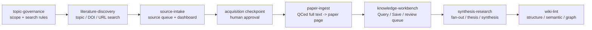

# ResearchWiki [](docs/ARCHITECTURE.md)

[English](README.md) | [使用指南](USER_GUIDE.zh-TW.md) | [Architecture](docs/ARCHITECTURE.md) | [Mode Registry](MODE_REGISTRY.md)

Research Wiki 是一個 GitHub-ready、skill-first 的 LLM Wiki 研究資料庫模板。它把 DOI/URL/PDF 來源變成可回查證據，把證據變成整理後 wiki，再把 wiki 變成有來源支撐的 synthesis。

```text
raw/ 保存證據
wiki/ 保存理解
maintenance/ 保存治理
pipeline skills 決定什麼 mode 可以寫到哪裡
```

> **Codex 是你的研究資料庫副駕駛，不是證據本身。** Research Wiki 讓
> Codex 協助閱讀、重排、摘要、稽核與 synthesis，但每個值得保存的 claim
> 都必須能回到可檢查的檔案或 wiki page。

## 快速開始

在這個 repo 打開 Codex；如果還沒有 repo，也可以請 Codex 幫你 clone。然後貼上：

```text
請幫我安裝並啟動 Research Wiki。我不熟 GitHub。
如果我還沒有 repository，請協助 clone git@github.com:ChenHau-Lan/ResearchWiki.git；如果已在 repo 中，請直接使用目前目錄。
請先讀 README.zh-TW.md、USER_GUIDE.zh-TW.md、INSTALL.zh-TW.md、AGENTS.md。
請檢查 Git、Python 3、ripgrep/rg、Poppler/pdftotext、Codex CLI 是否可用。
如果缺工具，請先說明用途；需要 Homebrew、系統安裝或權限時先問我再執行。
安裝或確認後，請替我執行 repository install check。
成功後請告訴我怎麼用 source-intake/add-source 開始，並帶我看 Skill-first 圖文快速開始。
```

可選的點擊式 router：

- macOS：`ResearchWikiCodex.command`
- Windows：`ResearchWikiCodex.cmd`

你也可以不開 router，直接在 Codex 指定 skill/mode：

```text
Use source-intake/add-source for this DOI URL: https://doi.org/10.xxxx/example
```

本機 deterministic commands 使用 CLI：

```bash
python3 tools/rw.py source add https://doi.org/10.xxxx/example
python3 tools/rw.py source search "wildfire aerosol cloud interaction" --topic-id wildfire-cloud
python3 tools/rw.py topic lint
python3 tools/rw.py wiki lint
```

## 為什麼需要 Research Wiki

研究材料很容易散掉：PDF 在資料夾、DOI 在聊天訊息、LLM 摘要在舊 session、筆記又慢慢失去來源脈絡。Research Wiki 讓 evidence chain 保持可見，讓你之後仍能回答：

- 這篇 paper 是 full-read、abstract-only，還是只確認 metadata？
- 哪個 source 支撐這個 claim？
- 這個 synthesis 是根據 peer-reviewed literature、seminar context，還是假說？
- 另一位研究者 clone repo 後能不能理解 workflow？

目標不是全自動化。目標是 **可稽核的人機協作研究**：local tools 處理機械檢查，Codex 處理需要閱讀理解的工作，而 wiki 保存真正有來源支撐的內容。

## Architecture & Pipeline

ResearchWiki 使用七個 pipeline skills。`ResearchWikiCodex.command` 只保留為薄 skill/mode router；`tools/rw.py` 負責 deterministic local maintenance。



完整設計在 [Architecture](docs/ARCHITECTURE.md)，skill/mode 矩陣在 [Mode Registry](MODE_REGISTRY.md)。

## 功能特色

- **LLM Wiki memory**：把值得保留的討論結果存成 Markdown，而不是讓它留在舊 chat。
- **高自動化 discovery**：topic、DOI、URL workflow 可建立 search candidates 與合法 source routes。
- **人工 evidence gates**：candidate PDFs 必須停在 `pdf_checkpoint_required`，核准後才可當 evidence。
- **Topic governance**：topic ID、aliases、scope、include/exclude rules 與 default searches 防止搜尋漂移。
- **Question / concept / synthesis pages**：把 uncertainty、概念與跨文獻判斷分開管理。
- **Git + Google Drive 分層**：Git 存 public-safe wiki/code；Drive 存 PDFs、attachments、大型 raw evidence。
- **External sandbox prompts**：產生 context capsule，讓其他 sandbox 可以協助並把值得保留的結果提回 Save。

## Individual Skills

### `literature-discovery`

從 topic、question、DOI 或 URL 搜尋候選文獻、建立合法 source routes 與 acquisition checkpoints。它不建立 paper page。

常用 modes：

- `topic-search`
- `resolve-candidates`
- `acquire-pdf`
- `checkpoint`

### Ingest Boundary

`source-intake` 與 `paper-ingest` 把 DOI/URL/PDF 來源整理成可查證的 paper page。來源先進 queue，合法或使用者可用的全文經 QC 後才進 `raw/full_text/`，再由 `paper-ingest` 建立 `wiki/literature/`。

### `source-intake`

加入 DOI/URL/PDF source pointers、刷新 DOI dashboard、掃描本機 PDFs、偵測 duplicate-looking files，並從合法或使用者提供的 evidence 建立 QC 後全文。

常用 modes：

- `add-source`
- `refresh-dashboard`
- `qced-full-text`

範例：

```text
Use source-intake/refresh-dashboard and tell me which papers already have PDF evidence, which still need legal full text, and whether duplicate-looking PDFs were found.
```

### `paper-ingest`

把一個 QC 後 `raw/full_text/<paper_file_key>.md` 變成一個精簡的 `wiki/literature/<slug>.md` paper page。它不取得來源，也不寫跨文獻 synthesis。

常用 mode：

- `ingest-qced-full-text`

範例：

```text
Use paper-ingest/ingest-qced-full-text for raw/full_text/example_2026_journal.md. Reject the ingest if readability_status, table_quality, or equation_quality makes it unsafe.
```

### `topic-governance`

管理 `wiki/topics/topic_registry.md`、topic pages、aliases、default search strings 與 review cadence。

常用 modes：

- `add-topic`
- `update-topic`
- `lint-topics`
- `topic-review`

### `knowledge-workbench`

在不混淆 read/write 邊界的前提下使用 wiki。Query 只讀不寫；Save 是 deliberate write，必須先選 target layer。

常用 modes：

- `query`
- `query-to-save`
- `save`
- `review-queue`

範例：

```text
Use knowledge-workbench/query. What do we know about wildfire smoke effects on warm rain? Label evidence tier and do not write files.
```

### `synthesis-research`

安全擴展跨文獻理解。一個 source 若會影響多個頁面，應先變成 fan-out candidate 或 review item，再進正式 wiki update。

常用 modes：

- `fanout-review`
- `apply-approved-fanout`
- `thesis-review`
- `synthesis-page-start`
- `external-sandbox-sync`

範例：

```text
Use synthesis-research/fanout-review for wiki/literature/example_2026.md. Stage possible concept, synthesis, overview, hot-question, and supersession impacts.
```

### `wiki-lint`

維持 LLM Wiki 的健康狀態。用於結構檢查、語義檢查、repair plan 與 runtime graph/state export。

常用 modes：

- `structure-lint`
- `semantic-lint`
- `repair-plan`
- `state-graph`

範例：

```text
Use wiki-lint/semantic-lint to find stale claims, missing counter-evidence, and source leads.
```

## 如何啟動不同 Modes

兩種方式等價：

1. 直接問 Codex：`Use knowledge-workbench/query ...`
2. 打開可選 router，先選 skill，再選 mode。

推薦第一篇 paper 路徑：

```text
topic-governance/add-topic
literature-discovery/topic-search
source-intake/add-source
source-intake/refresh-dashboard
literature-discovery/checkpoint
source-intake/qced-full-text
paper-ingest/ingest-qced-full-text
knowledge-workbench/query
knowledge-workbench/query-to-save
synthesis-research/fanout-review
wiki-lint/semantic-lint
```

完整圖文操作請看 [Skill-first 圖文快速開始](docs/manuals/research_wiki_skill_first_quickstart.zh-TW.md)；mode reference 請看 [USER_GUIDE.zh-TW.md](USER_GUIDE.zh-TW.md)。

## Storage Model

跨 Mac/Windows 共用時，使用 Google Drive for desktop 作 evidence root，Git 作 public wiki/code root：

```bash
cp researchwiki.config.example.toml researchwiki.config.toml
```

真實 PDF 建議放在 `Google Drive/My Drive/ResearchSync/literature/doi_pdf`。不要把 Drive 的 `Computers/My Mac/My PC` 備份區當共同工作區。若舊軟體需要舊路徑，在每台電腦本機建立 symlink/junction；Drive 裡放真實檔案，Git 不放 private evidence。

## 目前版本重點

- 七個 pipeline skills 覆蓋 literature discovery、source intake、paper ingest、topic governance、knowledge workbench、synthesis research 與 wiki lint。
- `knowledge-workbench` 用 mode 分開 read-only answer 與 deliberate save。
- `wiki-lint` 檢查結構、evidence tier、過期 claim、缺失連結與修復線索。
- `tools/rw.py` 負責 deterministic acquisition/QC gates。

完整版本紀錄見 [VERSION_LOG.zh-TW.md](VERSION_LOG.zh-TW.md)。

## 產出與範例

- [Skill-first 圖文快速開始](docs/manuals/research_wiki_skill_first_quickstart.zh-TW.md)
- [使用指南](USER_GUIDE.zh-TW.md)
- [Architecture](docs/ARCHITECTURE.md)
- [LLM Wiki content brief](docs/references/llm_wiki_video_content_brief.md)

## 安全承諾

- 不自動化未授權全文取得。
- 不繞過 paywall、CAPTCHA、robots 或 credential barriers。
- 不把完整 article 複製進 `wiki/`。
- 沒有真的讀完 full text，不可標 `full-read`。
- 不使用 recursive、wildcard 或批量刪除命令。
- Repair plans 只診斷與建議，不刪除檔案。

## 更多文件

- [使用指南](USER_GUIDE.zh-TW.md)
- [Skill-first 圖文快速開始](docs/manuals/research_wiki_skill_first_quickstart.zh-TW.md)
- [Pipeline Architecture](docs/guides/research_wiki_pipeline_architecture.zh-TW.md)
- [版本紀錄](VERSION_LOG.zh-TW.md)
- [安裝指南](INSTALL.zh-TW.md)
- [支援回報](SUPPORT.zh-TW.md)
- [Agent 規則](AGENTS.md)
