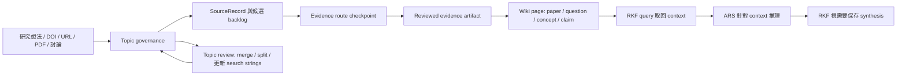

# Research Knowledge Framework

[English](README.md) | [Architecture](docs/ARCHITECTURE.md) | [Mode Registry](MODE_REGISTRY.md) | [手冊](docs/manuals/rkf_manual.zh-TW.md)

Research Knowledge Framework，簡稱 RKF，是一個以 LLM Wiki 為核心的研究知識框架。
它把研究討論、文獻、topic、question、claim、synthesis 變成可治理、可查詢、
可累積的長期記憶。

目前基準版本：`v1.0.0`。

PDF 是 paper 閱讀時最常見、最強的 evidence carrier，但不是唯一源頭。RKF 會把
private evidence 和 public-safe Markdown knowledge pages 分開，並判斷哪些結果
值得進入 wiki。

RKF 可以和 [Academic Research Skills](https://github.com/Imbad0202/academic-research-skills) 搭配：
ARS 負責研究、推理、寫作與審查；RKF 負責長期記憶、evidence boundary、topic
governance 與 graph-safe wiki state。

```text
candidate != evidence
ARS output 本身 != evidence
paper page -> 需要 reviewed source artifact，通常是 QCed PDF
query answer != wiki page，除非保存成 question / claim / synthesis
LLM discussion -> save/review proposal
```

## 快速開始

日常使用時用自然語言要求 RKF：

- 「建立台灣大氣觀測實驗 topic，找相關 SCI paper。」
- 「列出哪些候選文獻還缺 PDF 或全文，讓我先取得資料。」
- 「這份 PDF 是合法取得的，請檢查並整理成 paper wiki page。」
- 「問知識庫目前有哪些 evidence-backed recommendations，並用 ARS 分析取回的脈絡。」
- 「如果這個回答值得長期保存，請轉成 synthesis proposal。」
- 「定期整理這個 topic registry，建議 merge、split、過期候選與新的 search strings。」
- 「做一次 topic drift、evidence boundary、graph link、public safety 維護檢查。」
- 「把這個 RKF wiki 連到另一台電腦或外部 sandbox 的共享研究資料夾。」

## Skills At A Glance

| Skill | 目的 |
|---|---|
| `rkf-evidence-vault` | Capture sources、discovery、合法 evidence route、paper-reading artifact QC |
| `rkf-knowledge-synthesis` | 從 reviewed evidence 建立 paper page，維護 question/concept/claim/topic/synthesis |
| `rkf-wiki-core` | 取回 LLM Wiki context、銜接 ARS reasoning、保存 durable memory、graph、sandbox capsule |
| `rkf-lint` | 維護 structure、evidence boundary、graph、ARS handoff、public safety、repair plan |
| `rkf-connect` | 實驗性的多電腦共享資料庫、Drive 連結與外部 sandbox 存取管理 |

`rkf-ars-bridge` 是 protocol，不是 active skill。它把 ARS output 轉成 RKF
save/review/synthesis proposal。

## 實作範例

[`examples/taiwan-atmospheric-experiment`](examples/taiwan-atmospheric-experiment/)
示範「我想整理在台灣的大氣實驗」：建立 topic、搜尋 SCI paper、缺 PDF
checkpoint、evidence QC、paper wiki pages，以及針對「未來台灣要做氣象觀測實驗的
建議」建立 synthesis。

## Knowledge Flow



RKF 不把 durable full article text 當作 public knowledge layer。工具可以暫時讀取
PDF text、OCR output 或 browser text 來協助分析，但保存下來的知識必須保留
locator、review status 與 evidence boundary。

## 驗證

```bash
python3 -m py_compile tools/rk.py rkf/*.py tools/public_safety_scan.py
python3 -m unittest discover -s tests
python3 tools/rk.py topic lint
python3 tools/rk.py lint
python3 tools/public_safety_scan.py
```

## 實驗項目：建立共享資料庫在不同電腦

這個流程是實驗性功能，放在 RKF 的邊緣層，不放在最基本的入門流程。當你想讓多台
電腦或外部 sandbox 共用同一份研究資料庫時，使用 `rkf-connect`。

目前建議的方法是使用 Google Drive for desktop 作為共享資料夾。真正共享的資料放在
同一個 Drive 位置，例如：

```text
<Drive ResearchSync>/
  RAW/
  wiki/
```

每台電腦再用該作業系統適合的本機連結方式，把 Drive 裡的 `RAW` 和 `wiki` 連到本機
RKF 專案資料夾：macOS/Linux 可用 `ln` 或 symlink，Windows 可用 junction/symlink。
Drive 裡放真實 RAW 與 wiki 檔案；本機 RKF 資料夾只負責連接它們。不要把每台電腦
自己的 link 或 private Drive path commit 成 public source of truth。

外部 sandbox 預設只給讀取權限。若只需要查詢或提出想法，使用
`python3 tools/rk.py prompt external-sandbox` 產生 context capsule，並把
`prompts/external_sandbox_bootstrap.zh-TW.md` 貼到另一個 sandbox 作為啟動提示。

若另一個 sandbox 是可信任的研究代理，也可以把 RKF repo 加成可寫 workspace，讓它透過
RKF CLI 直接操作。這不是跳過治理：它仍必須走
`capture -> acquire -> verify-pdf -> distill`。搜尋結果只是 candidate；沒有合法
artifact、PDF/OCR/visual QC 與 locator notes，就不能生成正式 paper wiki page。

當 sandbox 沒有寫入權限，或 topic fit、PDF QC、locator、claim support 不完整時，應該
回傳 RKF save/review proposal，附上 evidence boundary，再由 RKF 決定是否寫入穩定
wiki。

## 版本管理

目前 release target：`v1.0.0`。

版本規則：

- `v1.x`：允許相容性的 docs、skill prompt、template、lint、example 與實驗性
  `rkf-connect` 指引更新。
- `v2.0`：保留給 breaking schema changes、核心 skill 重新命名、或新的 storage
  contract。
- 實驗功能在有穩定測試與 migration guidance 前，都要明確標示 experimental。

Release notes：

- `v1.0.0`：第一個 public RKF baseline。定義 LLM Wiki-based research memory
  model、五個 active RKF skills、topic review、evidence gates、ARS bridge
  protocol、shared-database experiment、雙語手冊、wiki page templates，以及台灣大氣
  experiment example。
