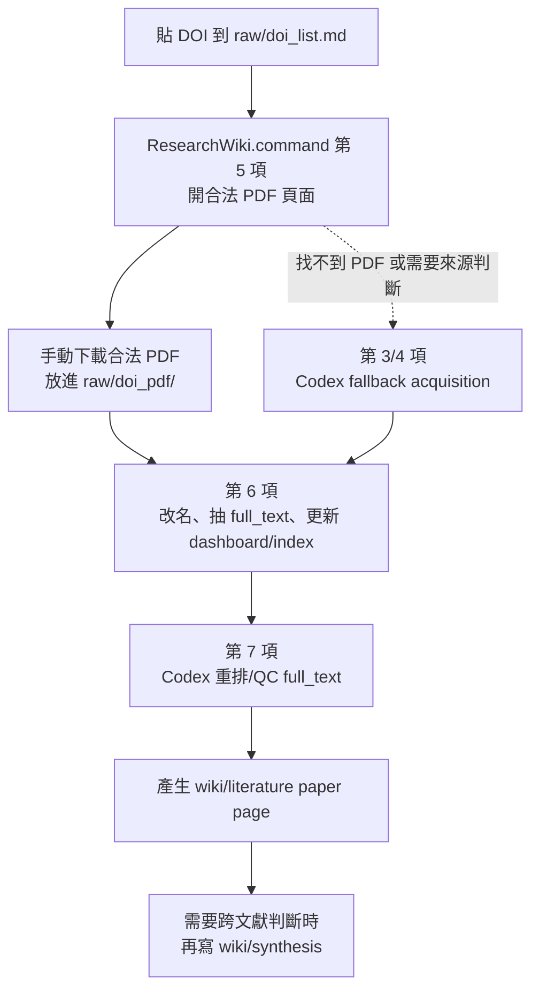
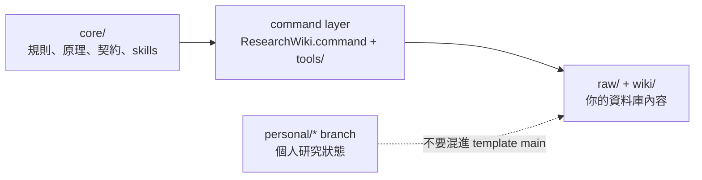
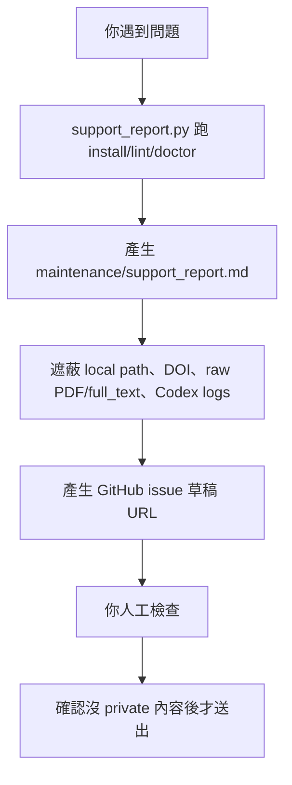

# Research Wiki：把 DOI 變成可以查的研究資料庫

[English README](README.md)

Research Wiki 是一個給研究者用的 GitHub-ready LLM Wiki 模板。你可以把 DOI、PDF、全文、閱讀筆記、meeting、seminar 和 synthesis 放在同一個可維護的資料庫裡。

一句話版：

> 機械整理交給 command，本地 evidence 留在 `raw/`，需要理解的閱讀與判斷再交給 Codex。

## 你大概只需要記住這張圖



正常情況下，不要一開始就叫 Codex 慢慢找全文。先用第 5 項打開合法來源頁面，把 PDF 放進 `raw/doi_pdf/`，再用第 6 項讓本地工具抽文字。Codex 最值得用在第 7 項：重排全文、做 QC、理解論文、寫 paper page。

## 完全不懂 GitHub 怎麼開始

打開 Codex，把這段貼給它：

```text
請幫我使用這個 Research Wiki repository。我不熟 GitHub。
請先讀 README.zh-TW.md、core/README.md、USER_GUIDE.zh-TW.md、AGENTS.md，
然後執行 python3 tools/check_install.py。
請用中文告訴我缺什麼工具、下一步要做什麼；不要上傳 private PDF、全文、local path 或 Codex logs。
```

然後照 Codex 說的做。真的要自己手動操作時，通常就是：

1. 打開 `ResearchWiki.command`。
2. 選第 1 項，把 DOI 貼進 `raw/doi_list.md`。
3. 選第 5 項，從合法頁面下載 PDF。
4. 把 PDF 放進 `raw/doi_pdf/`。
5. 選第 6 項，讓本地工具整理 PDF 和 full_text。
6. 選第 7 項，讓 Codex 做 full_text QC 和 paper page。

## 三層結構



- `core/`：資料庫規則。若 command 和 core 衝突，以 core 為準。
- `ResearchWiki.command` / `tools/`：操作介面，只實作 core 規則。
- `raw/`：證據層，例如 DOI、PDF、full_text、原始檔。
- `wiki/`：知識層，例如 paper page、synthesis、meeting、seminar。
- `maintenance/`：診斷、repair plan、release、branch 說明，不是正式 wiki 知識。
- `personal/*` branch：個人研究狀態，不應直接混進可發布模板。

## 支援回報是什麼

遇到問題時，不要手動貼一堆本機路徑或 PDF 內容到 issue。先跑：

```bash
python3 tools/support_report.py --issue-url
```

它會做這件事：



重點：它只準備 issue 草稿，**不會自動送出**。最後要不要送出，永遠由人確認。

## 測試時不小心動到 AGENTS.md 怎麼辦

先不要直接把測試中的 `AGENTS.md` 改動推進 `main`。

判斷方式：

- 臨時測試想法：寫到 `maintenance/` 或 issue，不改 `AGENTS.md`。
- 核心規則真的變了：先改 `core/agent_contract.md` 或 `core/data_contract.md`，再讓 `AGENTS.md` 簡短指向它。
- command 操作細節變了：改 `USER_GUIDE.zh-TW.md` 或 command prompt。
- 只是你的個人偏好：放到 `personal/chenhau-lan` branch。

`AGENTS.md` 會影響未來 Codex 如何工作，所以它應該走 PR，不要當成測試筆記。

## 什麼時候用 Codex

適合用 Codex：

- 判斷全文來源是否合法、可用。
- 把 machine-extracted full_text 重排成可讀 Markdown。
- 檢查 equation/table/section 是否被抽壞。
- 從 full_text 寫 paper page。
- 做 synthesis、project discussion、meeting/seminar 脈絡整理。

不適合浪費 Codex token：

- 掃描資料夾。
- 重建 index。
- 檢查 dashboard path 是否 stale。
- 把 PDF 改成 canonical 檔名。
- 產生 repair plan 的機械診斷。

這些應該交給 `ResearchWiki.command` 和 `tools/`。

## 常用命令

```bash
python3 tools/check_install.py
python3 tools/wiki_lint.py
python3 tools/wiki_doctor.py
python3 tools/generate_repair_plan.py
python3 tools/support_report.py --issue-url
```

`generate_repair_plan.py` 只產生建議，不會自動刪檔。

## 要重測資料庫流程

只有真的要重測時才用：

```text
InitializeResearchWiki.command
```

它會要求你輸入：

```text
INIT TEST DATABASE
```

然後只清理受限範圍內的測試 evidence、生成 raw artifacts 和生成 wiki pages。它會保留工具、模板、skills、docs、topic registry 和 Obsidian 設定。

## 更多文件

- [使用指南](USER_GUIDE.zh-TW.md)
- [安裝指南](INSTALL.zh-TW.md)
- [支援回報](SUPPORT.zh-TW.md)
- [Agent 規則](AGENTS.md)
- [目前 GitHub branch 安排](maintenance/github_current_arrangement.md)
- [Branch strategy](maintenance/branch_strategy.md)
