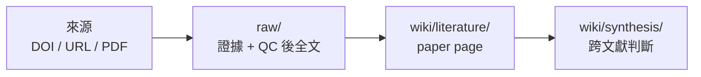

# Research Wiki：把研究材料變成可維護的 LLM Wiki

[English README](README.md)

Research Wiki 是一個 GitHub-ready LLM Wiki 研究資料庫模板。它不是單純放 PDF 的資料夾，也不是一次性的聊天摘要；它把文獻來源、全文、閱讀頁、meeting、seminar 和 synthesis 放進同一個可以版本控制、可以診斷、可以交給 Codex 協作的資料庫。

一句話版：

> `raw/` 保留證據，`wiki/` 保存理解，command 處理機械整理，Codex 處理閱讀與判斷。

## 為什麼要用 GitHub-ready LLM Wiki

研究資料很容易散掉：PDF 在資料夾、DOI 在訊息裡、LLM 摘要在另一個聊天視窗、Obsidian 筆記又不知道對應哪個來源。時間一久，很難知道「這篇到底讀完了嗎」、「這個判斷是從哪篇來的」、「這份資料能不能交給別人安裝使用」。

Research Wiki 的目標是讓研究資料有清楚的 evidence chain：

- 來源先進 `raw/`：DOI/URL/PDF source pointer、合法 PDF、staging extraction、QC 後全文、meeting transcript、seminar slides 或其他原始檔。
- 理解再進 `wiki/`：paper page、synthesis、meeting note、project synthesis、seminar note。
- GitHub 管規則與版本：README、core contract、templates、tools、CI、issue 都可以 review。
- Codex 只做需要理解的事：全文 QC、重排、paper page、跨文獻判斷、project discussion。

## 研究材料如何進入資料庫



論文可以從 DOI、網址、PDF URL 或本機 PDF 開始。資料庫先把它們變成 `raw/` 裡可回查的 evidence package；只有經過 Codex 重排與 QC 的可閱讀 Markdown，才會進 `raw/full_text/`，也只有這種 full text 才能產生 `wiki/literature/` paper page。

PDF 是 evidence package 的一種重要材料，因為它保留版面、表格、公式、圖說與出版格式。Paper page 不複製整篇全文，而是保存閱讀判斷與來源指標，讓你可以回查 PDF 或 QC 後 full text。

細節上，機械抽字會短暫放在 `raw/staging/extracted_text/`；它不是正式全文，不會進 index，也不會被拿去產生 wiki。

## 安裝與開始使用

需要的基本工具：

- Codex
- Git
- Python 3
- ripgrep (`rg`)

建議工具：

- Poppler / `pdftotext`：從 PDF 抽文字。
- Obsidian：看 wiki graph。
- Chrome：用已登入或已授權的 browser session 打開 publisher 頁面。

如果你不熟 GitHub，可以讓 Codex 一次帶你完成安裝檢查。打開 Codex，把這段貼給它：

```text
請幫我安裝並啟動 Research Wiki。我不熟 GitHub。
如果我還沒有 repository，請協助 clone git@github.com:ChenHau-Lan/wiki_research.git；如果已在 repo 中，請直接使用目前目錄。
請先讀 README.zh-TW.md、USER_GUIDE.zh-TW.md、INSTALL.zh-TW.md、AGENTS.md。
請檢查 Git、Python 3、ripgrep/rg、Poppler/pdftotext、Codex CLI 是否可用。
如果缺工具，請先說明用途；需要 Homebrew、系統安裝或權限時先問我再執行。
安裝或確認後，請執行 python3 tools/check_install.py --strict。
成功後請告訴我怎麼打開 ResearchWikiCodex.command。不要上傳 private PDF、全文、本機路徑、敏感 DOI 清單或 Codex logs。
```

自己手動操作時，macOS 打開 `ResearchWikiCodex.command`，Windows 打開 `ResearchWikiCodex.cmd`。這是正式 Codex-first 入口：local/no-token 步驟負責更新 dashboard、掃 PDF、開來源檔、重建 index 與準備 prompt；Codex 負責來源判斷、全文 QC、paper page、synthesis 與 issue 討論。詳細選項看 [使用指南](USER_GUIDE.zh-TW.md)。

第一次設定 topic 或需要明確確認後重置本機測試資料時，macOS 用 `InitializeResearchWiki.command`，Windows 用 `InitializeResearchWiki.cmd`。

## Command 的用意

`ResearchWikiCodex.command` 是低 token / 無 token 的正式操作入口。它的重點不是取代 Codex，而是讓 Codex 不要浪費在掃資料夾、改檔名、重建索引這些機械工作上。

Command 是這個資料模型的預設操作介面，不是資料庫規則來源。它可以更新並開啟 dashboard、掃描 PDF、把全文 QC 直接交給 Codex、準備 synthesis 討論頁與 prompt、準備同一台電腦上外部 sandbox 使用的同步 prompt，也可以準備 issue 回報用的 Codex prompt；完整選項放在 [使用指南](USER_GUIDE.zh-TW.md)。local/no-token 步驟不得偷偷啟動 Codex，Codex 只用於來源判斷、全文 reflow/QC、paper page、synthesis 與 project discussion。

## 遇到問題

最簡單的方式是請 Codex 幫你產生遮蔽後的 issue 草稿。把這段貼給 Codex：

```text
Research Wiki 安裝或執行遇到問題，請幫我產生 GitHub issue 草稿。
請先讀 SUPPORT.zh-TW.md，然後執行 python3 tools/support_report.py --issue-url。
請檢查 maintenance/support_report.md 和產生的 issue URL 是否已遮蔽本機路徑、private PDF、全文、敏感 DOI 清單、Codex logs 和個人研究狀態。
不要自動送出 issue；請把草稿交給我確認。
```

自己手動執行時：

```bash
python3 tools/support_report.py --issue-url
```

它會跑安裝檢查、lint、doctor，產生 `maintenance/support_report.md`，並開 GitHub issue 草稿。它會遮蔽常見 private 資訊，例如本機路徑、DOI、raw PDF/full_text 路徑與 Codex logs。

它不會自動送出 issue。送出前，請人工確認草稿沒有 private PDF、全文、敏感 DOI 清單或個人研究狀態。

## 更多文件

- [使用指南](USER_GUIDE.zh-TW.md)
- [安裝指南](INSTALL.zh-TW.md)
- [支援回報](SUPPORT.zh-TW.md)
- [Agent 規則](AGENTS.md)
- [目前 GitHub branch 安排](maintenance/github_current_arrangement.md)
- [Branch strategy](maintenance/branch_strategy.md)
