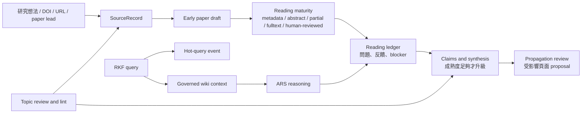

# Research Knowledge Framework

[English](README.md) | [Architecture](docs/ARCHITECTURE.md) | [Mode Registry](MODE_REGISTRY.md) | [手冊](docs/manuals/rkf_manual.zh-TW.md) | [功能與指令](docs/FEATURES_AND_COMMANDS.zh-TW.md)

Research Knowledge Framework，簡稱 RKF，是以 LLM Wiki 為核心的主動研究閱讀框架。
它把 source、paper draft、閱讀互動、人為反饋、question、claim、synthesis
整理成可治理、可追蹤、可累積的長期記憶。

目前基準版本：`v1.0.0`。

RKF 現在把 evidence 視為**升級邊界**，不是入口門檻。Paper draft 可以很早建立：
只有 metadata、abstract、部分 full text、或 user-provided PDF 都可以先進入閱讀循環。
但 stable claim、trusted synthesis、citation、publication 仍需要 locator、人為反饋、
既有受支持 wiki source，或明確 blocker。

RKF 可以和 [Academic Research Skills](https://github.com/Imbad0202/academic-research-skills) 搭配：
ARS 負責研究、推理、寫作與審查；RKF 負責 active reading state、human feedback、
evidence boundary、topic governance 與 graph-safe wiki memory。

```text
paper draft == active reading object
candidate != claim evidence
ARS output == proposal 或 reading feedback，直到被 review
user feedback 會提高 understanding maturity
stable claim -> locator、supported wiki source、human feedback 或 blocker
hot.md == public-safe 研究需求 dashboard，不是 evidence
```

## 快速開始

- 「先 capture 這個 DOI，就算只有 metadata 也建立 paper draft。」
- 「列出哪些已登錄 paper 需要我提供 PDF 或 human feedback。」
- 「我讀完這篇了，把我的反饋記錄進 reading ledger，並提高 trust level。」
- 「問知識庫目前知道什麼，並用 ARS 對取回 context 推理。」
- 「這次 reading update 後，列出可能需要 propagation review 的頁面。」
- 「整理這個 topic registry，建議 merge、split、過期候選與新的 search strings。」
- 「做一次 reading maturity、evidence boundary、graph link、public safety 維護檢查。」
- 「把這個 paper-search 問題記到 hot.md，讓 topic review 看見反覆需求。」

## Skills At A Glance

| Skill | 目的 |
|---|---|
| `rkf-evidence-vault` | Capture source、discovery、追蹤 full text availability、更新 reading artifact |
| `rkf-knowledge-synthesis` | 維護 paper draft、question、concept、claim、topic、synthesis 與 reading maturity review |
| `rkf-wiki-core` | 取回 LLM Wiki context、銜接 ARS reasoning、保存 durable memory、status、graph、sandbox capsule |
| `rkf-lint` | 維護 structure、reading maturity、evidence boundary、graph、ARS handoff、public safety、repair plan |
| `rkf-connect` | 實驗性的多電腦共享資料庫、Drive 連結與外部 sandbox 存取管理 |

`rkf-ars-bridge` 是 protocol，不是 active skill。它把 ARS output 轉成 RKF
save/review/synthesis proposal 或 reading feedback。

## Knowledge Flow



PDF 仍是重要閱讀 artifact，但 RKF 不再等 PDF 才記得一篇 paper 存在。若 full text
讀不到，RKF 會標記 `needs-user-pdf` 並放進 active reading queue。工具可以暫時讀
PDF text、OCR output 或 browser text；但 durable public pages 只能保存 locator、
review status、成熟度欄位與 evidence boundary。

## Reading Maturity

Paper page 追蹤：

- `reading_state`：metadata-only、abstract-read、partial-fulltext、fulltext-read、human-reviewed 或 mixed。
- `fulltext_status`：unknown、needs-user-pdf、user-pdf-provided、publisher-html、publisher-pdf、open-access-pdf、partial-only、fulltext-read、unavailable 或 blocked。
- `human_feedback_level`：none、skimmed、discussed、annotated 或 trusted。
- `understanding_confidence`：low、medium、high 或 mixed。
- `claim_readiness`：not-ready、locator-needed、claim-ready 或 synthesis-ready。
- `reading_ledger`：位於 `state/reading/` 的 public-safe operational record。

Synthesis page 也追蹤 `synthesis_maturity`、`source_coverage`、
`human_feedback_level` 與 `claim_readiness`。

## 主動推播 Paper

RKF 可以產生 active paper queue，列出需要 paper draft、user-provided PDF、human
feedback、locator 或 synthesis review 的 paper。這讓 wiki 更主動，但不會讓 unsupported
claim 自動變成 stable knowledge。

## 熱門研究問題

`hot.md` 是最近研究需求的單一檢索檔。RKF 會把短而 public-safe 的 query 與 discovery
紀錄寫入此檔，再整理最近 30 天的 topic、重複問題、paper/search lead 與
unknown-topic triage。這一層是 operational memory，不是 evidence。

## 驗證

```bash
python3 -m py_compile tools/rk.py rkf/*.py tools/public_safety_scan.py
python3 -m unittest discover -s tests
python3 tools/rk.py topic lint
python3 tools/rk.py lint
python3 tools/public_safety_scan.py
```

## 實驗項目：共享資料庫

當你想讓多台電腦或外部 sandbox 共用同一份研究資料庫時，使用 `rkf-connect`。目前建議
用 Google Drive for desktop 放真正的 `raw/` 與 `wiki/`，每台電腦再用本機 link 連到
該共享資料夾。Machine-specific links 與 private Drive paths 不進 public source of truth。

外部 sandbox 預設只給讀取權限。它的有用輸出回到 RKF 時，應成為 reading update、
save/review proposal 或 synthesis proposal；除非使用者明確批准寫入路徑。

## 版本管理

目前 release target：`v1.0.0`。

- `v1.x`：允許相容性的 docs、skill prompt、template、lint、example、reading maturity
  與實驗性 `rkf-connect` 指引更新。
- `v2.0`：保留給 breaking schema changes、核心 skill 重新命名、或新的 storage contract。
- 實驗功能在有穩定測試與 migration guidance 前，都要明確標示 experimental。

詳細版本歷史見 [CHANGELOG.md](CHANGELOG.md)。
