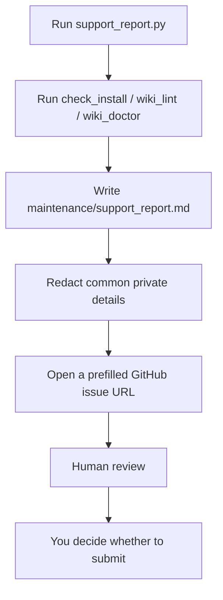

# Support

The support report is not an automatic uploader. It is a safer way to package
diagnostics into a GitHub issue draft.

## When To Use It

Use it when:

- installation is unclear;
- `ResearchWiki.command` does not run;
- DOI dashboard, full-text index, or wiki doctor output looks wrong;
- a new user gets stuck while following the README;
- you want to report a core contract, command UI, or privacy redaction problem.

## Ask Codex To Help

Paste this into Codex:

```text
Research Wiki install or execution failed. Please help me prepare a GitHub issue draft.
Read SUPPORT.md, then run python3 tools/support_report.py --issue-url.
Check maintenance/support_report.md and the generated issue URL for local paths, private PDFs, full text, sensitive DOI lists, Codex logs, and personal research state.
Do not submit the issue automatically. Give me the draft for review.
```

Codex can run checks, read the report, inspect whether redaction looks reasonable, and open the issue draft. A human should still review before submitting.

## What It Does



Manual command:

```bash
python3 tools/support_report.py --issue-url
```

## What It Does Not Do

- It does not submit a GitHub issue automatically.
- It does not upload PDFs.
- It does not paste full article text.
- It does not publish Codex logs.
- It does not guarantee that every possible private detail is removed.

## Redaction

The report attempts to redact:

- local paths;
- DOI values;
- `raw/doi_pdf/` paths;
- `raw/full_text/` paths;
- Codex logs;
- GitHub account names;
- detailed git status filenames.

Human review is still required before submitting.

## Before Submitting

Confirm that the issue draft does not include:

- private PDFs or PDF contents;
- full article text;
- local home-directory paths;
- Codex logs;
- sensitive DOI lists;
- private project or research state.

If unsure, do not submit yet. Ask Codex to review the draft for privacy first.

## Labels

Use these labels when relevant:

- `new-user-test`
- `install`
- `core-contract`
- `command-ui`
- `privacy`
- `needs-triage`
