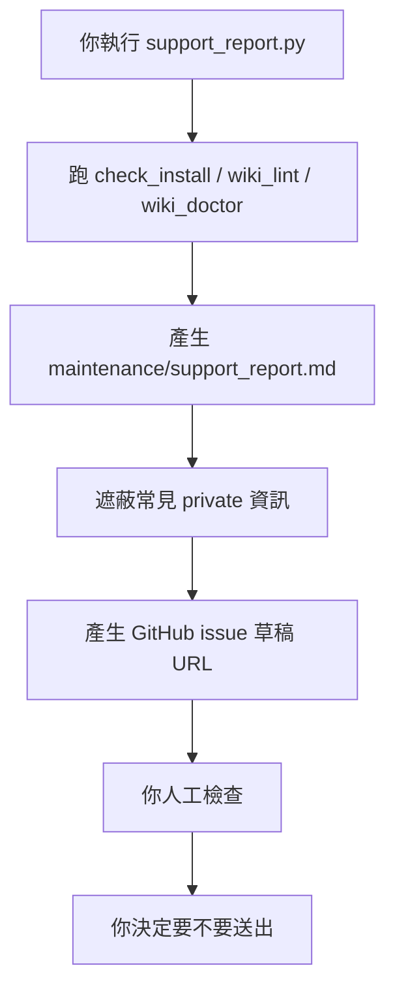

# 支援與 Issue 回報

Support report 的目的不是「自動把你的資料送上 GitHub」。它只是幫你把錯誤診斷整理成一份比較安全、比較好讀的 issue 草稿。

## 什麼時候用

遇到這些情況可以用：

- 不知道安裝少了什麼工具。
- `ResearchWiki.command` 跑不起來。
- DOI dashboard、full_text index、wiki doctor 出現錯誤。
- 新手照 README 做但卡住。
- 想回報 core contract、command UI、privacy redaction 的問題。

## 最簡單方式：交給 Codex

把這段貼給 Codex：

```text
Research Wiki 安裝或執行遇到問題，請幫我產生 GitHub issue 草稿。
請先讀 SUPPORT.zh-TW.md，然後執行 python3 tools/support_report.py --issue-url。
請檢查 maintenance/support_report.md 和產生的 issue URL 是否已遮蔽本機路徑、private PDF、全文、敏感 DOI 清單、Codex logs 和個人研究狀態。
不要自動送出 issue；請把草稿交給我確認。
```

Codex 可以幫你跑檢查、讀 report、檢查遮蔽是否合理，也可以打開 issue 草稿。但最後送出 issue 前，仍然要由人確認。

## 它實際做什麼



手動執行：

```bash
python3 tools/support_report.py --issue-url
```

## 它不會做什麼

- 不會自動送出 GitHub issue。
- 不會上傳 PDF。
- 不會貼出 full text。
- 不會把 Codex log 自動公開。
- 不會替你判斷所有內容都一定安全。

## 它會遮蔽什麼

工具會盡量遮蔽：

- 本機路徑，例如 home directory 或 repo 絕對路徑。
- DOI 值。
- `raw/doi_pdf/` 路徑。
- `raw/full_text/` 路徑。
- Codex logs。
- GitHub 帳號名稱。
- git status 的檔名細節。

但遮蔽不是魔法。送出 issue 前，仍然要人工檢查。

## 送出前檢查

請確認 issue 草稿裡沒有：

- private PDF 或 PDF 內容。
- 文章全文。
- 本機 home-directory 路徑。
- Codex logs。
- 敏感 DOI 清單。
- 個人研究狀態或尚未公開 project 細節。

如果不確定，就先不要送出，把草稿貼給 Codex 請它再幫你檢查 privacy。

## 建議 Labels

- `new-user-test`
- `install`
- `core-contract`
- `command-ui`
- `privacy`
- `needs-triage`
