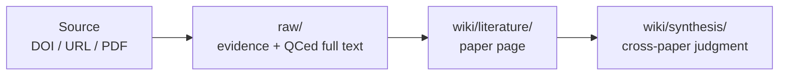

# User Guide

[中文操作摘要](USER_GUIDE.zh-TW.md)

This guide is for someone receiving Research Wiki for the first time. You do not need to understand GitHub, Markdown databases, or Obsidian before using it.

## 1. Remember Two Things

Research Wiki follows this path:



- `raw/` keeps evidence: sources, PDFs, staging text, QCed full text, meeting transcripts, and seminar slides.
- `wiki/` keeps understanding: paper pages, synthesis, meetings, projects, and seminars.

Do not treat machine-extracted PDF text as official full text. Official full text belongs in `raw/full_text/` only after Codex reflow and QC.

## 2. First Install

The easiest path is to let Codex guide the install. Open Codex and paste:

```text
Please help me install and start Research Wiki. I do not know GitHub well.
If I do not have the repository yet, help me clone git@github.com:ChenHau-Lan/wiki_research.git. If I am already inside the repo, use the current folder.
Read README.md, USER_GUIDE.md, INSTALL.md, and AGENTS.md first.
Check whether Git, Python 3, ripgrep/rg, Poppler/pdftotext, and the Codex CLI are available.
If a tool is missing, explain what it is for. Ask me before using Homebrew, system installation commands, or permission-requiring steps.
After installing or confirming tools, run python3 tools/check_install.py --strict.
When it succeeds, tell me how to open ResearchWiki.command. Do not upload private PDFs, full text, local paths, sensitive DOI lists, or Codex logs.
```

Required tools: Codex, Git, Python 3, and ripgrep. Recommended tools: Poppler / `pdftotext`, Obsidian, and Chrome.

## 3. Where Data Lives

The README stays short; the data details live here.

| Path | What It Stores | Note |
| --- | --- | --- |
| `core/` | rules, principles, contracts, skills | if command and core disagree, follow core |
| `raw/paper_sources.md` | new DOIs, DOI URLs, article URLs, PDF URLs | source queue |
| `raw/doi_pdf/` | legal or user-provided article PDFs | filenames should become `<paper_file_key>.pdf` |
| `raw/staging/extracted_text/` | temporary PDF/HTML/XML extraction | not official full text, not indexed, not wiki input |
| `raw/full_text/` | reflowed, QCed, readable full-text Markdown | official input for wiki ingest |
| `wiki/literature/` | single-paper reading pages | source pointers and judgment, not copied full text |
| `wiki/synthesis/` | cross-paper judgment | update when research understanding changes |
| `maintenance/` | diagnostics, repair plans, support reports | not part of the formal wiki knowledge layer |

Private research state, sensitive DOI batches, and unpublished raw evidence should stay in ignored files or a `personal/*` branch, not in the publishable template/main branch.

## 4. How Papers Enter

Most of the time, remember only two actions:

1. Use `Paper intake: sources -> QCed full_text` to turn DOI/URL/PDF sources into `raw/full_text/`.
2. Use `Ingest QCed full_text to wiki` to turn `raw/full_text/` into `wiki/literature/`.

The complete flow is:

1. Add a DOI, DOI URL, article URL, PDF URL, or source note to `raw/paper_sources.md`, or paste it into the command.
2. Open `ResearchWiki.command`.
3. Choose `Paper intake: sources -> QCed full_text`.
4. Use only legal sources: publisher pages, author pages, open access, institutional access, your authorized browser session, or user-provided PDF/text.
5. If manual PDF download is needed, save the legal PDF into `raw/doi_pdf/`, then run the same intake again.
6. Intake updates the dashboard, normalizes filenames, extracts staging text, and uses the Codex CLI or a pasteable Codex prompt for reflow/QC.
7. Only QC success writes into `raw/full_text/` and updates `raw/full_text_index.*`.
8. Then choose `Ingest QCed full_text to wiki` to create the paper page.

Progress is shown in `raw/doi_dashboard.md`. The main board stays short:

```text
Last Name_Year | Journal | DOI | Wiki Status | Access Legality | PDF | Full Text
```

Longer next actions, blockers, and notes live in the `DOI Notes` section below the board.

## 5. The Five Command Options

1. `Paper intake: sources -> QCed full_text`: the main one-stop paper intake. It adds DOI/URL sources, opens legal source pages, imports PDF/evidence, extracts staging text, and uses the Codex CLI or a pasteable prompt to create QCed full text.
2. `Ingest QCed full_text to wiki`: creates or updates `wiki/literature/` only from already-QCed `raw/full_text/`. It does not find new PDFs or perform full-text reflow/QC.
3. `Project / idea conversation`: starts a Codex project or idea discussion and lets Codex infer topics, subtopics, related papers, and DOI needs afterward.
4. `Topics / graph`: manages the topic/subtopic registry or opens Obsidian graph guidance.
5. `Maintenance / support`: opens the dashboard, runs health checks, writes repair plans, opens the source queue, or prepares a redacted GitHub issue draft.

If you only want to process papers, start with options 1 and 2.

## 6. Wiki Areas

- `wiki/literature/`: one paper.
- `wiki/synthesis/`: cross-paper judgment.
- `wiki/seminars/`: seminar or talk, lower evidence tier than literature.
- `wiki/meetings/`: one meeting.
- `wiki/project_synthesis/`: project evolution across meetings.

Default research query priority:

```text
synthesis > literature > seminars
```

Project history or meeting-decision priority:

```text
project_synthesis > meetings
```

## 7. Obsidian Graph

Open `wiki/` as an Obsidian vault.

Formal pages should include `Graph Links` and explicit `[[...]]` wikilinks. This lets the graph show relationships among papers, synthesis pages, seminars, projects, topics, and subtopics.

## 8. Maintenance And Repair

Routine checks:

```bash
python3 tools/wiki_lint.py
python3 tools/wiki_doctor.py
python3 tools/generate_repair_plan.py
```

Repair plans list recommendations and do not delete files. If a repair plan mentions `.DS_Store` or other release noise, inspect the exact path and remove only one explicit file at a time after human review; do not use recursive, wildcard, or bulk cleanup commands.

Use `InitializeResearchWiki.command` only when intentionally resetting a local test database. It asks you to type `INIT TEST DATABASE`, then resets test evidence, generated raw artifacts, and generated wiki pages. Do not use it as everyday cleanup.

## 9. Problems And Issues

Codex can prepare a redacted issue draft. Paste:

```text
Research Wiki install or execution failed. Please help me prepare a GitHub issue draft.
Read SUPPORT.md, then run python3 tools/support_report.py --issue-url.
Check maintenance/support_report.md and the generated issue URL for local paths, private PDFs, full text, sensitive DOI lists, Codex logs, and personal research state.
Do not submit the issue automatically. Give me the draft for review.
```

Manual command:

```bash
python3 tools/support_report.py --issue-url
```

It writes `maintenance/support_report.md`, redacts common private details, and opens a GitHub issue draft. Human review is still required before submitting.
