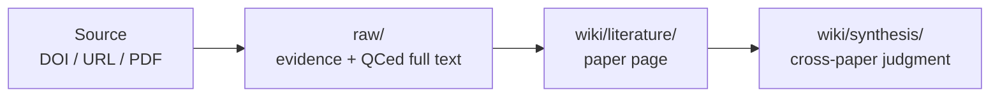

# User Guide

[中文操作摘要](USER_GUIDE.zh-TW.md)

This guide is for someone receiving Research Wiki for the first time. You do not need to understand GitHub, Markdown databases, or Obsidian before using it.

## 1. Remember Two Things

Research Wiki follows this path:



- `raw/` keeps evidence: sources, PDFs, staging text, QCed full text, meeting transcripts, and seminar slides.
- `wiki/` keeps understanding: paper pages, synthesis, meetings, projects, and seminars.

Do not treat machine-extracted PDF text as official full text. Official full text belongs in `raw/full_text/` only after Codex reflow and QC.

## 2. First Install

The easiest path is to let Codex guide the install. Open Codex and paste:

```text
Please help me install and start Research Wiki. I do not know GitHub well.
If I do not have the repository yet, help me clone git@github.com:ChenHau-Lan/wiki_research.git. If I am already inside the repo, use the current folder.
Read README.md, USER_GUIDE.md, INSTALL.md, and AGENTS.md first.
Check whether Git, Python 3, ripgrep/rg, Poppler/pdftotext, and the Codex CLI are available.
If a tool is missing, explain what it is for. Ask me before using Homebrew, system installation commands, or permission-requiring steps.
After installing or confirming tools, run python3 tools/check_install.py --strict.
When it succeeds, tell me how to open ResearchWikiCodex.command. Do not upload private PDFs, full text, local paths, sensitive DOI lists, or Codex logs.
```

Required tools: Codex, Git, Python 3, and ripgrep. Recommended tools: Poppler / `pdftotext`, Obsidian, and Chrome.

## 3. Where Data Lives

The README stays short; the data details live here.

| Path | What It Stores | Note |
| --- | --- | --- |
| `core/` | rules, principles, contracts, skills | if command and core disagree, follow core |
| `raw/paper_sources.md` | new DOIs, DOI URLs, article URLs, PDF URLs | source queue |
| `raw/doi_pdf/` | legal or user-provided article PDFs | filenames should become `<paper_file_key>.pdf` |
| `raw/staging/extracted_text/` | temporary PDF/HTML/XML extraction | not official full text, not indexed, not wiki input |
| `raw/full_text/` | reflowed, QCed, readable full-text Markdown | official input for wiki ingest |
| `wiki/literature/` | single-paper reading pages | source pointers and judgment, not copied full text |
| `wiki/synthesis/` | cross-paper judgment | update when research understanding changes |
| `maintenance/` | diagnostics, repair plans, support reports | not part of the formal wiki knowledge layer |

Private research state, sensitive DOI batches, and unpublished raw evidence should stay in ignored files or a `personal/*` branch, not in the publishable template/main branch.

## 4. How Papers Enter

Most of the time, remember two phases:

1. Use `ResearchWikiCodex.command` to organize DOI/URL/PDF sources into legal evidence, PDFs, and QCed full text; it does not create new persistent un-QCed staging text.
2. Use `Ingest QCed full_text to wiki` to turn `raw/full_text/` into `wiki/literature/`.

The complete flow is:

1. Add a DOI, DOI URL, article URL, PDF URL, or source note to `raw/paper_sources.md`, or paste it into the command.
2. Open `ResearchWikiCodex.command` on macOS, or `ResearchWikiCodex.cmd` on Windows.
3. Choose `Open/add paper sources` or paste the source directly into `raw/paper_sources.md`.
4. Use only legal sources: publisher pages, author pages, open access, institutional access, your authorized browser session, or user-provided PDF/text.
5. If manual PDF download is needed, save the legal PDF into `raw/doi_pdf/`, then run the same intake again.
6. Run `Refresh DOI dashboard + scan PDFs`: update the dashboard, normalize filenames, scan for orphan/duplicate PDFs, rebuild the index, and open the dashboard for review.
7. Run `Create QCed full_text with Codex`. It prefers legal online full text, opens source pages for manual PDF download when needed, and only writes QCed output into `raw/full_text/`; abstract-only fallback is marked `abstract_only`.
8. Then choose `Ingest QCed full_text to wiki` to create the paper page.

Progress is shown in `raw/doi_dashboard.md`. The main board stays short:

```text
Last Name_Year | Journal | DOI | Wiki Status | PDF | Full Text
```

`PDF` and `Full Text` are checkboxes for whether evidence exists. Longer next
actions, blockers, source routes, and notes live in the `DOI Notes` section
below the board.

## 5. Command Options

`ResearchWikiCodex.command` is the canonical entrypoint:

1. `Open/add paper sources`: open or append DOI, URL, PDF URL, or source notes.
2. `Refresh DOI dashboard + scan PDFs`: sync the dashboard, rebuild indexes, scan `raw/doi_pdf/`, ask for confirmed cleanup when byte-identical duplicate PDFs are found, and open the dashboard for review without launching Codex or creating staging full text.
3. `Create QCed full_text with Codex`: handles a small batch, prefers legal online full text, opens DOI/source pages for user PDF download when needed, then asks Codex to create only QCed `raw/full_text/`; if only an abstract is available, it records `abstract_only`.
4. `Ingest QCed full_text to wiki`: uses the QC-only wiki ingest boundary and rejects visibly noisy PDF extraction.
5. `Prepare synthesis page + Codex prompt`: creates a draft synthesis page, copies a discussion prompt, and opens Codex so you can start a new conversation.
6. `Prepare feedback issue Codex prompt`: asks only for a title, copies a prompt, and opens Codex so you can provide the full issue description before any submission.
7. `Prepare external sandbox sync prompt`: creates a draft synthesis/project page and copies a prompt for another Codex sandbox on the same computer to read and update this exact database path directly.
When option 2 finds duplicate PDFs, it lists byte-identical groups, keeps the canonical file, and deletes the listed duplicate candidates only after you type `DELETE ALL DUPLICATE PDFS` or confirm one explicit path at a time.

Use `InitializeResearchWiki.command` on macOS, or `InitializeResearchWiki.cmd` on Windows, for first-time topic setup or a guarded reset of generated local artifacts.

Full-text QC now treats tables as their own reliability layer. Wide,
continued, or numeric tables may be preserved as fenced text with
`table_quality: partial`; reuse exact table values only after checking the PDF,
HTML/XML table, or supplement. Duplicate publisher PDF filenames are reported
and skipped instead of creating duplicate DOI rows. Run
`python3 tools/check_full_text_tables.py` for an advisory table-QC report.

## 6. Wiki Areas

- `wiki/literature/`: one paper.
- `wiki/synthesis/`: cross-paper judgment.
- `wiki/seminars/`: seminar or talk, lower evidence tier than literature.
- `wiki/meetings/`: one meeting.
- `wiki/project_synthesis/`: project evolution across meetings.

Default research query priority:

```text
synthesis > literature > seminars
```

Project history or meeting-decision priority:

```text
project_synthesis > meetings
```

## 7. Obsidian Graph

Open `wiki/` as an Obsidian vault.

Formal pages should include `Graph Links` and explicit `[[...]]` wikilinks. This lets the graph show relationships among papers, synthesis pages, seminars, projects, topics, and subtopics.

## 8. Maintenance And Repair

Routine checks:

```bash
python3 tools/wiki_lint.py
python3 tools/wiki_doctor.py
python3 tools/generate_repair_plan.py
```

Repair plans list recommendations and do not delete files. If a repair plan mentions `.DS_Store` or other release noise, inspect the exact path and remove only one explicit file at a time after human review; do not use recursive, wildcard, or bulk cleanup commands.

Use `InitializeResearchWiki.command` only for first-time topic setup or when intentionally resetting a local test database. Reset mode asks you to type `INIT TEST DATABASE`, then resets scoped test evidence, generated raw artifacts, and generated wiki pages. Do not use reset mode as everyday cleanup.

## 9. Problems And Issues

Codex can prepare a redacted issue draft. Paste:

```text
Research Wiki install or execution failed. Please help me prepare a GitHub issue draft.
Read SUPPORT.md, then run python3 tools/support_report.py --issue-url.
Check maintenance/support_report.md and the generated issue URL for local paths, private PDFs, full text, sensitive DOI lists, Codex logs, and personal research state.
Do not submit the issue automatically. Give me the draft for review.
```

Manual command:

```bash
python3 tools/support_report.py --issue-url
```

It writes `maintenance/support_report.md`, redacts common private details, and opens a GitHub issue draft. Human review is still required before submitting.
