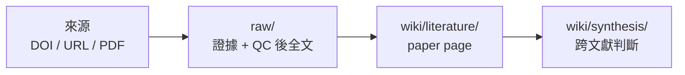

# User Guide 中文摘要

[English User Guide](USER_GUIDE.md)

這份文件是給第一次拿到 Research Wiki 的人。你不需要先懂 GitHub、Markdown database 或 Obsidian；先照這份走就可以。

## 1. 先記住兩件事

Research Wiki 做的是這條流程：



- `raw/` 放證據：來源、PDF、暫存抽字、QC 後全文、meeting transcript、seminar slides。
- `wiki/` 放理解：單篇文獻頁、跨文獻 synthesis、meeting、project、seminar。

不要把剛從 PDF 機械抽出的文字當成正式全文。正式全文只放在 `raw/full_text/`，而且必須已經由 Codex 重排與 QC。

## 2. 第一次安裝

最簡單的方式是把安裝交給 Codex 帶你做。打開 Codex，貼上：

```text
請幫我安裝並啟動 Research Wiki。我不熟 GitHub。
如果我還沒有 repository，請協助 clone git@github.com:ChenHau-Lan/wiki_research.git；如果已在 repo 中，請直接使用目前目錄。
請先讀 README.zh-TW.md、USER_GUIDE.zh-TW.md、INSTALL.zh-TW.md、AGENTS.md。
請檢查 Git、Python 3、ripgrep/rg、Poppler/pdftotext、Codex CLI 是否可用。
如果缺工具，請先說明用途；需要 Homebrew、系統安裝或權限時先問我再執行。
安裝或確認後，請執行 python3 tools/check_install.py --strict。
成功後請告訴我怎麼打開 ResearchWikiCodex.command。不要上傳 private PDF、全文、本機路徑、敏感 DOI 清單或 Codex logs。
```

需要的工具是 Codex、Git、Python 3、ripgrep。建議安裝 Poppler / `pdftotext`、Obsidian、Chrome。

## 3. 資料放在哪裡

README 只講最短流程；細節放在這裡。

| 位置 | 放什麼 | 注意 |
| --- | --- | --- |
| `core/` | 規則、原理、contract、skills | command 如果和 core 衝突，以 core 為準 |
| `raw/paper_sources.md` | 新 DOI、DOI URL、article URL、PDF URL | 這是待處理來源 queue |
| `raw/doi_pdf/` | 合法取得或使用者提供的論文 PDF | 檔名應整理成 `<paper_file_key>.pdf` |
| `raw/staging/extracted_text/` | PDF/HTML/XML 機械抽字暫存 | 不是正式全文，不進 index，不產生 wiki |
| `raw/full_text/` | 已重排、已 QC、可閱讀的全文 Markdown | 這才是 wiki ingest 的正式輸入 |
| `wiki/literature/` | 單篇論文閱讀頁 | 不複製全文，只放閱讀判斷與來源指標 |
| `wiki/synthesis/` | 跨文獻判斷 | 有新理解時更新這裡 |
| `maintenance/` | 診斷、repair plan、support report | 不屬於正式 wiki 知識層 |

個人研究狀態、私人 DOI batch、還不能公開的 raw evidence，應留在 ignored files 或 `personal/*` branch，不要混進可發布的 template/main。

## 4. 論文怎麼進資料庫

大多數時候先記住兩段：

1. 用 `ResearchWikiCodex.command` 先把 DOI/URL/PDF 整理成合法 evidence、PDF 與 QC 後全文；這個正式入口不會新增持久的未 QC staging text。
2. 用 `Ingest QCed full_text to wiki` 把已 QC 的 `raw/full_text/` 變成 `wiki/literature/`。

更完整的流程是：

1. 把 DOI、DOI URL、article URL、PDF URL 或來源註記貼到 `raw/paper_sources.md`，或在 command 中貼上。
2. macOS 打開 `ResearchWikiCodex.command`，Windows 打開 `ResearchWikiCodex.cmd`。
3. 選 `Open/add paper sources`，或直接把來源貼到 `raw/paper_sources.md`。
4. 只使用合法來源：publisher、作者頁、open-access、institutional access、你已授權的 browser session、或你自己提供的 PDF/text。
5. 如果需要手動下載 PDF，把合法 PDF 放到 `raw/doi_pdf/`，再重新跑同一個 intake。
6. 執行 `Refresh DOI dashboard + scan PDFs`：更新 dashboard、整理檔名、掃 orphan/duplicate PDFs、重建 index，並打開 dashboard 檢查。
7. 執行 `Create QCed full_text with Codex`。它會優先找合法線上全文，需要 PDF 時先開來源頁讓你手動下載；只有 QC 成功才寫入 `raw/full_text/`，只能取得摘要時會標成 `abstract_only`。
8. 再選 `Ingest QCed full_text to wiki` 產生 paper page。

進度看 `raw/doi_dashboard.md`。主表只放快速判讀欄位：

```text
Last Name_Year | Journal | DOI | Wiki Status | PDF | Full Text
```

`PDF` 和 `Full Text` 只是確認 evidence 有無的 checkbox。較長的下一步、來源路徑、失敗原因與備註會放在同檔案下方的 `DOI Notes`。

## 5. Command 選項

`ResearchWikiCodex.command` 是正式入口：

1. `Open/add paper sources`：打開或加入 DOI、URL、PDF URL、來源註記。
2. `Refresh DOI dashboard + scan PDFs`：同步 dashboard、重建 index、掃描 `raw/doi_pdf/`；若發現 byte-identical 重複 PDF，會要求確認清理，然後開啟 dashboard 供檢查；不啟動 Codex，也不建立 staging full text。
3. `Create QCed full_text with Codex`：一次只處理小批量，優先找合法線上全文；需要 PDF 時先開 DOI/source 頁面讓使用者下載，再交給 Codex 只建立已 QC 的 `raw/full_text/`；若只能取得摘要，標成 `abstract_only`。
4. `Ingest QCed full_text to wiki`：沿用穩定版 command 的 QC-only wiki ingest 邊界，並拒絕明顯還有 PDF 抽字雜訊的全文。
5. `Prepare synthesis page + Codex prompt`：先建立 synthesis 草稿頁，複製適合展開討論的 prompt，並開啟 Codex 進入新對話。
6. `Prepare feedback issue Codex prompt`：只輸入問題建議標題，複製 prompt 並開啟 Codex；完整描述、圖片和送出確認都在接下來的對話補齊。
7. `Prepare external sandbox sync prompt`：建立 synthesis/project 草稿頁，複製給同一台電腦上另一個 Codex sandbox 使用的 prompt，要求它直接讀寫這個資料庫的同一路徑。
option 2 發現重複 PDF 時，會列出 byte-identical groups，保留 canonical file；只有在你輸入 `DELETE ALL DUPLICATE PDFS`，或逐一輸入明確路徑確認句時，才刪除列出的 duplicate candidates。

第一次設定 topic 或需要受保護的本機資料重置時，macOS 用 `InitializeResearchWiki.command`，Windows 用 `InitializeResearchWiki.cmd`。

全文 QC 現在把表格當成獨立可靠性層。寬表、跨頁表、數值表可以保留為 fenced text，並標 `table_quality: partial`；需要重用精確表格數值時，先回查 PDF、HTML/XML table 或 supplement。重複的 publisher PDF 檔名會被回報並略過，不會再建立重複 DOI row。可執行 `python3 tools/check_full_text_tables.py` 取得 advisory table-QC report。

## 6. Wiki 分區

- `wiki/literature/`：單篇文獻。
- `wiki/synthesis/`：跨文獻判斷。
- `wiki/seminars/`：seminar / talk，證據層級低於 literature。
- `wiki/meetings/`：單次 meeting。
- `wiki/project_synthesis/`：跨 meeting 的 project 整合。

一般研究問題優先看：

```text
synthesis > literature > seminars
```

問 project history 或 meeting decision 時優先看：

```text
project_synthesis > meetings
```

## 7. Obsidian Graph

把 `wiki/` 當成 Obsidian vault 打開。

正式頁應有 `Graph Links`，並使用 `[[...]]` wikilinks。這樣 Obsidian graph 才能看出文獻、synthesis、seminar、project、topic、subtopic 的關係。

## 8. 維護與修復

平常可以跑：

```bash
python3 tools/wiki_lint.py
python3 tools/wiki_doctor.py
python3 tools/generate_repair_plan.py
```

修復計畫只列建議，不會自動刪除。若 repair plan 提到 `.DS_Store` 或其他雜訊，先檢查明確路徑，確認安全後一次只刪除一個指定檔案；不要使用 recursive、wildcard 或批量清理命令。

`InitializeResearchWiki.command` 可用於第一次設定 topic；只有真的要重測流程時才進入 reset mode。Reset mode 會要求輸入 `INIT TEST DATABASE`，再重置 scoped test evidence、生成 raw artifacts 與生成 wiki pages；不要拿它當日常清理工具。

## 9. 遇到問題或要發 Issue

可以讓 Codex 產生 issue 草稿。貼上：

```text
Research Wiki 安裝或執行遇到問題，請幫我產生 GitHub issue 草稿。
請先讀 SUPPORT.zh-TW.md，然後執行 python3 tools/support_report.py --issue-url。
請檢查 maintenance/support_report.md 和產生的 issue URL 是否已遮蔽本機路徑、private PDF、全文、敏感 DOI 清單、Codex logs 和個人研究狀態。
不要自動送出 issue；請把草稿交給我確認。
```

手動執行時：

```bash
python3 tools/support_report.py --issue-url
```

它會產生 `maintenance/support_report.md`，遮蔽常見 private 資訊，並開啟 GitHub issue 草稿。送出前仍要人工確認。
