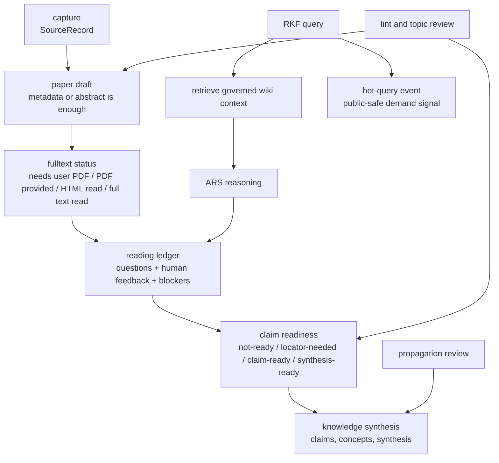

# RKF Architecture

RKF is an LLM Wiki-based research knowledge framework for active reading. It
separates source capture, reading maturity, operational reading ledgers,
maintained wiki knowledge, claim/publication boundaries, topic review, graph
export, ARS handoff proposals, and optional shared-database connections.

## Layer Model

| Layer | Purpose | Public Git Policy |
|---|---|---|
| Intake | Capture DOI, URL, topic, idea, question, PDF, or discussion leads | public-safe source records only |
| Paper Drafts | Create early paper pages even from metadata or abstract state | concise Markdown with maturity fields |
| Reading Maturity | Track full-text availability, reading state, human feedback, and trust | frontmatter and summaries only |
| Reading Ledger | Store public-safe reading events, questions, corrections, and blockers | `state/reading/` operational memory |
| Claim Boundary | Decide when a reading result can support claims or synthesis | locators, supported pages, feedback, or blockers |
| Topic Governance | Match leads to topic scope or propose a new topic | topic registry and topic pages are public-safe |
| Knowledge Objects | Maintain paper, question, concept, claim, topic, synthesis, overview, meeting, seminar pages | concise Markdown only |
| Research Graph | Export typed source/evidence/wiki/topic edges and maturity metadata | generated public-safe graph |
| Hot Query Layer | Track recent public-safe research questions and paper-search demand | single retrieval file: `hot.md` |
| Propagation Review | Identify pages affected by new reading, evidence, or synthesis | proposal gates only; no automatic rewrites |
| ARS Bridge | Convert ARS research/reasoning/writing/review output into RKF proposals or reading feedback | proposals only |
| Connect | Manage experimental shared RAW/wiki folders and external sandbox access boundaries | connection plans only; no private paths |

## Knowledge Flow

## Core Objects

- `SourceRecord`: source candidate or resolved identity plus reading-state hints.
- `EvidenceArtifact`: public-safe pointer to a private PDF, official document,
  OCR/visual artifact, screenshot, or related reading artifact.
- `ReadingLedger`: operational record of public-safe reading events, questions,
  human corrections, trust changes, and blockers.
- `KnowledgeObject`: Markdown page with type, status, review stage, topics,
  maturity fields, and evidence boundary.
- `Topic`: governed search scope with aliases, include/exclude rules, default
  search strings, canonical pages, and review cadence.
- `GateDecision`: legacy or exceptional route/review decision. Normal paper
  drafts do not wait on this object.
- `GraphEdge`: typed relation among sources, evidence, topics, and wiki pages.
- `HotQueryEvent`: public-safe query/search demand signal summarized into
  `hot.md`; it is operational memory, not evidence.

## Boundary Rules

- Paper drafts are active reading objects and may be created early.
- Search candidates are not stable claim evidence.
- ARS outputs are not evidence by themselves; they may become reading feedback
  or save/review proposals.
- Full text availability is tracked explicitly; if it is unavailable, RKF asks
  the user for a PDF or authorized text.
- Claims need a locator, supported wiki source, strong human feedback, or a
  review blocker.
- Durable full article text is not an RKF public knowledge layer.
- Public pages must not contain copied article text or private evidence paths.
- Saving and propagation are conservative: existing knowledge pages are not
  overwritten or rewritten unless the update path is explicit and reviewable.

## Storage And Connection Strategy

RKF separates public memory from private or machine-specific artifacts:

- Git root: framework code, schemas, templates, docs, public-safe knowledge
  pages, graph exports, examples, and tests.
- Private evidence root: PDFs, authorized full text, screenshots, browser
  captures, OCR outputs, attachments, and other non-public reading artifacts.
- Reading state: `state/reading/` contains public-safe operational ledgers.
- Hot-query state: `hot.md` is the source of truth and the readable 30-day
  dashboard.

The multi-computer version is an experimental `rkf-connect` concern. The current
pattern is to keep real shared `RAW` and `wiki` folders in one Google Drive for
desktop research folder, then link those folders into each local RKF project.

## ARS Integration

ARS skills can produce research reports, paper drafts, reviews, and pipeline
outputs. RKF stores only durable wiki knowledge and public-safe reading state.
For wiki questions, RKF retrieves governed context first. ARS may reason over
that context and suggest analysis, but RKF decides whether the result should be
saved, logged as reading feedback, or treated as a blocker.
