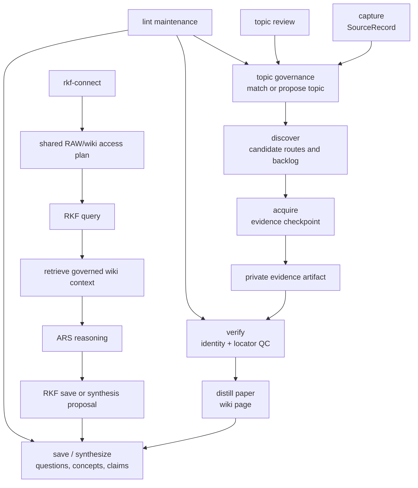

# RKF Architecture

RKF is an LLM Wiki-based research knowledge framework. It separates source
candidates, evidence boundaries, verification gates, maintained wiki knowledge,
topic review, graph export, ARS handoff proposals, and optional shared-database
connections.

PDFs remain the default strong artifact for peer-reviewed paper reading, but
the framework also handles DOI/URL leads, official project documents, browser
captures, OCR/visual reading notes, questions, concepts, claims, and synthesis.

## Layer Model

| Layer | Purpose | Public Git Policy |
|---|---|---|
| Intake | Capture DOI, URL, topic, idea, question, PDF, or discussion leads | public-safe source records only |
| Topic Governance | Match leads to existing topic scope or propose a new topic | topic registry and topic pages are public-safe |
| Evidence Vault | Store private PDFs, authorized text, screenshots, OCR outputs, and acquisition/QC metadata | private artifacts stay outside Git |
| Verification Gates | Check source identity, legal route, PDF/OCR/visual QC, claim support | public-safe gate summaries only |
| Knowledge Objects | Maintain paper, question, concept, claim, topic, synthesis, overview, meeting, seminar pages | concise Markdown only |
| Research Graph | Export typed source/evidence/wiki/topic edges | generated public-safe graph |
| ARS Bridge | Convert ARS research/reasoning/writing/review output into RKF proposals | proposals only, not evidence |
| Connect | Manage experimental shared RAW/wiki folders and external sandbox access boundaries | connection plans only; no private paths |

## Knowledge Flow

## Core Objects

- `SourceRecord`: candidate or resolved source identity. Metadata lives here,
  but is not evidence.
- `EvidenceArtifact`: public-safe pointer to private PDF, official document,
  OCR/visual artifact, screenshot, or related reading artifact.
- `KnowledgeObject`: Markdown page with type, status, review stage, topics, and
  evidence boundary.
- `Topic`: governed search scope with aliases, include/exclude rules, default
  search strings, canonical pages, and review cadence.
- `GateDecision`: source identity, acquisition, PDF/OCR/visual QC,
  claim-support, or synthesis-merge checkpoint.
- `GraphEdge`: typed relation among sources, evidence, topics, and wiki pages.

## Evidence Rules

- Search candidates are not evidence.
- ARS outputs are not evidence by themselves.
- Paper pages require a reviewed source artifact, usually a QCed PDF.
- Missing-PDF papers remain candidates, review queue items, or topic backlog.
- Claims need a locator, existing RKF page, or review blocker.
- Durable full article text is not an RKF public knowledge layer.
- Public pages must not contain copied article text or private evidence paths.
- Topics should be reviewed regularly for drift, duplicate scopes, stale
  candidates, missing canonical synthesis, and weak default search strings.

## Storage And Connection Strategy

RKF separates public memory from private or machine-specific artifacts:

- Git root: framework code, schemas, templates, docs, public-safe knowledge
  pages, graph exports, examples, and tests.
- Private evidence root: PDFs, authorized full text, screenshots, browser
  captures, OCR outputs, attachments, and other non-public evidence artifacts.

The multi-computer version is an experimental `rkf-connect` concern. The
current pattern is to keep real shared `RAW` and `wiki` folders in one Google
Drive for desktop research folder, then link those folders into each local RKF
project. Machine-specific links, local paths, and sandbox permissions stay out
of the public repo.

## ARS Integration

ARS skills can produce research reports, paper drafts, reviews, and pipeline
outputs. RKF stores only durable wiki knowledge. The bridge protocol turns ARS
outputs into structured proposals with a target layer, evidence boundary,
confidence, and recommended RKF mode.

For wiki questions, RKF retrieves governed context first. ARS may reason over
that context and suggest analysis, but RKF decides whether the result should be
saved as a question, claim, concept, synthesis, or review item.
