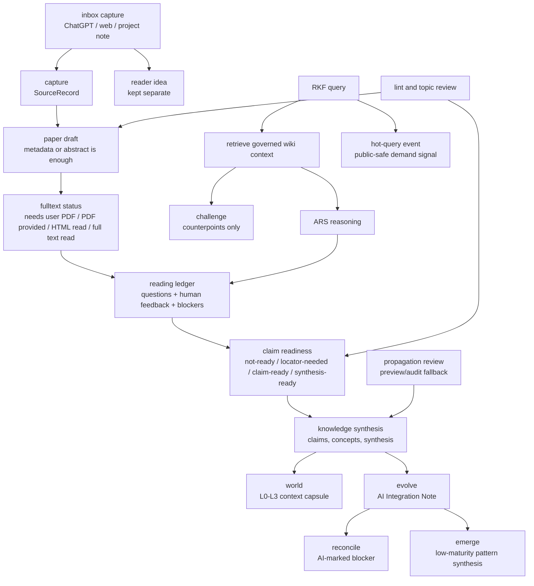

# RKF Architecture

RKF is an LLM Wiki-based research knowledge framework for active reading. It
separates inbox capture, source capture, reading maturity, operational reading
ledgers, maintained wiki knowledge, claim/publication boundaries, topic review,
graph export, ARS handoff proposals, and optional shared-database connections.

## Layer Model

| Layer | Purpose | Public Git Policy |
|---|---|---|
| Inbox Capture | Capture ChatGPT snippets, web clips, cross-project notes, DOI/URL leads, and reader ideas before classification | short public-safe Markdown only |
| Intake | Capture DOI, URL, topic, idea, question, PDF, or discussion leads | public-safe source records only |
| Paper Drafts | Create early paper pages even from metadata or abstract state | concise Markdown with maturity fields |
| Paper Section Boundaries | Separate source-grounded summary, extracted locators, reader notes, AI/agent notes, feedback, and claim-promotion candidates | concise Markdown sections only |
| Reading Maturity | Track full-text availability, reading state, human feedback, and trust | frontmatter and summaries only |
| Reading Ledger | Store public-safe reading events, questions, corrections, and blockers | `state/reading/` operational memory |
| Claim Boundary | Decide when a reading result can support claims or synthesis | locators, supported pages, feedback, or blockers |
| Topic Governance | Match leads to topic scope or propose a new topic | topic registry and topic pages are public-safe |
| Knowledge Objects | Maintain paper, question, concept, claim, topic, synthesis, overview, meeting, seminar pages | concise Markdown only |
| Research Graph | Export typed source/evidence/wiki/topic edges and maturity metadata | generated public-safe graph |
| Hot Query Layer | Track recent public-safe research questions and paper-search demand | single retrieval file: `hot.md` |
| Action Runtime | Execute Codex app workflow requests without routing through the CLI parser | `rkf/actions.py`, structured request/result only |
| L0-L3 World Context | Rebuild session context from identity, critical facts, active reading, synthesis, graph links, and validation state | Codex app capsule, public-safe |
| Critical Facts | Store short public-safe facts with temporal metadata for future agents | `CRITICAL_FACTS.md` |
| Priority Evolve | Rewrite low-risk existing pages with visible AI Integration Notes and maturity-aware blockers | governed page update |
| Reconcile | Detect contradictions across same-topic pages and write AI-marked blockers when needed | page-local blockers |
| Challenge | Use existing RKF pages to argue against a target answer or synthesis | Codex app critique only |
| Emerge | Detect unnamed patterns from active reading, hot queries, and topic state | low-maturity synthesis draft |
| Agent Prompts | Morning, nightly, weekly, and health operating prompts | `prompts/agents/*.md` |
| Bi-Temporal Memory | Track when RKF observed a claim and when the described fact is valid | frontmatter and critical facts |
| Propagation Review | Identify pages affected by new reading, evidence, or synthesis | manual preview/audit fallback |
| ARS Bridge | Convert ARS research/reasoning/writing/review output into RKF proposals or reading feedback | proposals only |
| Connect | Manage experimental shared RAW/wiki folders and Codex handoff access boundaries | connection plans only; no private paths |

## Knowledge Flow

## Core Objects

- `SourceRecord`: source candidate or resolved identity plus reading-state hints.
- `InboxItem`: captured ChatGPT/web/project snippet with provenance, short
  excerpt, reader notes, AI/agent notes, and promotion targets. It can link to a
  source or paper page, but is not evidence.
- `EvidenceArtifact`: public-safe pointer to a private PDF, official document,
  OCR/visual artifact, screenshot, or related reading artifact.
- `ReadingLedger`: operational record of public-safe reading events, questions,
  human corrections, trust changes, and blockers.
- `KnowledgeObject`: Markdown page with type, status, review stage, topics,
  maturity fields, and evidence boundary.
- `Topic`: governed search scope with aliases, include/exclude rules, default
  search strings, canonical pages, and review cadence.
- `GateDecision`: legacy or exceptional route/review decision. Normal paper
  drafts do not wait on this object.
- `GraphEdge`: typed relation among sources, evidence, topics, and wiki pages.
- `HotQueryEvent`: public-safe query/search demand signal summarized into
  `hot.md`; it is operational memory, not evidence.

## Boundary Rules

- Paper drafts are active reading objects and may be created early.
- Inbox items are the safest default for mixed source/idea capture. DOI
  injection may create a `SourceRecord` and paper backlink, but must not promote
  claims or overwrite reader notes.
- Paper pages separate source-grounded summaries from reader interpretation and
  AI/agent notes. Only locator-backed or otherwise supported source-grounded
  material can support claim promotion.
- The Codex app is the only user-facing RKF interaction surface. Markdown pages
  are durable artifacts. New integrations should call `rkf.actions` structured
  requests; the legacy CLI is only an internal shim for agents, tests, and
  maintenance.
- Search candidates are not stable claim evidence.
- ARS outputs are not evidence by themselves; they may become reading feedback
  or save/review proposals.
- Full text availability is tracked explicitly; if it is unavailable, RKF asks
  the user for a PDF or authorized text.
- Claims need a locator, supported wiki source, or strong human feedback. Review
  blockers preserve the boundary and prevent promotion until reviewed.
- Durable full article text is not an RKF public knowledge layer.
- Public pages must not contain copied article text or private evidence paths.
- `world` is the default session bootstrap: it summarizes L0 critical facts, L1
  active reading, L2 synthesis/readiness, and L3 graph/detail links.
- `evolve` is the normal low-risk direct integration path. Every rewrite leaves
  an AI Integration Note and keeps stable claim or publication-ready content
  blocked until a locator, human feedback, supported source, or explicit blocker
  is reviewed.
- Propagation remains available as a manual preview/audit fallback.
- `reconcile` may write AI-marked blockers for contradictions; it does not
  silently resolve stable claims.
- `challenge` is adversarial retrieval over RKF's own pages. It produces
  counterpoints and downgrade suggestions, not new stable knowledge.
- `emerge` may create low-maturity synthesis drafts from existing RKF signals
  without requiring candidate records. It starts as partial/unknown coverage and
  not-ready claim readiness.
- Claim, synthesis, and critical facts use minimal temporal metadata:
  `observed_at`, `valid_from`, optional `valid_until`, and optional `supersedes`.

## Storage And Connection Strategy

RKF separates public memory from private or machine-specific artifacts:

- Git root: framework code, schemas, templates, docs, public-safe knowledge
  pages, graph exports, examples, and tests.
- Private evidence root: PDFs, authorized full text, screenshots, browser
  captures, OCR outputs, attachments, and other non-public reading artifacts.
- Reading state: `state/reading/` contains public-safe operational ledgers.
- Hot-query state: `hot.md` is the source of truth and the readable 30-day
  dashboard.

The multi-computer version is an experimental `rkf-connect` concern. The current
pattern is to keep real shared `RAW` and `wiki` folders in one Google Drive for
desktop research folder, then link those folders into each local RKF project.

## Runtime Surfaces

- `rkf.actions`: structured Codex app action API. It currently covers
  `inbox.capture` and `hot.record`, returning `ActionResult` objects for
  agent-facing summaries.
- `tools/rkf_auto_connect.py`: connector helper that classifies cross-project
  material, builds `ActionRequest` objects, and can execute those requests
  directly against the configured ResearchWiki root.
- `tools/rk.py` / `rkf/cli.py`: legacy/dev shim kept for compatibility,
  repeatable maintenance, and existing tests. New app workflows should not add
  user-facing command syntax here first.

## ARS Integration

ARS skills can produce research reports, paper drafts, reviews, and pipeline
outputs. RKF stores only durable wiki knowledge and public-safe reading state.
For wiki questions, RKF retrieves governed context first. ARS may reason over
that context and suggest analysis, but RKF decides whether the result should be
saved, logged as reading feedback, or treated as a blocker.
