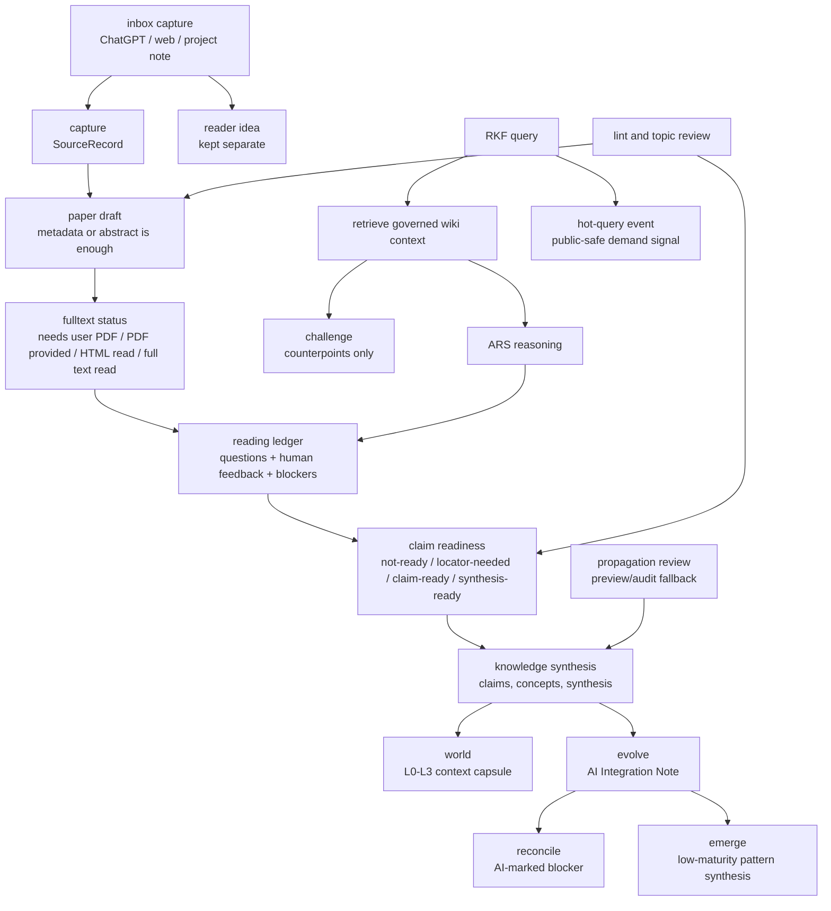

# RKF Architecture

RKF is an LLM Wiki-based research knowledge framework for active reading. It
separates inbox capture, source capture, reading maturity, operational reading
ledgers, maintained wiki knowledge, claim/publication boundaries, topic review,
graph export, ARS handoff proposals, and optional shared-database connections.

## Layer Model

| Layer | Purpose | Public Git Policy |
|---|---|---|
| Inbox Capture | Capture ChatGPT snippets, web clips, cross-project notes, DOI/URL leads, and reader ideas before classification | short public-safe Markdown only |
| Intake | Capture DOI, URL, topic, idea, question, PDF, or discussion leads | public-safe source records only |
| Paper Drafts | Create early paper pages even from metadata or abstract state | concise Markdown with maturity fields |
| Paper Section Boundaries | Keep source identity, methods, findings, locators, limitations, paper-specific questions, and intrinsic links in the paper; keep reader/AI interactions in the reading ledger | concise Markdown sections only |
| Reading Maturity | Track full-text availability, reading state, human feedback, and trust | frontmatter and summaries only |
| Reading Ledger | Store public-safe reading events, questions, corrections, and blockers | `state/reading/` operational memory |
| Claim Boundary | Decide when a reading result can support claims or synthesis | locators, supported pages, feedback, or blockers |
| Topic Governance | Match leads to topic scope or propose a new topic | topic registry and topic pages are public-safe |
| Knowledge Objects | Maintain paper, question, concept, claim, topic, synthesis, overview, meeting, seminar pages | concise Markdown only |
| Research Graph | Export typed source/evidence/wiki/topic edges and maturity metadata | generated public-safe graph |
| Hot Query Layer | Track recent public-safe research questions and paper-search demand | single retrieval file: `hot.md` |
| Session Activation | Keep every new Codex task OFF until the user explicitly activates RKF; preflight storage and writer state before retrieval or capture | `rkf.activate`, `rkf.status`, `rkf.deactivate` |
| Action Runtime | Execute guarded Codex app requests without routing through the CLI parser, including deterministic retrieval and event-first capture | `query.search`, `capture.route`, structured request/result only |
| Operational Events | Preserve capture intent before any derived inbox/hot/wiki projection | append-only `state/events/`; single designated projection writer |
| Provider Discovery | Query allowlisted bibliographic metadata and separate preview, immutable run, and acceptance state | `discover.preview`; `state/search_runs/*/candidates.json` plus `acceptance.json`; candidate-only |
| Public Dashboard | Render machine-neutral settings and aggregate research demand/pipeline health | exact-hash private preview, then approved `site/data/` snapshot; no source identity or raw query |
| Migration Preview | Transform paper-page copies and emit diffs, routing proposals, copied ledgers, and a manifest hash before any live write | local ignored report only; separate live-apply approval |
| Connection Doctor | Inspect roots, writer role, conflict copies, schema, stale aggregates, and PDF checksum divergence | read-only receipt; blockers force read-only operation |
| Obsidian Views | Generate canonical Bases from Markdown properties for a local Obsidian client | `wiki/views/*.base`; no second database or synced `.obsidian/` state |
| Maintenance And Cleanup | Plan daily/weekly/monthly reviews and enumerate exact cleanup candidates | public-safe receipts and pending manifests; no automatic promotion/deletion |
| L0-L3 World Context | Rebuild session context from identity, critical facts, active reading, synthesis, graph links, and validation state | Codex app capsule, public-safe |
| Critical Facts | Store short public-safe facts with temporal metadata for future agents | `CRITICAL_FACTS.md` |
| Priority Evolve | Rewrite low-risk existing pages with visible AI Integration Notes and maturity-aware blockers | governed page update |
| Reconcile | Detect contradictions across same-topic pages and write AI-marked blockers when needed | page-local blockers |
| Challenge | Use existing RKF pages to argue against a target answer or synthesis | Codex app critique only |
| Emerge | Detect unnamed patterns from active reading, hot queries, and topic state | low-maturity synthesis draft |
| Agent Prompts | Morning, nightly, weekly, and health operating prompts | `prompts/agents/*.md` |
| Bi-Temporal Memory | Track when RKF observed a claim and when the described fact is valid | frontmatter and critical facts |
| Propagation Review | Identify pages affected by new reading, evidence, or synthesis | manual preview/audit fallback |
| ARS Bridge | Convert ARS research/reasoning/writing/review output into RKF proposals or reading feedback | proposals only |
| Connect | Manage experimental shared RAW/wiki folders and Codex handoff access boundaries | connection plans only; no private paths |

## Knowledge Flow

The session lifecycle is `new Codex task -> OFF -> rkf.activate -> ACTIVE or
ACTIVE_READ_ONLY -> query.search / capture.route -> rkf.deactivate`. Activation
is session-owned and never persists into the next task.

```text
new Codex task -> OFF
啟動 RKF -> read-only preflight -> ACTIVE | ACTIVE_READ_ONLY
research request -> query.search -> central governed result cards -> project-local fallback
reusable source/discussion -> capture.route -> immutable event -> writer projection
paper demand -> discover.preview -> exact-hash run -> selected capture -> reading gates
dashboard request -> aggregate preview -> exact-hash local publish -> separate deployment approval
停用 RKF -> OFF
```



## Core Objects

- `SourceRecord`: source candidate or resolved identity plus reading-state hints.
- `InboxItem`: captured ChatGPT/web/project snippet with provenance, short
  excerpt, reader notes, AI/agent notes, and promotion targets. It can link to a
  source or paper page, but is not evidence.
- `EvidenceArtifact`: public-safe pointer to a private PDF, official document,
  OCR/visual artifact, screenshot, or related reading artifact.
- `ReadingLedger`: operational record of public-safe reading events, questions,
  human corrections, trust changes, and blockers.
- `KnowledgeObject`: Markdown page with type, status, review stage, topics,
  maturity fields, and evidence boundary.
- `Topic`: governed search scope with aliases, include/exclude rules, default
  search strings, canonical pages, and review cadence.
- `GateDecision`: legacy or exceptional route/review decision. Normal paper
  drafts do not wait on this object.
- `GraphEdge`: typed relation among sources, evidence, topics, and wiki pages.
- `HotQueryEvent`: public-safe query/search demand signal summarized into
  `hot.md`; it is operational memory, not evidence.
- `DiscoveryRun`: an immutable, exact-hash bibliographic candidate payload.
  Mutable acceptance decisions live beside it rather than rewriting the run.
- `PublicDashboardSnapshot`: an aggregate-only, path-redacted site payload.
  Its public-safe status does not itself grant publication or deployment approval.

## Boundary Rules

- Paper drafts are active reading objects and may be created early.
- Inbox items are the safest default for mixed source/idea capture. DOI
  injection may create a `SourceRecord` and paper backlink, but must not promote
  claims or overwrite reader notes.
- Paper pages use a paper-centered v1.1 contract: source identity, reading
  maturity, research question, methods/data, findings, locators, limitations,
  paper-specific questions, retrieval brief, and intrinsic links. Reader/AI
  interpretation, broader questions, project/manuscript use, and claim
  proposals remain in reading-ledger, inbox, question, synthesis, or project
  layers until reviewed.
- The Codex app is the only user-facing RKF interaction surface. Markdown pages
  are durable artifacts. New integrations should call `rkf.actions` structured
  requests; the legacy CLI is only an internal shim for agents, tests, and
  maintenance.
- Every new Codex task starts RKF OFF. `rkf.activate` performs a read-only
  preflight and enables the session-owned runtime; `rkf.deactivate` returns it
  to OFF. A project marker may provide routing hints, but cannot activate RKF.
- `query.search` is the deterministic retrieval-first entry point. It returns
  maturity and evidence-boundary cards; an answer is not a wiki page.
- `capture.route` classifies material, deduplicates it, and records an immutable
  event before any projection. Capture receipts always state `Promotion: none`.
- `discover.preview` reads provider metadata without writing RKF state.
  `discover.record` and `discover.accept` require an active designated-writer
  session, a passing connection doctor, and exact/selected review boundaries.
  Acceptance defaults to inbox/SourceRecord capture without a paper draft.
- `dashboard.preview` writes only a private aggregate review bundle.
  `dashboard.publish` may update only the exact approved local site snapshot;
  commit, push, GitHub Pages, and recurring publication remain separate approvals.
- `inbox.capture` and `hot.record` are writer-side projection actions, not
  normal cross-project entrypoints.
- Only the registered maintenance writer may turn events into derived
  inbox/hot/wiki files. Other computers queue events or operate read-only. The
  writer uses `capture.project_pending` with per-target checkpoints to fold
  queued or partially projected events exactly once.
- `paper.migration.preview` works only on copied pages in a local ignored
  report directory. A manifest hash and zero unresolved routing items are
  prerequisites for a separate live-migration approval.
- `paper.migration.apply` and `paper.migration.rollback` are designated-writer
  actions behind the session and doctor guards. Apply is bound to the reviewed
  manifest hash, rejects input drift, creates a private raw backup/journal, and
  automatically restores partial writes. Rollback requires the matching backup
  ID and hash. Neither path promotes claims or deletes the backup.
- `connect.doctor` never creates files or resolves conflicts. Any blocker moves
  an already-active action runtime to `ACTIVE_READ_ONLY`.
- `views.preview` is read-only; `views.generate` writes five public-safe
  Obsidian Bases only for the designated maintenance writer, with atomic
  expected-checksum replacement.
- `maintenance.preview` and `maintenance.run` preserve `Promotion: none`.
  `cleanup.manifest.preview` can only create a local pending manifest; it has
  no apply/delete/archive operation.
- Search candidates are not stable claim evidence.
- ARS outputs are not evidence by themselves; they may become reading feedback
  or save/review proposals.
- Full text availability is tracked explicitly; if it is unavailable, RKF asks
  the user for a PDF or authorized text.
- Claims need a locator, supported wiki source, or strong human feedback. Review
  blockers preserve the boundary and prevent promotion until reviewed.
- Durable full article text is not an RKF public knowledge layer.
- Public pages must not contain copied article text or private evidence paths.
- `world` is the default session bootstrap: it summarizes L0 critical facts, L1
  active reading, L2 synthesis/readiness, and L3 graph/detail links.
- `evolve` is the normal low-risk direct integration path. Every rewrite leaves
  an AI Integration Note and keeps stable claim or publication-ready content
  blocked until a locator, human feedback, supported source, or explicit blocker
  is reviewed.
- Propagation remains available as a manual preview/audit fallback.
- `reconcile` may write AI-marked blockers for contradictions; it does not
  silently resolve stable claims.
- `challenge` is adversarial retrieval over RKF's own pages. It produces
  counterpoints and downgrade suggestions, not new stable knowledge.
- `emerge` may create low-maturity synthesis drafts from existing RKF signals
  without requiring candidate records. It starts as partial/unknown coverage and
  not-ready claim readiness.
- Claim, synthesis, and critical facts use minimal temporal metadata:
  `observed_at`, `valid_from`, optional `valid_until`, and optional `supersedes`.

## Storage And Connection Strategy

RKF separates public memory from private or machine-specific artifacts:

- Git root: framework code, schemas, templates, docs, tests, the static dashboard
  shell, and only explicitly committed public-safe examples/snapshots. It is not
  assumed to contain the operational wiki.
- Configured wiki root: the authoritative public-safe knowledge, reading state,
  hot demand, discovery runs, graph, and governance surface resolved from
  `rkf.workspace.toml`; it may be outside the checkout.
- Private evidence root: PDFs, authorized full text, screenshots, browser
  captures, OCR outputs, attachments, and other non-public reading artifacts.
- Reading state: `state/reading/` contains public-safe operational ledgers.
- Hot-query state: `hot.md` is the operational demand source of truth under the
  configured wiki root. It feeds but is not identical to the published static dashboard.
- Static dashboard: `site/` contains the public shell and one reviewed
  aggregate snapshot; it never reads the live wiki in the browser.
- Obsidian is a local view client. Each computer may use a local vault whose
  `wiki/` link targets the Google Drive wiki root; neither that link nor
  `.obsidian/` settings belong in the canonical data root.

The multi-computer version is an experimental `rkf-connect` concern. The current
pattern is to keep real shared `RAW` and `wiki` folders in one Google Drive for
desktop research folder, then link those folders into each local RKF project.

## Runtime Surfaces

- `rkf.actions`: session-owned structured Codex app action API. A new
  `RKFActionRuntime` starts OFF; `rkf.activate`, `rkf.status`, and
  `rkf.deactivate` control only that runtime instance. It provides
  `query.search`, `capture.route`, `discover.preview`, `discover.status`,
  exact-hash writer-only `discover.record`, selected writer-only
  `discover.accept`, `dashboard.preview`, exact-hash local
  `dashboard.publish`, `paper.migration.preview`, `connect.doctor`,
  `views.preview`, writer-only `views.generate`, `maintenance.preview`,
  writer-only `maintenance.run`, and `cleanup.manifest.preview`, plus
  writer-only `capture.project_pending`,
  then retains guarded support for
  `inbox.capture`, `hot.record`, report/read actions (`world.render`,
  `paper.queue`, `lint.run`, `graph.export`, `index.generate`,
  `codex_handoff.generate`), and `stats.snapshot` for compact health review.
  Actions return `ActionResult` objects for agent-facing summaries and tests.
  It also exposes read-only graph traversal actions: `graph.neighbors`,
  `graph.paths`, and `graph.page_context`. These actions read from an in-memory
  graph built by `build_research_graph(ws)` and do not write
  `graph/research_graph.json`; explicit `graph.export` remains the generated-file
  route.
- `tools/rkf_auto_connect.py`: request-only connector helper that classifies
  cross-project material and builds `rkf.activate`, `query.search`, and
  `capture.route` requests. It cannot create an active session or bypass the
  runtime guard by itself.
- `tools/rk.py` / `rkf/cli.py`: legacy/dev shim kept for compatibility,
  repeatable maintenance, and existing tests. New app workflows should not add
  user-facing command syntax here first.

## ARS Integration

ARS skills can produce research reports, paper drafts, reviews, and pipeline
outputs. RKF stores only durable wiki knowledge and public-safe reading state.
For wiki questions, RKF retrieves governed context first. ARS may reason over
that context and suggest analysis, but RKF decides whether the result should be
saved, logged as reading feedback, or treated as a blocker.
