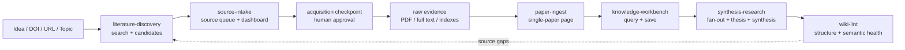
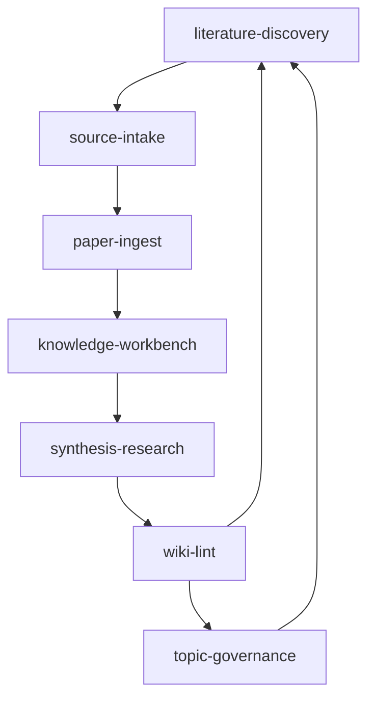

# ResearchWiki Architecture

ResearchWiki combines a GitHub-ready LLM Wiki with ARS-style skill routing and
human checkpoints. The design goal is high automation without losing the
evidence chain.

## Pipeline

## Data Layers

| Layer | Purpose | Public Git Policy |
|---|---|---|
| `raw/` | Source pointers, status dashboards, public-safe indexes, local evidence roots | Commit pointers/indexes only; PDFs/full text ignored except placeholders |
| `wiki/` | Paper pages, questions, concepts, topics, synthesis, meetings, seminars | Commit public-safe Markdown; no full articles |
| `maintenance/` | Review queues, fan-out candidates, checkpoints, prompts, diagnostics | Commit templates and durable governance; ignore private runtime reports |
| `core/` | Contracts, principles, agent rules, skill rules | Commit |
| `skills/` | Project-local skill wrappers for discoverability | Commit |
| `tools/` | Deterministic CLI/lint/index tooling | Commit |

## Quality Gates

- Search can be automated; evidence promotion is gated.
- Candidate PDFs, browser captures, and legal-source routes require a human
  checkpoint before `pdf_downloaded`.
- Machine extraction belongs in `raw/staging/extracted_text/` until reflow/QC.
- `raw/full_text/` requires QC metadata and table/equation quality flags.
- `paper-ingest` writes one paper page only.
- Source fan-out becomes a reviewable candidate before multi-page edits.
- Query never writes; Save must choose a target layer.

## Skill Dependency Graph

## External References

ResearchWiki adapts ideas from Karpathy's LLM Wiki framing, ARS-style mode and
gate design, Oh My Paper-style survey memory, and public LLM Wiki repo patterns.
See `docs/references/third_party_sources.md` for attribution and vendoring
rules.
