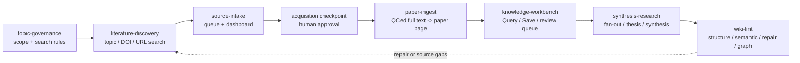

# Research Wiki Pipeline Architecture

ResearchWiki is organized around pipeline skills and modes. The command
launcher is only a thin router; deterministic local behavior lives in
`tools/rw.py`, and durable rules live in `core/`, `core/skills/`, and this
matrix.

## Pipeline Flow

## Skill And Mode Matrix

| Skill | Mode | Writes | Primary artifacts |
| --- | --- | --- | --- |
| `source-intake` | `add-source` | `raw/paper_sources.md`, dashboard refresh | source pointers |
| `source-intake` | `refresh-dashboard` | dashboard/index only | `raw/doi_dashboard.md`, `raw/full_text_index.*` |
| `source-intake` | `qced-full-text` | `raw/full_text/`, dashboard/index | QCed full text or abstract-only fallback |
| `literature-discovery` | `topic-search` | `maintenance/search_runs/` | search plan and candidate JSON |
| `literature-discovery` | `resolve-candidates` | source queue/dashboard | accepted DOI/URL candidates |
| `literature-discovery` | `acquire-pdf` | configured PDF root | approved legal PDF evidence |
| `literature-discovery` | `checkpoint` | `maintenance/acquisition_checkpoints/` | human acquisition decision record |
| `paper-ingest` | `ingest-qced-full-text` | `wiki/literature/`, dashboard/index | paper page |
| `topic-governance` | `add-topic` | `wiki/topics/topic_registry.md`, optional topic page | topic ID/scope/search governance |
| `topic-governance` | `lint-topics` | none | topic registry validation |
| `knowledge-workbench` | `query` | none | answer with evidence tier and Save recommendation |
| `knowledge-workbench` | `save` | chosen target layer | synthesis, concept, project synthesis, review queue, or log |
| `knowledge-workbench` | `query-to-save` | proposal first, then chosen target | Save proposal or saved item |
| `knowledge-workbench` | `review-queue` | `maintenance/review_queue.md` only | uncertain or supersession candidate |
| `synthesis-research` | `fanout-review` | `maintenance/fanout_candidates.md`, optional review queue | source-impact proposal |
| `synthesis-research` | `apply-approved-fanout` | approved wiki targets | synthesis, concept, overview, hot, project synthesis |
| `synthesis-research` | `thesis-review` | `maintenance/thesis_runs/` | stance evidence and verdict proposal |
| `synthesis-research` | `synthesis-page-start` | draft synthesis/project page and prompt | discussion workspace |
| `synthesis-research` | `external-sandbox-sync` | draft synthesis/project page and prompt | same-computer handoff |
| `wiki-lint` | `structure-lint` | none or terminal output | frontmatter, index, path, wikilink, Graph Links, orphan checks |
| `wiki-lint` | `semantic-lint` | maintenance findings only | review queue or semantic-lint report |
| `wiki-lint` | `repair-plan` | repair plan only | lint/doctor/repair output |
| `wiki-lint` | `state-graph` | generated maintenance exports | `maintenance/state.json`, `maintenance/graph.json` |
| `wiki-lint` | `support-report` | `maintenance/support_report.md` | advanced support report and issue URL |
| `wiki-lint` | `feedback-issue` | prompt only | advanced issue drafting prompt |

## Gates

- `query` is read-only. It may recommend a Save target but must not write.
- `save` and `query-to-save` must choose a target layer before writing.
- `qced-full-text` may write `raw/full_text/` only after Codex reflow/QC, or an
  honest `abstract_only` fallback.
- `literature-discovery` may automate search and candidate collection, but
  candidate PDFs must stop at `pdf_checkpoint_required` until approved.
- `paper-ingest` only reads QCed full text and writes one paper page.
- `topic-governance` controls broad search scope and must be used before adding
  new recurring topics.
- Fan-out starts as a candidate or review item before cross-page updates.
- Wiki lint and repair tools are advisory; they do not directly fix formal
  wiki pages unless a later Save or approved fan-out mode is started.
- Release hygiene may list `.DS_Store` or duplicate files but must not perform
  recursive or bulk deletion.

## Data Access Boundaries

- `raw/` is evidence and intake state.
- `wiki/` is curated knowledge.
- `maintenance/` is governance, review, generated state, support, and release
  evidence.
- `researchwiki.config.toml` is local/private and maps each computer to its
  Google Drive for desktop evidence root.
- Dashboard rows are status views, not evidence.
- Abstract-only, seminar, personal-note, and hypothesis material must not be
  upgraded into full-read peer-reviewed evidence.

## Command Compatibility

`ResearchWikiCodex.command` remains available for users who want a clickable
entrypoint. It now routes by skill and mode instead of exposing the old
numbered command menu. Existing capabilities are preserved through the matrix
above.

`audit-release` is a compatibility alias: `semantic-audit` maps to
`wiki-lint/semantic-lint`, `runtime-state-graph` maps to `wiki-lint/state-graph`,
and `release-hygiene` maps to `wiki-lint/repair-plan`. Support reports and
feedback issues are advanced support maintenance, not the beginner workflow.
