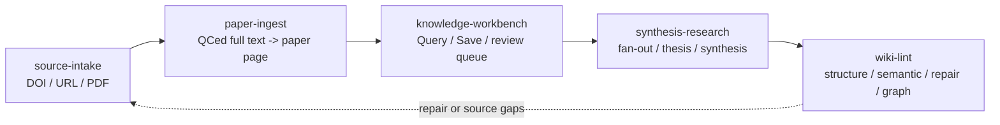

# Research Wiki Pipeline Architecture

Research Wiki 現在改以 pipeline skills 和 modes 組織操作。Command launcher
只保留為薄路由器；長期規則放在 `core/`、`core/skills/` 與本矩陣。

## Pipeline Flow

## Skill 與 Mode 矩陣

| Skill | Mode | 寫入範圍 | 主要 artifacts |
| --- | --- | --- | --- |
| `source-intake` | `add-source` | `raw/paper_sources.md`、dashboard refresh | source pointers |
| `source-intake` | `refresh-dashboard` | dashboard/index only | `raw/doi_dashboard.md`、`raw/full_text_index.*` |
| `source-intake` | `qced-full-text` | `raw/full_text/`、dashboard/index | QC 後全文或 abstract-only fallback |
| `paper-ingest` | `ingest-qced-full-text` | `wiki/literature/`、dashboard/index | paper page |
| `knowledge-workbench` | `query` | 無 | 附 evidence tier 的回答與 Save 建議 |
| `knowledge-workbench` | `save` | 已選 target layer | synthesis、concept、project synthesis、review queue 或 log |
| `knowledge-workbench` | `query-to-save` | 先 proposal，再寫入已選 target | Save proposal 或已保存項目 |
| `knowledge-workbench` | `review-queue` | 僅 `maintenance/review_queue.md` | 不確定或 supersession candidate |
| `synthesis-research` | `fanout-review` | `maintenance/fanout_candidates.md`、可選 review queue | source-impact proposal |
| `synthesis-research` | `apply-approved-fanout` | 已核准 wiki targets | synthesis、concept、overview、hot、project synthesis |
| `synthesis-research` | `thesis-review` | `maintenance/thesis_runs/` | stance evidence 與 verdict proposal |
| `synthesis-research` | `synthesis-page-start` | draft synthesis/project page 與 prompt | 討論工作頁 |
| `synthesis-research` | `external-sandbox-sync` | draft synthesis/project page 與 prompt | 同電腦 sandbox handoff |
| `wiki-lint` | `structure-lint` | 無或 terminal output | frontmatter、index、path、wikilink、Graph Links、orphan checks |
| `wiki-lint` | `semantic-lint` | maintenance findings only | review queue 或 semantic-lint report |
| `wiki-lint` | `repair-plan` | repair plan only | lint/doctor/repair output |
| `wiki-lint` | `state-graph` | generated maintenance exports | `maintenance/state.json`、`maintenance/graph.json` |
| `wiki-lint` | `support-report` | `maintenance/support_report.md` | advanced support report 與 issue URL |
| `wiki-lint` | `feedback-issue` | prompt only | advanced issue drafting prompt |

## Gates

- `query` 只讀不寫。它可以建議 Save target，但不可寫檔。
- `save` 與 `query-to-save` 必須先選 target layer 才能寫入。
- `qced-full-text` 只有在 Codex reflow/QC 後，才能寫 `raw/full_text/`；若只有摘要，必須誠實標示 `abstract_only`。
- `paper-ingest` 只讀 QC 後全文，並只寫單篇 paper page。
- Fan-out 必須先成為 candidate 或 review item，才能做跨頁更新。
- Wiki lint 與 repair tools 只提供建議；除非後續啟動 Save 或 approved fan-out，不直接修正式 wiki。
- Release hygiene 可以列出 `.DS_Store` 或重複檔案，但不得做 recursive 或批量刪除。

## Data Access Boundaries

- `raw/` 是證據與 intake 狀態。
- `wiki/` 是整理後知識。
- `maintenance/` 是治理、review、generated state、support 與 release evidence。
- Dashboard row 只是狀態視圖，不是 evidence source of truth。
- Abstract-only、seminar、personal-note、hypothesis material 不可被升級成 full-read peer-reviewed evidence。

## Command Compatibility

`ResearchWikiCodex.command` 仍保留給需要可點擊入口的使用者。它現在依 skill/mode
路由，不再暴露舊的 numbered command menu。既有能力由上面的矩陣保留。

`audit-release` 是相容別名：`semantic-audit` 對應 `wiki-lint/semantic-lint`，
`runtime-state-graph` 對應 `wiki-lint/state-graph`，`release-hygiene` 對應
`wiki-lint/repair-plan`。Support report 與 feedback issue 屬於 advanced support
maintenance，不是新手主流程。
