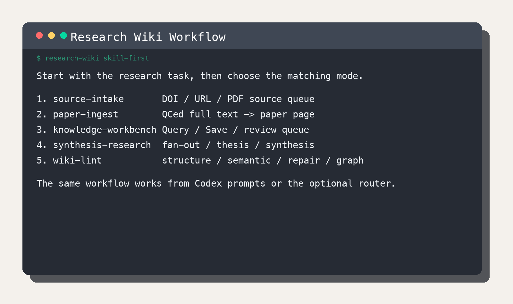
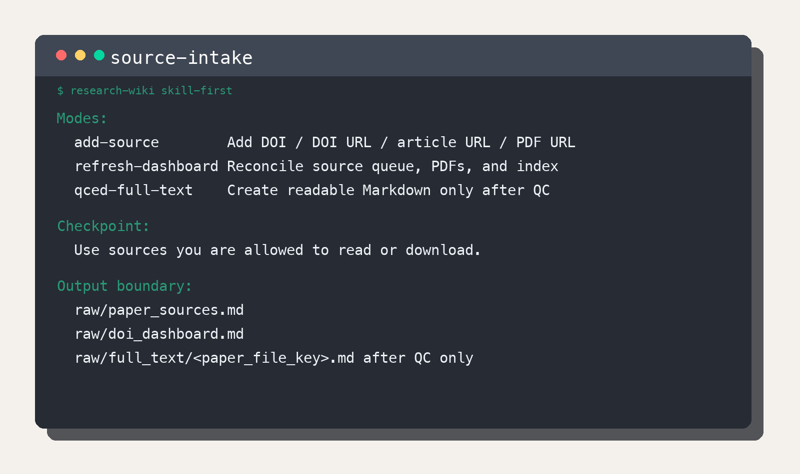
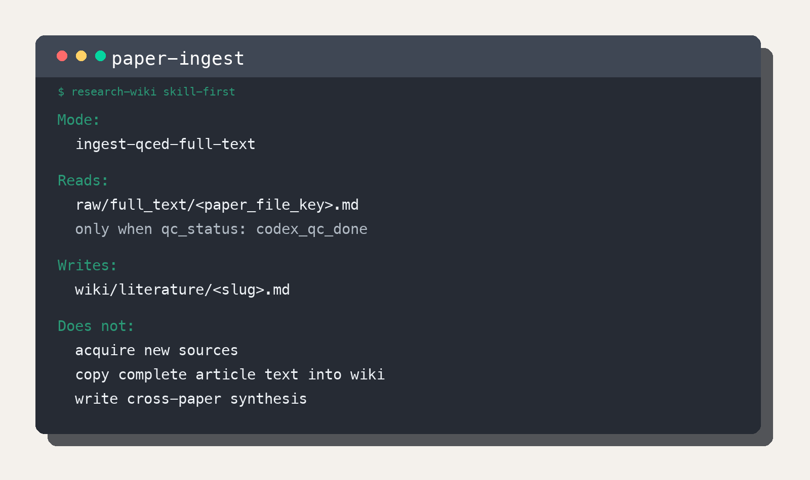
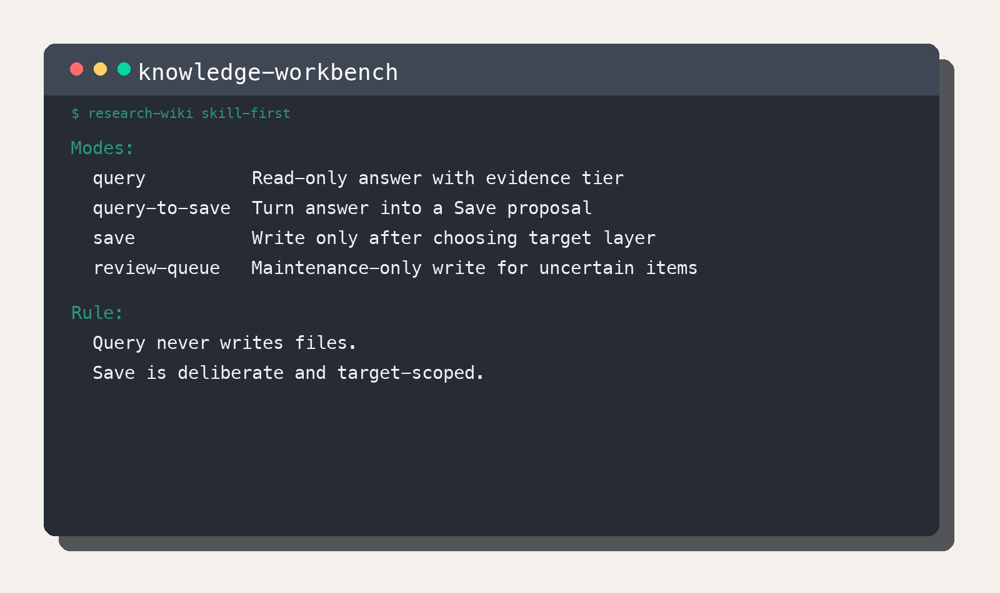
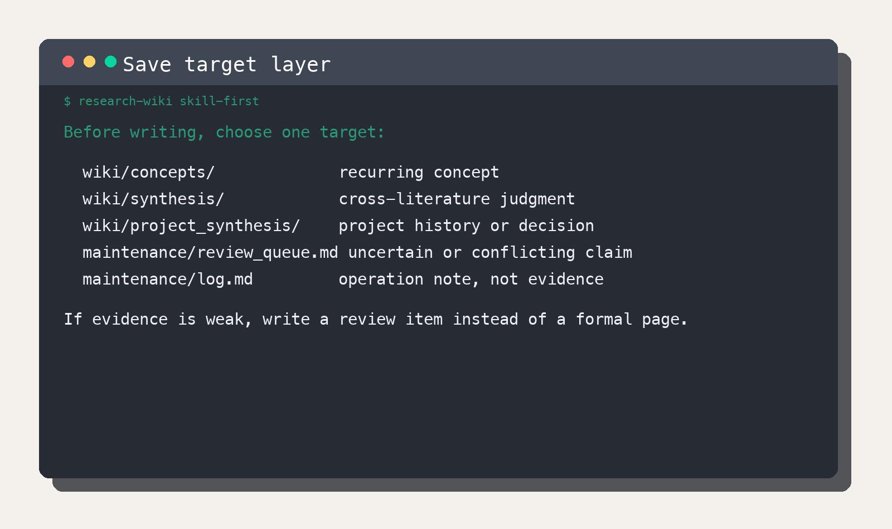
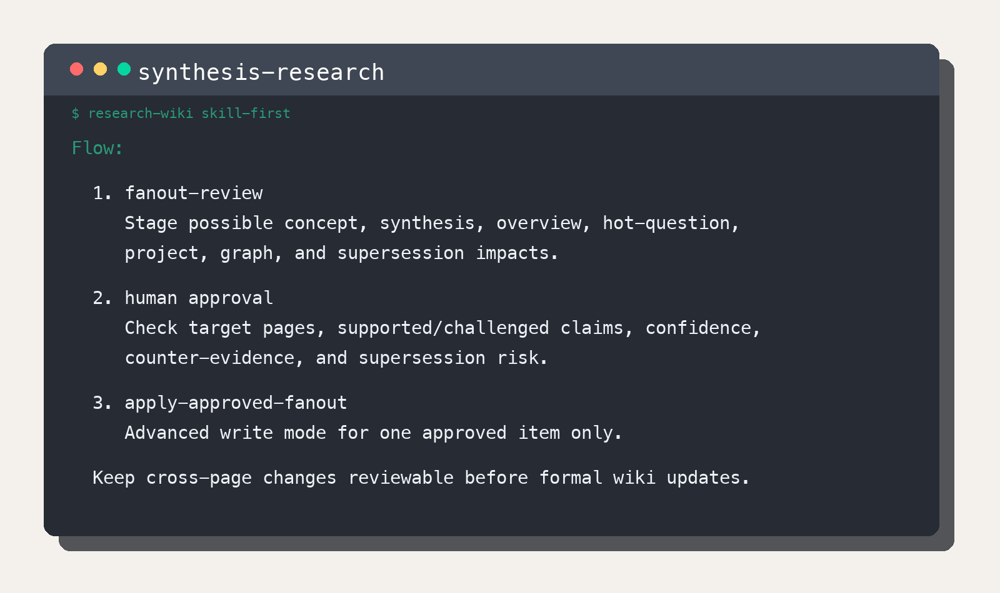
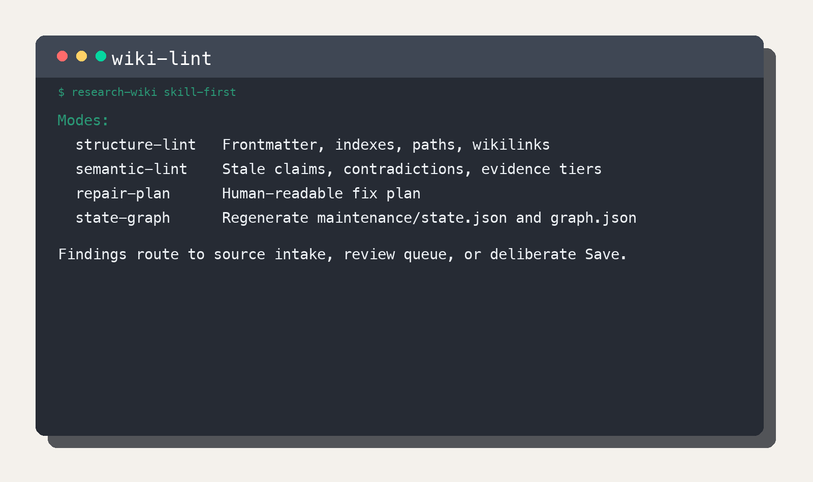

# Research Wiki Illustrated Quickstart

[繁體中文](research_wiki_skill_first_quickstart.zh-TW.md)

Research Wiki is an LLM-assisted Markdown knowledge base for research. You put sources in `raw/`, let Codex help compile them into `wiki/`, and use lint to keep links, evidence tiers, and open questions healthy.



## 1. Build The Research Wiki

Research Wiki has three work areas:

- `raw/` stores sources and evidence.
- `wiki/` stores curated research understanding.
- `maintenance/` stores review items, repair plans, state, and graph exports.

Main workflow:

```text
source-intake -> paper-ingest -> knowledge-workbench -> synthesis-research -> wiki-lint
```

You can ask Codex directly with a skill/mode phrase such as `Use source-intake/add-source ...`, or open `ResearchWikiCodex.command` / `ResearchWikiCodex.cmd` and choose a skill and mode from the menu.

## 2. First Open The Repo

Open this repository in Codex. If you do not have it locally, ask Codex to clone it. If you are already inside the repo, ask Codex to use the current folder.

You can paste:

```text
Please help me start Research Wiki from zero.
Read README.md, USER_GUIDE.md, INSTALL.md, and AGENTS.md first.
Check the required tools, explain any missing tool, and ask me before system installs or permission-requiring steps.
After the check succeeds, guide me through source-intake/add-source for my first DOI or URL.
```

When this step is done, you will know whether the repo is ready, where the first source goes, and which mode comes next.

## 3. Add The First Source

Use `source-intake/add-source` for a DOI, DOI URL, article URL, PDF URL, or source note.



This step does three things:

- puts the source in `raw/paper_sources.md`;
- lets the dashboard know the paper is waiting;
- preserves the lead needed for full text and a paper page.

Use sources you are allowed to read or download. Adding a source does not mean the paper has been read, and it does not create a paper page.

## 4. Get And Prepare Full Text

Use `source-intake/refresh-dashboard` to check the dashboard, PDF evidence, and index state. When the source is readable, use `source-intake/qced-full-text` to create `raw/full_text/paper_file_key.md`.

Before full text enters `raw/full_text/`, check that:

- title, authors, year, venue, and DOI are correct;
- paragraph order is readable;
- tables, equations, and captions were not broken by extraction;
- frontmatter says `qc_status: codex_qc_done`.

## 5. Create A Paper Page

When QCed full text exists, use `paper-ingest/ingest-qced-full-text`. The output is a paper page under `wiki/literature/`.



A paper page handles one paper:

- it summarizes the paper's question, method, findings, limits, and source pointers;
- it does not copy the full article;
- it does not write cross-paper conclusions;
- if only metadata or abstract is available, mark the page `metadata-only` or `abstract-only`.

## 6. Query: Ask What The Wiki Already Knows

Use `knowledge-workbench/query` to ask a research question.



Query answers from the existing wiki and evidence index, and labels:

- what comes from full-read literature;
- what is only abstract, seminar, or project context;
- which claims still need sources;
- which questions belong in the review queue.

Query is for exploring the current knowledge base. It does not edit files.

## 7. Save: Put Durable Knowledge In The Right Place

If a Query result is worth keeping, use `knowledge-workbench/query-to-save` to shape a Save proposal, then use `knowledge-workbench/save` to write to the right target layer.



Common targets:

- single-paper fact: `wiki/literature/`
- recurring term, method, dataset, instrument, or variable: `wiki/concepts/`
- cross-literature judgment: `wiki/synthesis/`
- project decision or meeting evolution: `wiki/project_synthesis/` / `wiki/meetings/`
- uncertain, conflicting, low-confidence item: `maintenance/review_queue.md`

If the evidence is not ready, save a review item first.

## 8. Synthesis: Connect Papers Into Research Judgment

When one paper may affect multiple concepts, synthesis pages, or active questions, use `synthesis-research/fanout-review` to create a review proposal.



A review proposal should answer:

- which pages the source affects;
- which claims it supports or challenges;
- whether confidence is appropriate;
- whether counter-evidence is needed;
- whether it changes an existing interpretation.

After approval, use `synthesis-research/apply-approved-fanout` to update the formal wiki.

## 9. Wiki Lint: Keep The Knowledge Base Healthy

Use `wiki-lint` regularly to check Research Wiki. Lint keeps the knowledge base readable, traceable, and ready to grow.



Common modes:

- `structure-lint`: check frontmatter, indexes, paths, wikilinks, Graph Links, and orphan pages.
- `semantic-lint`: check stale claims, contradictions, evidence tiers, missing counter-evidence, and supersession.
- `repair-plan`: generate a human repair plan.
- `state-graph`: rebuild `maintenance/state.json` and `maintenance/graph.json`.

Lint findings usually route back to one of three places: new source intake, the review queue, or a deliberate Save.

## 10. Next

- For mode permissions and advanced maintenance, read [USER_GUIDE.md](../../USER_GUIDE.md).
- For the full pipeline contract, read [Pipeline Architecture](../guides/research_wiki_pipeline_architecture.en.md).
