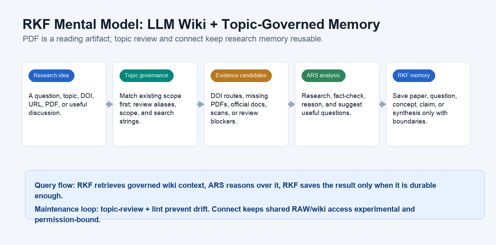
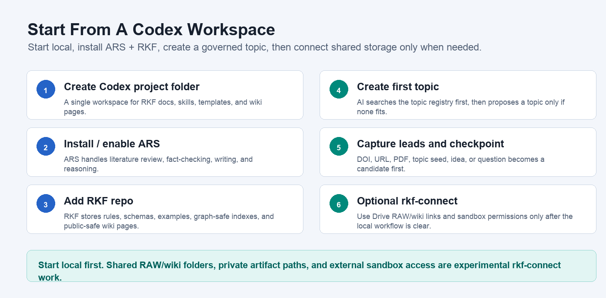
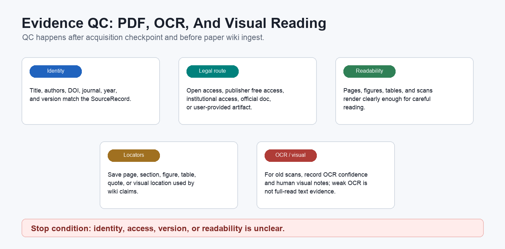
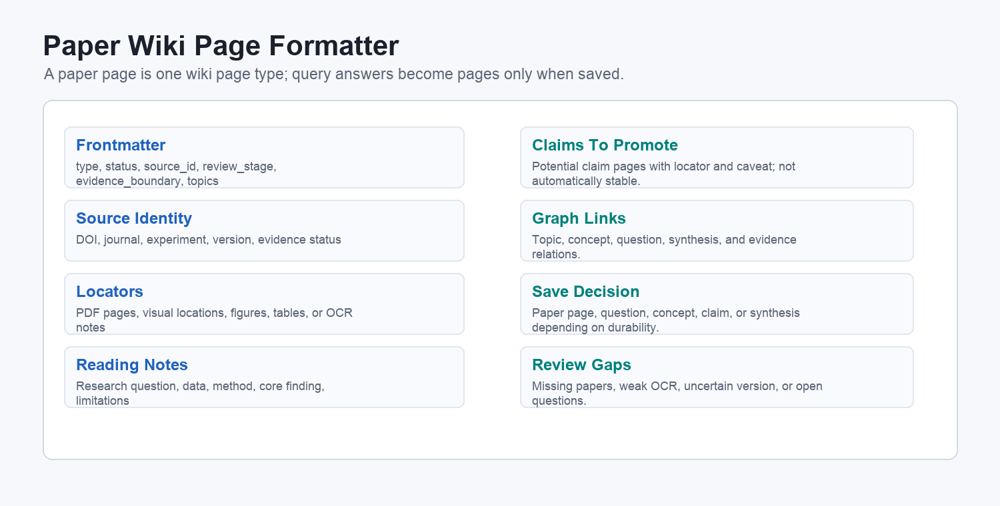
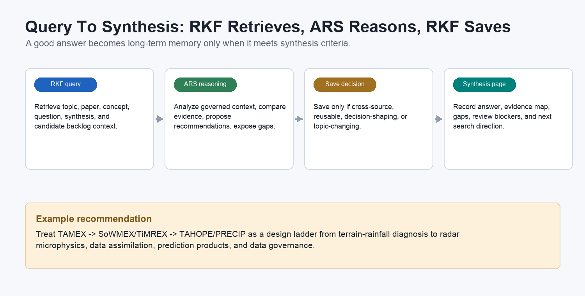

# RKF Operating Manual

Research Knowledge Framework (RKF) is an LLM Wiki-based research knowledge
framework. It turns research discussions, literature leads, topics, questions,
claims, concepts, and synthesis into governed, queryable, compounding long-term
memory.

PDF is not the source of the knowledge base. It is the most common and strongest
evidence carrier for paper reading. RKF manages source trust, evidence locators,
save decisions, topic drift, and whether the wiki can be reused in the next
research session.



## Core Mental Model

The core of an LLM Wiki is not a prettier folder. It is a way for LLM reasoning
to compound. ARS can research, fact-check, write, and review; RKF adds durable
memory, topic governance, evidence boundaries, and a maintainable wiki graph.

```text
research idea -> topic governance -> evidence candidates -> ARS analysis
-> RKF memory decision -> wiki page / review queue / synthesis
```

Wiki pages are not only paper pages. RKF maintains paper, question, concept,
claim, topic, overview, and synthesis pages. A query answer is not a wiki page
until it is saved as a question, claim, concept, or synthesis.

## Start From A Codex Workspace

1. Create a new Codex project folder, such as `ResearchKnowledgeFramework`.
2. Put or clone the RKF repo into that folder. This is the Git root for rules,
   templates, schemas, skills, manuals, and public-safe wiki pages.
3. Install or enable `academic-research-skills` in Codex. ARS is the research
   and reasoning capability; RKF is the persistence and governance layer.
4. Start with a local RKF workspace. You do not need cross-computer sync on day
   one. Shared databases, Drive links, and private artifact locations are
   experimental `rkf-connect` concerns described at the end of this manual.
5. Create the first topic. AI should search the topic registry first, reuse the
   closest topic when possible, and propose a new topic only when needed. You can
   later revise aliases, scope, include/exclude rules, and search strings.
6. Capture DOI, URL, PDF, topic, or idea leads. They begin as candidates, not
   evidence.
7. After literature search, stop at a checkpoint: which artifacts are ready for
   QC, which papers lack PDF/full text, and which items require the user to get
   legal access.
8. Only reviewed paper artifacts can become paper wiki pages. Cross-paper
    ideas become questions, concepts, claims, or synthesis.



## Skill And Mode Routing

| Stage | When To Use It | Skill | Mode | Output | Boundary |
|---|---|---|---|---|---|
| Clarify scope | Topic names, acronyms, or boundaries are unclear | `academic-research-skills` | `deep-research:socratic` or `deep-research:quick` | Scope and search terms | No RKF wiki write yet |
| Find literature | You need SCI papers, DOI routes, and research context | `academic-research-skills` | `deep-research:lit-review` | Candidate paper list | Candidates are not evidence |
| Verify sources | DOI, authors, version, or route need checking | `academic-research-skills` | `deep-research:fact-check` | Source verification notes | ARS output remains proposal context |
| Capture source | You have a DOI/URL/PDF/topic lead | `rkf-evidence-vault` | `capture` | SourceRecord | No paper page yet |
| Manage candidates | Literature exists but PDF/full text is missing | `rkf-evidence-vault` | `discover` | Candidate backlog / missing artifact checkpoint | Missing evidence stays in review queue |
| Acquire evidence | You found a legal PDF, official document, screenshot, or authorized text | `rkf-evidence-vault` | `acquire` | Acquisition checkpoint | Stop on unclear access or identity |
| Verify evidence | Artifact usability must be checked | `rkf-evidence-vault` | `verify-pdf` | QCed reading artifact and locators | Un-QCed artifacts cannot create paper pages |
| Write wiki | Evidence passed QC | `rkf-knowledge-synthesis` | `distill-paper`, `save-concept`, `synthesize` | Paper, concept, or synthesis pages | Claims must trace back to locators |
| Review topics | Topics grow, candidates pile up, or scope drifts | `rkf-knowledge-synthesis` | `topic-review` | merge/split/search-string/update proposal | Propose changes before large registry edits |
| Ask wiki | You need an answer from existing wiki context | `rkf-wiki-core` | `query` | RKF context + ARS analysis + save proposal | Answer is not automatically a wiki page |
| Maintain | Topic grows, evidence changes, or sharing is planned | `rkf-lint` | `structure-lint`, `evidence-lint`, `graph-lint`, `ars-handoff-lint`, `public-safety-lint`, `repair-plan` | Findings or repair plan | Repair plans do not bulk-edit claims |
| Connect shared database | Multiple computers, Drive sharing, or external sandbox access | `rkf-connect` | `shared-database-plan`, `link-workspace`, `sandbox-grant`, `sandbox-save-proposal` | connection plan or proposal | Experimental; do not commit local links or private paths |

## Skill Triggers

| Skill | English Triggers | 中文觸發詞 |
|---|---|---|
| `academic-research-skills` | literature review, deep research, fact check, source verification | 文獻回顧、深度研究、找 SCI、查 DOI、查核來源 |
| `rkf-evidence-vault` | find papers, capture DOI, missing PDF, acquire evidence, PDF/OCR QC | 文獻搜尋、加入 DOI/URL/PDF、缺 PDF、合法取得、PDF 檢查、OCR 檢查 |
| `rkf-knowledge-synthesis` | paper note, wiki page, concept, question, claim, synthesis, topic review | 整理成 wiki、論文筆記、概念頁、問題頁、claim、綜整、topic 整理、topic 建議 |
| `rkf-wiki-core` | ask the wiki, ARS reasoning, save memory, graph, sandbox capsule | 問知識庫、ARS 分析、回寫 wiki、保存討論、知識圖譜、外部 sandbox |
| `rkf-lint` | audit, maintenance, repair plan, public safety, evidence boundary | 檢查、定期維護、修復計畫、證據邊界、發布安全、private path 檢查 |
| `rkf-connect` | shared database, Google Drive, symlink, junction, sandbox access | 共享資料庫、多台電腦、Google Drive、ln、symlink、junction、連結 wiki、外部 sandbox 權限 |

## Topic Governance

A topic is the research index, not just a folder name. Each topic should have:

- topic ID: stable, short, frontmatter-safe.
- aliases: synonyms, acronyms, spelling variants.
- scope: what the topic governs.
- include / exclude rules: which sources belong and which do not.
- default search strings: reusable ARS/search queries.
- canonical pages: main topic, concept, and synthesis pages.
- review cadence: how often to check topic drift and candidate backlog.

When you ask a new research question, AI should search the topic registry first.
If a near match exists, it should reuse that topic. If none fits, it should
propose a new topic. You can later edit aliases, scope, include/exclude rules,
and search strings so future discovery gets sharper.

Topics need regular review, not just setup. `topic-review` answers four
questions:

- Has this topic become too broad and needs subtopics?
- Do two topics govern the same research area and need merging or aliases?
- Which candidate papers no longer fit the scope, and which still lack artifacts?
- Are the default search strings stale, causing ARS to find the same or wrong papers?

Useful requests:

- "Review this topic regularly and suggest merges, splits, and stale candidates."
- "Clean up this topic's aliases, include/exclude rules, and search strings."
- "Based on the current wiki, suggest keywords for the next literature search."
- "Check which candidates still lack PDFs and which should move to another topic."

## Wiki Page Types And Template Functions

RKF wiki pages are knowledge objects, not just notes. Each page type has a
different job:

| Page Type | Main Function | Core Fields / Sections | Create When |
|---|---|---|---|
| `paper` | Preserve reading results from one QCed artifact | source identity, evidence boundary, PDF/visual locators, reading notes, claims to promote, graph links | a legal paper artifact has passed QC |
| `question` | Preserve a research question worth tracking | question, why it matters, current evidence, missing evidence, next search | a query reveals a reusable or unresolved question |
| `concept` | Preserve a reusable method, variable, instrument, mechanism, or dataset | definition, scope, related papers, use cases, open caveats | several sources reuse the same idea |
| `claim` | Preserve a supported or reviewable statement | claim statement, supporting locator, confidence, caveat, review blocker | a statement may enter synthesis or writing and needs traceability |
| `topic` | Govern research scope and discovery strategy | topic ID, aliases, scope, include/exclude, default searches, canonical pages, review cadence | starting or reorganizing a research direction |
| `overview` | Preserve project, dataset, experiment, or field context | context, scope, key artifacts, related topics, limitations | the source is contextual rather than one SCI paper |
| `synthesis` | Preserve cross-source judgment, recommendation, or reusable answer | synthesis question, evidence base, claims, gaps, recommendations, review status | an answer crosses sources or affects research decisions |
| `project-synthesis` | Preserve a project-stage conclusion | project goal, source set, decision log, remaining blockers, next actions | a research project needs stage-level integration |
| `meeting` | Preserve research decisions and action items from a meeting | agenda, decisions, evidence links, action items, save proposals | meeting outcomes affect topics or synthesis |
| `seminar` | Preserve seminar or reading-group knowledge that may enter RKF | speaker/context, main claims, related papers, questions, follow-up | external knowledge should become question/concept/claim proposals |

All pages should have frontmatter: `type`, `status`, `review_stage`, `topics`,
`evidence_boundary`, `created`, and `updated`. `evidence_boundary` states
whether the page rests on PDF evidence, an existing wiki page, an ARS proposal,
or a review blocker.

## Evidence Checkpoint And QC

After SCI paper discovery, do not write paper pages immediately. Stop at a
checkpoint:

| Category | Meaning | Next Step |
|---|---|---|
| Artifact ready for QC | Legal PDF, official document, or authorized text exists | Run evidence QC |
| Missing PDF / full text | Only DOI, metadata, abstract, or candidate page exists | Keep in candidate backlog |
| User action needed | Institutional access, author manuscript, publisher page, or scan may be needed | User obtains legal artifact, then returns to RKF |

PDF QC happens after acquisition checkpoint and before paper page creation. It
checks:

- source identity: title, authors, DOI, journal, year.
- legal route: open access, publisher free access, institutional access,
  user-provided artifact, or official document.
- version: publisher version, author manuscript, preprint, or scan.
- readability: pages, figures, and tables render clearly.
- locator: page, section, figure, table, or visual location used by the wiki
  page.

For old scanned image PDFs, add visual/OCR notes. Use screenshots, page numbers,
manual visual reading, and OCR confidence notes. If OCR is unreliable, save
visual locators and human summaries only; do not claim searchable full-read text
evidence.



## Worked Example: Taiwan Atmospheric Experiments

The complete example lives in
[`examples/taiwan-atmospheric-experiment/`](../../examples/taiwan-atmospheric-experiment/).
Starting prompt:

> I want to organize atmospheric experiments in Taiwan, such as TAMEX, SOMEX,
> and TAHOPE.

### 1. Create The Topic

AI checks whether a related topic already exists in the topic registry. If a
close topic exists, it attaches new candidates there. If not, it proposes a new
topic. The example uses:

Topic ID: `taiwan-atmospheric-field-campaigns`

Scope: Taiwan atmospheric observation campaigns and field studies, including
TAMEX, SoWMEX/TiMREX, TAHOPE/PRECIP, complex-terrain rainfall, Mei-yu fronts,
southwest monsoon rainfall, typhoon rainfall, dual-polarimetric radar, data
assimilation, aerosol, CCN, and cloud microphysics.

### 2. Use ARS To Find SCI Papers

Use `academic-research-skills` with `deep-research:lit-review` to find
candidates, then `deep-research:fact-check` to verify DOI, venue, version, and
route.

| Status | Paper | DOI / Route | RKF Decision |
|---|---|---|---|
| QCed, wiki done | Chen and Liang 1992 TAMEX midlevel vortex | `10.2151/jmsj1965.70.1_25`; J-STAGE free PDF | Ingested as TAMEX paper page |
| Candidate, missing artifact | Kuo and Chen 1990 TAMEX overview | `10.1175/1520-0477(1990)071<0488:TTAMEA>2.0.CO;2`; AMS | Await legal PDF or authorized text |
| QCed, wiki done | You, Chung, and Tsai 2020 SoWMEX IOP8 | `10.3390/rs12183004`; MDPI | Manual browser checkpoint, then QC |
| Candidate, missing artifact | Chang, Lee, and Liou 2015 SoWMEX/TiMREX microphysics | `10.1175/MWR-D-14-00081.1`; AMS/UCAR | Keep in candidate backlog |
| QCed, wiki done | Miao et al. 2025 TAHOPE/PRECIP IOP2 | `10.1029/2024JD042375`; open PDF route | Ingested as TAHOPE/PRECIP paper page |
| Candidate, missing artifact | Yang et al. 2024 TAHOPE/PRECIP IOP3 | `10.1175/MWR-D-24-0049.1`; AMS | Await legal PDF/QC |
| Project context | TAHOPE official introduction PDF | official project PDF | Saved as project overview, not SCI evidence |


### 3. Ingest Evidence Into Wiki Pages

A paper page is one wiki page type, not the whole wiki. The example paper page
contains:

- frontmatter: type, status, source_id, review_stage, evidence_boundary, topics.
- Source Identity: DOI, journal, experiment, evidence status.
- PDF / visual locators: where abstract, method, figures, or conclusions appear.
- Reading Notes: research question, data, method, core finding.
- Claims To Promote: possible claim pages with locator and caveat.
- Graph Links: topic, concept, question, and synthesis links.



After paper pages are ingested, ARS can suggest useful questions:

- How did experiment design evolve from terrain-rainfall diagnosis to prediction systems?
- Which instruments or data flows recur across campaign generations?
- Which candidate papers lack artifacts and limit the current synthesis?

### 4. Ask The Wiki And Save Synthesis

Question:

> What should Taiwan do in a future meteorological observation experiment?

Flow:

1. RKF retrieves relevant topic, paper, concept, question, and candidate backlog
   context.
2. ARS analyzes the governed wiki context and proposes recommendations.
3. RKF marks evidence gaps and missing artifacts.
4. Save as synthesis only when the answer crosses multiple sources, supports a
   research decision, will be reused, or changes topic direction.

The example synthesis recommends treating TAMEX, SoWMEX/TiMREX, and
TAHOPE/PRECIP as a design ladder from terrain-rainfall diagnosis to radar
microphysics, data assimilation, prediction products, and data governance.



## Why Maintenance Matters

A wiki that is not maintained slowly loses trust: topics drift, candidate papers
are forgotten, claims detach from evidence, graph links break, synthesis pages
go stale, and private evidence can accidentally enter Git.

Useful maintenance requests:

- "Run maintenance for this topic."
- "Check which candidates still lack PDF or full text."
- "Check whether this synthesis is stale and which claims need updates."
- "Run evidence-lint, graph-lint, and public-safety-lint."
- "Create a repair plan without changing content automatically."

Suggested rhythm:

- Active topic: weekly checks for topic drift, candidate backlog, evidence
  boundaries, and graph links.
- Major new PDF / ARS report / synthesis: semi-automatic evidence and ARS
  handoff lint before and after saving.
- Stable topic: monthly checks for stale synthesis, unresolved candidates, and
  duplicate concepts.
- Before sharing or publishing: public-safety lint is mandatory.
- After durable wiki writes: refresh `index.md` and keep `log.md` as the
  operation trail for the next LLM session.

## Experimental: Shared Database Across Computers

A shared database is not required for basic RKF use. Enable it when multiple
computers or external sandboxes need the same research memory. This is managed
by `rkf-connect`.

Current method:

```text
<Drive ResearchSync>/
  raw/
  wiki/
    index.md
    log.md
    knowledge/
    state/
    governance/
    graph/
```

- Google Drive for desktop is the shared folder; `raw` and `wiki` hold the real
  data.
- Each computer creates local links from its RKF project folder to the Drive
  `raw` and `wiki` folders.
- macOS/Linux can use `ln` or symlink; Windows can use junction or symlink.
- Do not commit cross-platform links, private Drive paths, or licensed evidence
  into the public repo.
- When `storage.wiki_root` is configured, RKF treats that folder as the active
  database for `knowledge`, `state`, `governance`, and `graph`.
- `index.md` gives LLM sessions a compact retrieval entrypoint; `log.md` keeps
  the append-only operation history.
- External sandboxes are read-only by default. Generate the `external-sandbox`
  context capsule, then use `prompts/external_sandbox_bootstrap.en.md` or
  `prompts/external_sandbox_bootstrap.zh-TW.md` to start the other sandbox.
- A trusted sandbox can receive the RKF repo as a writable workspace and operate
  through RKF CLI: `capture -> acquire -> verify-pdf -> distill`. This still
  must pass the evidence gates.
- If the sandbox only has search results, unclear topic fit, missing PDF QC,
  weak locators, unclear claim support, or no write access, return a
  `sandbox-save-proposal` and let RKF decide whether to save it.

For external sandbox literature search and reading, use this path:

```text
literature search
  -> source candidate
  -> capture DOI/URL/PDF pointer
  -> legal acquisition checkpoint
  -> PDF/OCR/visual QC with locators
  -> paper wiki distillation
```

Remember: candidates are not evidence, and ARS/deep-research reports are not
evidence by themselves. Temporary PDF text or OCR text may be used for reading,
but do not write full article text, PDFs, browser captures, private Drive paths,
tokens, or local secrets into RKF.

Useful `rkf-connect` requests:

- "Plan a Google Drive shared database so my Mac and Windows machines use the same raw/wiki."
- "Check this machine's RKF links and make sure private paths are not in the repo."
- "Generate sandbox instructions for reading the wiki and proposing saves."
- "Start RKF mode in another sandbox so it can search papers and add wiki pages through gates."
- "Turn a useful sandbox question into an RKF question proposal."

## Reference Sources

- [Kuo and Chen 1990 TAMEX overview](https://journals.ametsoc.org/abstract/journals/bams/71/4/1520-0477_1990_071_0488_ttamea_2_0_co_2.xml)
- [J-STAGE Chen and Liang 1992 TAMEX paper](https://www.jstage.jst.go.jp/article/jmsj1965/70/1/70_1_25/_article)
- [J-STAGE Wang and Chen 2003 TAMEX paper](https://www.jstage.jst.go.jp/article/jmsj/81/2/81_2_339/_article)
- [MDPI You et al. 2020 SoWMEX IOP8 paper](https://www.mdpi.com/2072-4292/12/18/3004)
- [UCAR Chang et al. 2015 SoWMEX/TiMREX paper](https://www.eol.ucar.edu/publications/kinematic-and-microphysical-characteristics-and-associated-precipitation-efficiency)
- [TAHOPE Project Office](https://rain.as.ntu.edu.tw/TAHOPE/TAHOPE-home.html)
- [TAHOPE introduction PDF](https://exp.pccu.edu.tw/TAHOPE_2019/data/TAHOPE_Introduction.pdf)
- [Miao et al. 2025 TAHOPE/PRECIP PDF](https://tropical.colostate.edu/Publications/papers/Miao_etal_JGR_2025.pdf)
- [TAHOPE/PRECIP IOP3 paper record](https://www.researchgate.net/publication/384138264_Investigating_the_mechanisms_of_an_intense_coastal_rainfall_event_during_TAHOPEPRECIP-IOP3_using_a_multiscale_radar_ensemble_data_assimilation_system)
