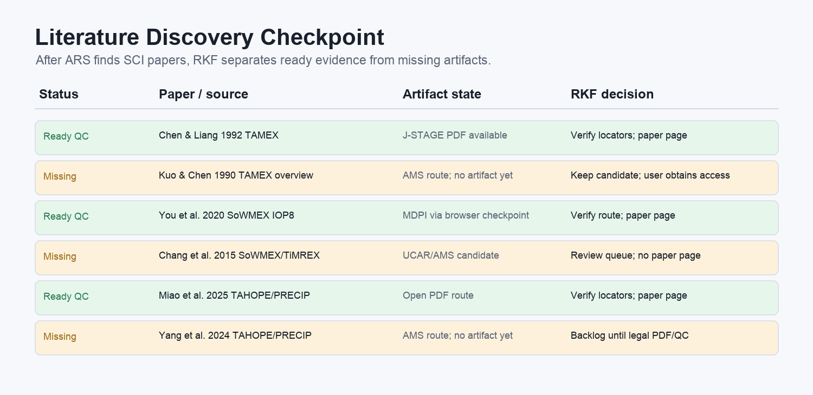

# Example: Taiwan Atmospheric Experiments

This example demonstrates how RKF handles the prompt:

> I want to organize atmospheric experiments in Taiwan, such as TAMEX, SoWMEX, and TAHOPE.

It uses `academic-research-skills` for ARS-style literature discovery and
source verification, then uses RKF skills for source capture, legal PDF
checkpointing, evidence QC, paper wiki pages, and a final wiki query about
future meteorological observation experiments in Taiwan.

## What This Example Contains

| Path | Purpose |
|---|---|
| `literature_candidates.md` | SCI paper candidates found for the topic |
| `governance/topic_registry.json` | Topic ID, scope, aliases, include/exclude rules, default search strings |
| `skill_mode_walkthrough.md` | When to use ARS modes and RKF modes |
| `state/sources/` | Public-safe source records |
| `state/evidence/` | Public-safe evidence artifact pointers; actual PDFs are not included |
| `state/gates/pdf_acquisition/` | Human-readable PDF checkpoint/QC decisions |
| `knowledge/papers/` | Paper wiki pages from QCed PDFs |
| `knowledge/questions/` | A decision-oriented question page |
| `knowledge/synthesis/` | A synthesis answering the example question |
| `graph/research_graph.json` | Public-safe graph export |

## Evidence Boundary

The actual PDFs used for the demonstration stay in a private evidence root.
This example stores only public-safe pointers such as
`PRIVATE_EVIDENCE_ROOT/doi_pdf/...`. The paper pages summarize evidence and
include PDF locators; they do not contain copied article text.

## Alias Note

The starting prompt intentionally keeps the user's wording. Topic governance
records ambiguous or variant names as aliases, then ARS/RKF checks the
literature context before durable naming.

## Key Result

The example synthesis recommends treating TAMEX, SoWMEX/TiMREX, and
TAHOPE/PRECIP as a generational arc: move from mesoscale terrain-rainfall
process diagnosis, to monsoon-rainfall microphysics, to integrated
radar/data-assimilation and storm-microphysics prediction.

## Screenshots

See [README.zh-TW.md](README.zh-TW.md) for the Traditional Chinese guide.
